# Architecture Overview

## System Architecture

### High-Level Architecture

The application follows a modern, modular frontend architecture with the following key components:

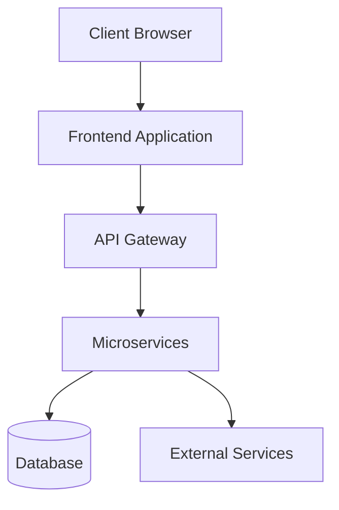

### Frontend Architecture

#### Component Hierarchy

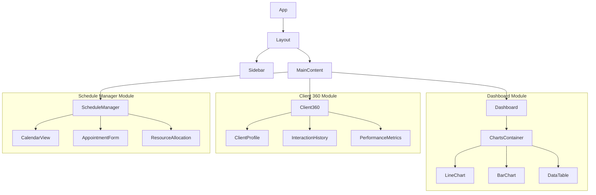

### Data Flow

1. **Initialization**
   - App loads and initializes authentication
   - User session is validated
   - Core modules are lazy-loaded based on permissions

2. **Data Fetching**
   - Components request data via React Query hooks
   - API service layer handles request/response transformation
   - Data is cached for performance

3. **State Management**
   - Global state (auth, user preferences) in React Context
   - Local component state for UI-specific data
   - Server state managed by React Query

## Module Descriptions

### 1. Core Module
- **Purpose**: Shared functionality across the application
- **Components**:
  - Authentication
  - Navigation
  - Layout components
  - Theme provider
  - Error boundaries

### 2. Business Intelligence Dashboard
- **Purpose**: Data visualization and analytics
- **Key Features**:
  - Interactive charts and graphs
  - Custom report generation
  - Data export functionality
  - Real-time data updates

### 3. Client 360° Panel
- **Purpose**: Comprehensive client management
- **Key Features**:
  - Client profiles and history
  - Interaction tracking
  - Performance analytics
  - Client segmentation

### 4. Schedule Manager
- **Purpose**: Appointment and resource scheduling
- **Key Features**:
  - Calendar view with drag-and-drop
  - Resource allocation
  - Conflict detection
  - Notifications and reminders

## Technical Decisions

### State Management
- **React Query**: For server state management and data fetching
- **Context API**: For global state that doesn't change often
- **Local State**: For UI-specific state within components

### Styling
- **TailwindCSS**: For utility-first styling
- **CSS Modules**: For component-scoped styles
- **Responsive Design**: Mobile-first approach with breakpoints

### Performance
- **Code Splitting**: Route-based and component-based code splitting
- **Lazy Loading**: Components loaded on demand
- **Caching**: Data caching with React Query
- **Optimized Builds**: Vite for fast development and production builds

## Security Considerations

1. **Authentication**
   - JWT-based authentication
   - Token refresh mechanism
   - Secure token storage

2. **Authorization**
   - Role-based access control (RBAC)
   - Route guards for protected routes
   - Permission checks for sensitive operations

3. **Data Protection**
   - Input validation and sanitization
   - XSS protection
   - CSRF protection

## Deployment Architecture

### Development
- Local development with Vite dev server
- Mock API for development
- Hot module replacement

### Staging/Production
- Static file hosting (Vercel/Netlify)
- CDN for global distribution
- Environment-based configuration
- Monitoring and error tracking

## 🐳 Dockerization Roadmap & Deep Concepts

The platform embraces containerisation as the foundation for local development, CI/CD and production deployment. This section summarises the **how** and **why** behind our approach; see `PROJECT_STATUS.md` → *Dockerization & Deployment Strategy* for a living specification.

### Phased Roadmap

| Phase | Target Date | Deliverable | Description |
|-------|-------------|-------------|-------------|
| 1 | 2025-08-20 | Compose-first dev stack | All services start with `docker compose up` incl. hot-reload. |
| 2 | 2025-09-01 | CI image build pipeline | GitHub Actions builds multi-arch images, runs Trivy scan, pushes to GHCR. |
| 3 | 2025-09-15 | k3s staging cluster | ArgoCD deploys images; secrets mounted via Vault-Agent Injector. |
| 4 | 2025-10-15 | EKS production cluster | Multi-AZ, cluster-autoscaler, Karpenter node provisioning. |
| 5 | 2025-11-01 | Istio canary rollout | Progressive delivery (5%→25%→100%), SLO-based promotion gates. |
| 6 | 2026-01-15 | Cost optimisation pass | Spot nodes, image slimming (<50 MB), horizontal- & vertical-pod-autoscaler tuning. |

### Deep-Dive Concepts

1. **Multi-Stage Builds**  
   Keep final images minimal by compiling in a “builder” stage and copying artefacts into a slim runtime stage. Cache is shared across services with BuildKit.

2. **Build vs Run-Time Configuration**  
   • `VITE_*/NEXT_PUBLIC_*` variables injected at build time.  
   • Secrets (DB creds, API keys) supplied as Kubernetes `Secret` or Vault templated files at run-time.

3. **Service Mesh (Istio)**  
   Provides mTLS, traffic splitting, retries & circuit-breaking without changing application code. Enables observability with Envoy metrics & distributed tracing headers.

4. **Progressive Delivery**  
   Blue/Green for breaking changes, Canary for incremental. Automated analysis uses Prometheus SLIs (`http_error_rate`, `p95_latency`). Rollbacks triggered via Argo Rollouts.

5. **Observability Stack**  
   • Logs: Loki + Grafana  
   • Metrics: Prometheus + Grafana  
   • Traces: Tempo / Jaeger  
   • Dashboards auto-generated by jsonnet.

6. **Security Hardening**  
   Non-root UID, read-only rootfs, seccomp/apparmor, image scanning (Trivy) in the CI gate, network policies denying egress by default.

7. **Cost Controls**  
   Spot/Pre-emptible nodes for stateless workloads, vertical pod autoscaler for memory-bound services, cluster-wide idle-resource report via Kubecost.

## Future Architecture Considerations

1. **Micro-frontend Architecture**
   - Split into independently deployable frontend modules
   - Module federation for shared dependencies

2. **Server-side Rendering (SSR)**
   - Improve SEO and initial load performance
   - Better social media sharing

3. **Progressive Web App (PWA)**
   - Offline capabilities
   - Installable on devices
   - Push notifications

## 🔄 Authentication Flow

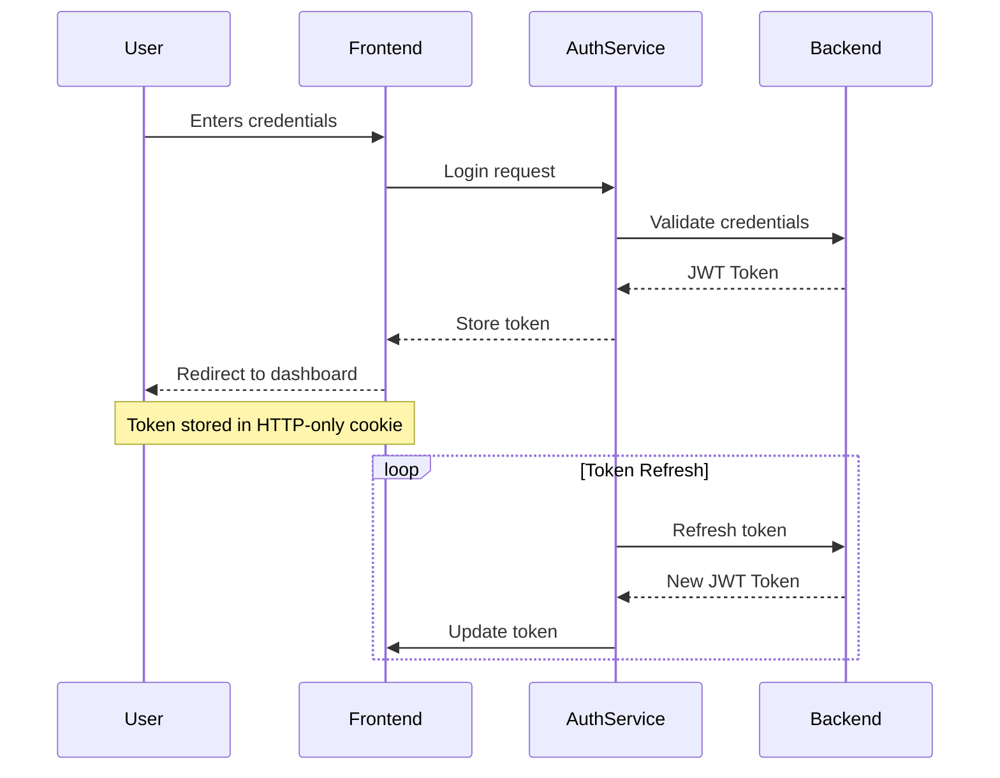

## 📊 Data Flow Architecture

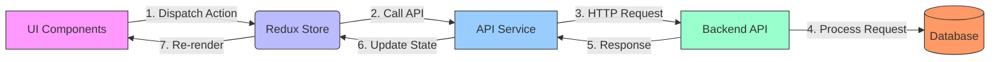

## 🚀 Deployment Architecture

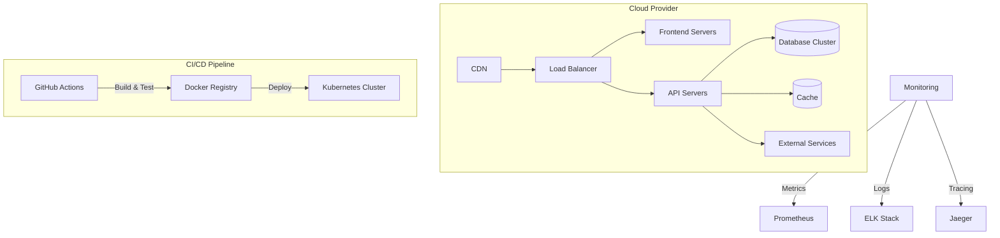

## 🧩 Module Interaction

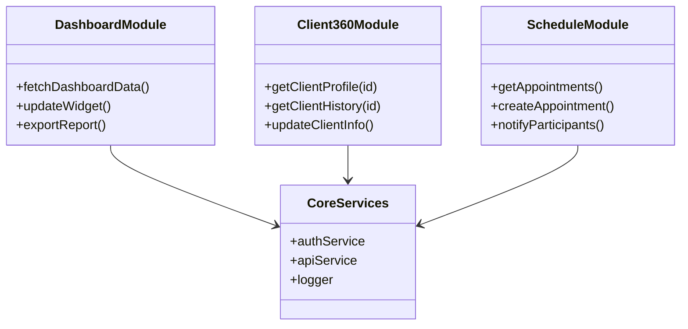

## 🔄 CI/CD Pipeline

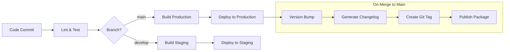

## 🛡️ Security Architecture

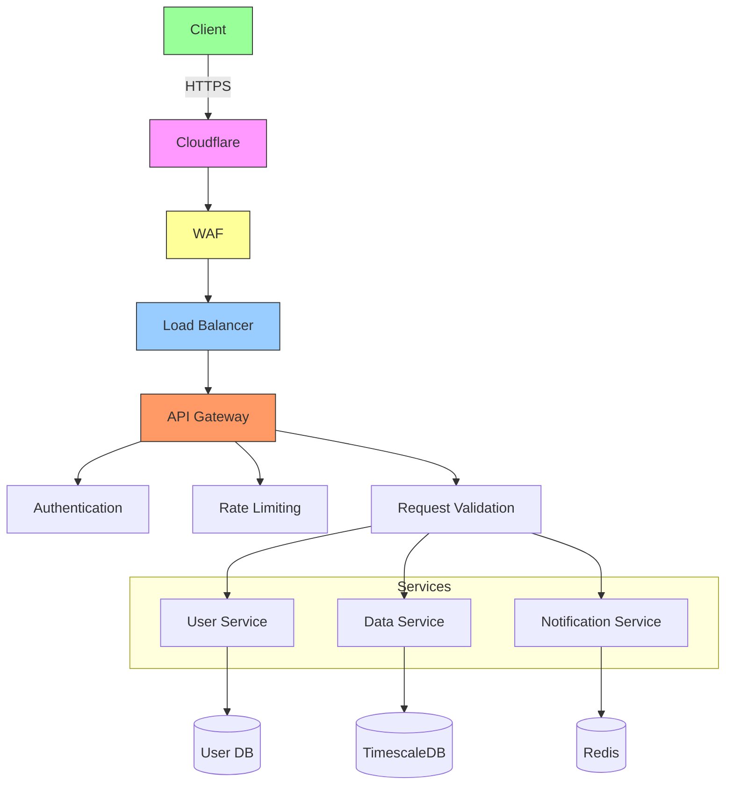

## Monitoring and Observability

### System Health Dashboard

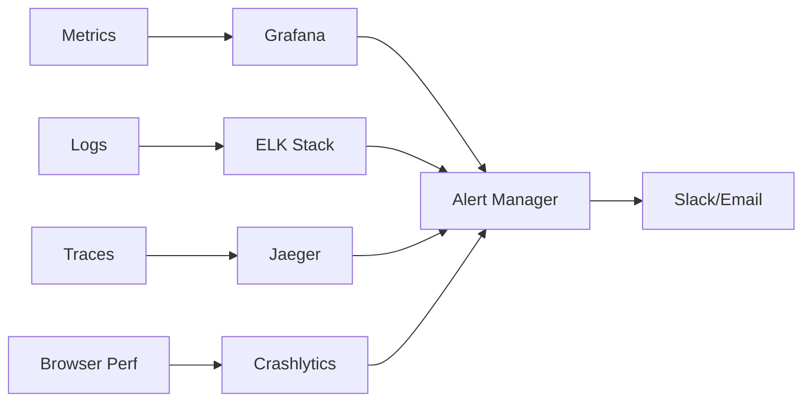

### Performance Budget

| Metric                  | Target       | Current | Status  |
|-------------------------|--------------|---------|---------|
| Time to Interactive    | < 3s         | 2.8s    | ✅       |
| First Contentful Paint | < 1.5s       | 1.2s    | ✅       |
| Bundle Size (gzipped)  | < 500KB      | 450KB   | ✅       |
| API Response Time (p95)| < 500ms      | 420ms   | ✅       |
| Lighthouse Score       | > 90         | 92      | ✅       |

## 🚀 Future Architecture Enhancements

### Event-Driven Architecture
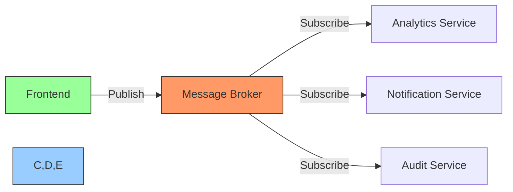

### Micro-frontend Architecture
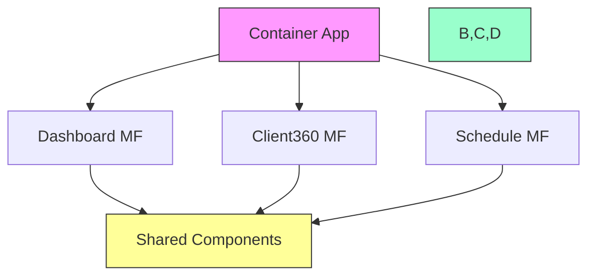
