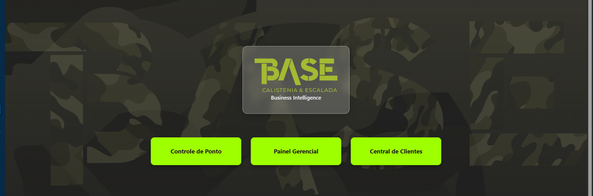

# 📊 SaaS Business Intelligence Platform

<div align="center">
  
  
  <p>Modern, scalable, and intuitive BI solution for data-driven organizations</p>

  <!-- Project Status -->
  <p>
    <a href="LICENSE">
      
    </a>
    <a href="https://github.com/your-org/saas-platform/releases">
      
    </a>
    <a href="https://github.com/your-org/saas-platform/actions">
      
    </a>
  </p>

  <!-- Tech Stack -->
  <p>
    <a href="https://reactjs.org/">
      
    </a>
    <a href="https://www.typescriptlang.org/">
      
    </a>
    <a href="https://nodejs.org/">
      
    </a>
  </p>

  <!-- Documentation -->
  <p>
    <a href="https://docs.saas-platform.com">
      
    </a>
    <a href="CONTRIBUTING.md">
      
    </a>
  </p>
</div>

## 📚 Documentation

### 📦 Project Modules

| Module | Description | Documentation | Status |
|--------|-------------|----------------|--------|
| **Business Intelligence Dashboard** | Core analytics and reporting dashboard | [View Docs](src/pages/base_business-intelligence-dashboard/README-Dash.md) | ✅ Active |
| **Client 360° Panel** | Customer data and interaction management | [View Docs](src/pages/painel-cliente-360/README-360.md) | ✅ Active |
| **Schedule Manager** | Employee scheduling and time tracking | [View Docs](src/pages/schedule-manager/README-Ponto.md) | ✅ Active |

### 📖 Getting Started

| Document | Description | Last Updated |
|----------|-------------|--------------|
| [📋 Quick Start](docs/GETTING_STARTED.md) | 5-minute setup guide | 2025-08-12 |
| [🔧 Development Guide](CONTRIBUTING.md) | Setup, workflows, and contribution guidelines | 2025-08-12 |
| [🚀 Project Status](PROJECT_STATUS.md) | Current progress, roadmap, and milestones | 2025-08-12 |

### 📚 Documentation Hub

#### Core Documentation

| Document | Description | Last Updated |
|----------|-------------|--------------|
| [📖 Developer Guide](docs/DEVELOPER_GUIDE.md) | Comprehensive guide for developers | 2025-08-13 |
| [🔍 API Reference](docs/API_REFERENCE.md) | Complete API documentation | 2025-08-13 |
| [🗃️ Data Models](docs/DATA_MODELS.md) | Database schemas and data structures | 2025-08-13 |
| [🧩 Components](docs/COMPONENTS.md) | UI component architecture | 2025-08-13 |

#### Technical References

| Reference | Description | Status |
|-----------|-------------|--------|
| [🚀 Getting Started](docs/GETTING_STARTED.md) | Quick start guide | Coming Soon |
| [🧪 Testing Strategy](docs/TESTING.md) | Testing approach and guidelines | Coming Soon |
| [🔒 Security Guidelines](docs/SECURITY.md) | Security best practices | Coming Soon |
| [🚀 Deployment Guide](docs/DEPLOYMENT.md) | CI/CD and infrastructure | Coming Soon |

#### Module Documentation

| Module | Description | Documentation | Status |
|--------|-------------|----------------|--------|
| 📊 Business Intelligence Dashboard | Core analytics and reporting platform | [View Documentation](src/pages/base_business-intelligence-dashboard/README-Dash.md) | ✅ Active |
| 👥 Client 360° Panel | Comprehensive customer data and interaction management | [View Documentation](src/pages/painel-cliente-360/README-360.md) | ✅ Active |
| 📅 Schedule Manager | Employee scheduling and time tracking system | [View Documentation](src/pages/schedule-manager/README-Ponto.md) | ✅ Active |

### 🔍 Quick Links

- [📋 Project Status](PROJECT_STATUS.md)
- [📝 Changelog](CHANGELOG.md)
- [🤝 Contributing](CONTRIBUTING.md)
- [❓ FAQ](docs/FAQ.md)

### 🔍 Search Documentation

<!-- Add search functionality here when documentation site is set up -->

```markdown
[Search Documentation](https://your-org.github.io/saas-platform/search)
```

## 📌 Overview

A comprehensive Business Intelligence platform built with modern web technologies, providing data visualization, client management, and scheduling capabilities in a unified interface.

### 🚀 Key Features

- **Business Intelligence Dashboard**: Interactive data visualization and analytics
- **Client 360° View**: Comprehensive client profiles and insights
- **Schedule Management**: Appointment and task scheduling system
- **Modular Architecture**: Independent yet integrable components
- **Responsive Design**: Works across desktop and mobile devices

### 🛠 Technology Stack

- **Frontend**: 
  - React 19 with TypeScript
  - Vite for build tooling
  - TailwindCSS for styling
  - React Query for data fetching
  - Chart.js for data visualization

- **Testing**:
  - Vitest for unit testing
  - Playwright for E2E testing
  - React Testing Library for component testing

- **Development Tools**:
  - ESLint + Prettier for code quality
  - TypeScript for type safety
  - Vite for fast development server

## 🚀 Getting Started

### Prerequisites

- Node.js 18+ and npm/yarn
- Git
- (Optional) Docker for containerization

### 🛠 Installation

#### 1. Clone the Repository
```bash
git clone https://github.com/your-org/saas-platform.git
cd saas-platform
```

#### 2. Install Dependencies
```bash
# Using npm
npm install

# Or using Yarn
yarn

# Or using pnpm (recommended for monorepos)
corepack enable
pnpm install
```

#### 3. Environment Setup
```bash
# Copy example environment file
cp .env.example .env

# Configure environment variables
nano .env  # or open in your preferred editor
```

#### 4. Database Setup
```bash
# Start local database (requires Docker)
docker-compose up -d db

# Run database migrations
npm run db:migrate
```

#### 5. Start Development Server
```bash
# Start frontend development server
npm run dev

# In a separate terminal, start backend server
npm run dev:server
```

### Development

Start the development server:
```bash
npm run dev
# or
yarn dev
```

### Building for Production

```bash
# Build the application
npm run build
# or
yarn build

# Preview the production build
npm run preview
# or
yarn preview
```

## 🏗 Architecture

### High-Level Overview


### Core Components

#### 1. Frontend Architecture
- **React 19** with TypeScript
- **Vite** for build tooling
- **React Query** for data fetching and caching
- **Redux Toolkit** for global state management
- **TailwindCSS** for utility-first styling
- **React Router** for navigation

#### 2. Backend Services
- **RESTful API** with Express.js
- **JWT** for authentication
- **PostgreSQL** for relational data
- **MongoDB** for document storage
- **Redis** for caching and real-time features
- **Message Queue** for background processing

#### 3. Data Flow


### System Architecture

For a detailed breakdown of the system architecture, please refer to the [Architecture Documentation](ARCHITECTURE.md).

## 📊 Data Models

The application uses a combination of relational and document-based data models. Below is a high-level overview of the core entities and their relationships.


### Key Entities

#### 1. User Management
- **User**: System users with authentication details
- **Role**: Permission groups (Admin, Manager, User)
- **Permission**: Granular access controls

#### 2. Client Management
- **Client**: Business customers
- **Contact**: Individual contacts within client organizations
- **Deal**: Sales opportunities

#### 3. Analytics
- **Dashboard**: Collection of visualizations
- **Widget**: Individual data visualizations
- **Dataset**: Data sources for visualizations

For a comprehensive reference of all data models, relationships, and schemas, please see the [Data Models Documentation](docs/DATA_MODELS.md).

## 🔒 Security

### Authentication & Authorization


### Security Measures

#### 1. Authentication
- **JWT** with short-lived access tokens
- **Refresh tokens** for session management
- **Multi-factor authentication** (MFA) support
- **OAuth 2.0** for third-party integrations

#### 2. Authorization
- **Role-Based Access Control (RBAC)**
- **Attribute-Based Access Control (ABAC)**
- **Row-Level Security** in database

#### 3. Data Protection
- **Encryption at rest** for sensitive data
- **TLS 1.3** for data in transit
- **Input validation** and output encoding
- **CORS** policy enforcement
- **Rate limiting** and DDoS protection

#### 4. Compliance
- **GDPR** compliant data handling
- **SOC 2** Type II certification (in progress)
- Regular security audits and penetration testing

For detailed security policies and procedures, please refer to the [Security Documentation](docs/SECURITY.md).

## 🧪 Testing

### Testing Strategy


### Test Suite

#### 1. Unit Testing
- **Framework**: Vitest
- **Coverage**: >80% statement coverage required
- **Location**: `src/**/*.test.ts`

#### 2. Component Testing
- **Framework**: React Testing Library
- **Focus**: Component rendering and interactions
- **Location**: `src/components/**/__tests__`

#### 3. Integration Testing
- **Framework**: Vitest + MSW
- **Focus**: API interactions and state management
- **Location**: `src/__tests__/integration`

#### 4. E2E Testing
- **Framework**: Playwright
- **Focus**: Critical user journeys
- **Location**: `e2e/tests`

### Running Tests

```bash
# Run all tests
npm test

# Run unit tests in watch mode
npm run test:unit

# Run component tests
npm run test:components

# Run E2E tests
npm run test:e2e

# Generate coverage report
npm run test:coverage

# Run performance tests
npm run test:performance
```

For more details on testing practices and guidelines, see the [Testing Documentation](docs/TESTING.md).

## 🚀 Deployment

### Deployment Options

#### 1. Cloud Platform (Recommended)
[](https://vercel.com/new/git/external?repository-url=https%3A%2F%2Fgithub.com%2Fyour-org%2Fsaas-platform)
[](https://app.netlify.com/start/deploy?repository=https://github.com/your-org/saas-platform)

#### 2. Self-Hosted

##### Prerequisites
- Node.js 18+
- PostgreSQL 14+
- Redis 6+
- Nginx (recommended)

##### Production Build

```bash
# Install dependencies
npm ci --production

# Build the application
npm run build

# Start the production server
NODE_ENV=production node server.js
```

### Containerization

#### Docker Compose (Development)

```yaml
version: '3.8'
services:
  web:
    build: .
    ports:
      - "3000:3000"
    environment:
      - NODE_ENV=development
      - DATABASE_URL=postgres://user:pass@db:5432/dbname
    depends_on:
      - db
      - redis

  db:
    image: postgres:14
    environment:
      - POSTGRES_USER=user
      - POSTGRES_PASSWORD=pass
      - POSTGRES_DB=dbname
    volumes:
      - postgres_data:/var/lib/postgresql/data

  redis:
    image: redis:6
    ports:
      - "6379:6379"

volumes:
  postgres_data:
```

#### Kubernetes (Production)

```yaml
# Example deployment.yaml
apiVersion: apps/v1
kind: Deployment
metadata:
  name: saas-platform
spec:
  replicas: 3
  selector:
    matchLabels:
      app: saas-platform
  template:
    metadata:
      labels:
        app: saas-platform
    spec:
      containers:
      - name: saas-platform
        image: your-registry/saas-platform:latest
        ports:
        - containerPort: 3000
        env:
        - name: NODE_ENV
          value: production
        - name: DATABASE_URL
          valueFrom:
            secretKeyRef:
              name: db-secrets
              key: connection-string
---
apiVersion: v1
kind: Service
metadata:
  name: saas-platform
spec:
  selector:
    app: saas-platform
  ports:
    - protocol: TCP
      port: 80
      targetPort: 3000
  type: LoadBalancer
```

For detailed deployment instructions, see the [Deployment Guide](docs/DEPLOYMENT.md).

## 🤝 Contributing

We welcome contributions from the community! Before you start, please read our [Contributing Guidelines](CONTRIBUTING.md).

### Quick Start for Contributors

1. **Setup Development Environment**
   ```bash
   # Fork and clone the repository
   git clone https://github.com/your-username/saas-platform.git
   cd saas-platform
   
   # Install dependencies
   npm install
   
   # Set up pre-commit hooks
   npm run prepare
   ```

2. **Create a Feature Branch**
   ```bash
   git checkout -b feat/your-feature-name
   ```

3. **Make Your Changes**
   - Follow the [code style guide](CONTRIBUTING.md#code-style)
   - Write tests for new features
   - Update documentation as needed

4. **Run Tests**
   ```bash
   npm test
   ```

5. **Commit Your Changes**
   ```bash
   git add .
   git commit -m "feat: add your feature description"
   ```

6. **Push and Open a Pull Request**
   ```bash
   git push origin feat/your-feature-name
   # Then create a PR on GitHub
   ```

### Reporting Issues
Found a bug or have a feature request? Please [open an issue](https://github.com/your-org/saas-platform/issues/new/choose).

### Code of Conduct
Please note that this project is released with a [Contributor Code of Conduct](CODE_OF_CONDUCT.md). By participating in this project you agree to abide by its terms.

## 📝 License

This project is licensed under the MIT License - see the [LICENSE](LICENSE) file for details.

## 📧 Contact

### Short-term Enhancements
- [ ] Implement user authentication
- [ ] Add role-based access control
- [ ] Enhance dashboard customization
- [ ] Improve mobile responsiveness

### Long-term Goals
- [ ] Advanced analytics with machine learning
- [ ] Custom report builder
- [ ] Third-party integrations
- [ ] Mobile application

## 📞 Contact

For support, email support@saasplatform.com or open an issue in the repository.

---

<div align="center">
  Made with ❤️ by the SaaS Platform Team
</div>
