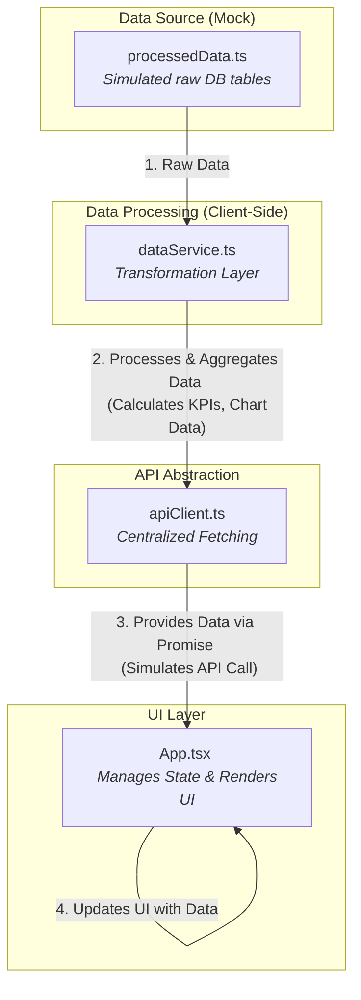

<div align="center">

# Business Intelligence Dashboard
  
    
  <p>
    
    
    
    
    
    
    
  </p>
</div>

This project is a sophisticated, data-driven Business Intelligence (BI) dashboard built with React, TypeScript, and Tailwind CSS. It provides a comprehensive suite of tools for visualizing and analyzing business data, including sales funnels, financial performance, and team productivity. A key feature of this dashboard is its integration with the Google Gemini API to generate actionable, AI-powered insights and provide an interactive business assistant.

## ✨ Features

- **Multi-Page Dashboard**: Separate, detailed pages for different business areas: Commercial, Sales, Opportunities, Conversions, Financial, Strategic, and Productivity.
- **Advanced & Predictive Analytics**: Dedicated pages for deep-dive analysis and future performance forecasting.
- **Interactive Visualizations**: A rich library of charts and graphs built with **Recharts** and **D3.js**, including funnels, heatmaps, radar charts, and more.
- **Dynamic Filtering**: Easily filter the entire dashboard's data by predefined date ranges (e.g., Today, 7 Days, 30 Days, etc.).
- **AI-Powered Insights**:
  - **Insights Panel**: Generates a concise summary and actionable insights based on the current data view.
  - **Business Assistant**: An interactive chat assistant, powered by the Gemini API, that can answer natural language questions about the dashboard data.
- **Responsive Design**: A clean, modern UI that adapts to different screen sizes.
- **Component-Based Architecture**: Built with reusable React components for maintainability and scalability.

---

## 🛠️ Technologies Used

-   **Frontend**: React 19, TypeScript, Tailwind CSS
-   **Data Visualization**: Recharts, D3.js
-   **AI Integration**: Google Gemini API (`@google/genai`)
-   **Module System**: ES Modules with Import Maps (via esm.sh)

---

## 📂 Project Structure

The project is organized into several key directories:

```
/
├── public/
├── src/
│   ├── components/
│   │   ├── charts/         # Recharts & D3 chart components
│   │   ├── ... (page and UI components)
│   ├── services/
│   │   ├── apiClient.ts      # API abstraction layer
│   │   ├── dataService.ts    # Core data processing (acts as mock API)
│   │   ├── geminiService.ts  # Handles communication with Google Gemini API
│   │   └── processedData.ts  # Simulates a raw database source
│   ├── App.tsx             # Main application component (routing & state)
│   ├── index.tsx           # React application entry point
│   └── types.ts            # TypeScript type definitions
├── index.html              # Main HTML file
└── README.md               # This file
```

---

## ⚙️ Backend Operations & Architecture

This section details the current data handling architecture and outlines the roadmap for transitioning to a production-ready backend.

### Current Architecture: Client-Side Mock

The dashboard currently operates entirely on the client side, using a mock data layer to simulate a real backend. This architecture is designed for rapid prototyping and allows for a seamless transition to a live API.



#### 1. Source of Truth (`services/processedData.ts`)

-   This file acts as the mock database. It exports several arrays of objects (`FatoOportunidades`, `DimUsuario`, etc.) that simulate raw, unaggregated "Fact" and "Dimension" tables you would find in a data warehouse. This provides a realistic foundation for data processing.

#### 2. Data Transformation Layer (`services/dataService.ts`)

-   This is the "brain" of the mock backend. Its primary export, `getAllData()`, consumes the raw data from `processedData.ts` and performs all the necessary aggregations, calculations, and transformations to shape the data for the UI components.
-   **Data Veracity**: This service is responsible for ensuring data accuracy. For example, it replaces previously hardcoded values (like stage IDs) with dynamic lookups. It also includes functions like `calculateDataQualityScore()` which dynamically assesses the completeness of the source data, providing a real-time metric on data integrity.

#### 3. API Abstraction Layer (`services/apiClient.ts`)

-   This service acts as a crucial intermediary between the UI and the data source. All components that need data call `fetchDataFromApi()` from this file.
-   This abstraction is key for production migration: to switch from the mock data to a real API, **only this file needs to be modified**.

#### 4. Asynchronous State Management (`App.tsx`)

-   The main `App` component manages the data-fetching lifecycle, tracking `loading`, `succeeded`, and `failed` states. This ensures the user always receives clear feedback (e.g., loading spinners, error messages) and makes the application resilient to network issues when connected to a real backend.

---

## 🚀 Production Roadmap: From Mock to Live

This roadmap outlines a phased approach to evolving the dashboard from its current state into a scalable, production-grade application.

### Phase 0: Current State (Client-Side Prototyping)

-   **Architecture**: All data is stored, processed, and rendered in the browser.
-   **Pros**: Excellent for rapid UI development, offline-first functionality, and easy setup.
-   **Limitations**: Not scalable. Performance will degrade significantly with large datasets. All business logic is exposed on the client.

### Phase 1: Lift & Shift to a Simple Backend

The first and most critical step is to move the data processing logic from the client to a server. This immediately addresses the major limitations of the current architecture.

-   **Goal**: Create a Node.js backend that serves the same data object as the current `dataService.ts`.
-   **Action**:
    1.  Set up a simple Node.js/Express server.
    2.  Move `dataService.ts` and `processedData.ts` to the backend.
    3.  Create an API endpoint (e.g., `/api/dashboard`) that calls the `getAllData` function and returns the result as JSON.
    4.  Update `apiClient.ts` in the frontend to fetch from this new endpoint.

-   **Example Node.js/Express Server (`server.js`)**:
    ```javascript
    const express = require('express');
    const cors = require('cors');
    // Assuming you have converted dataService to CommonJS or are using a transpiler
    const { getAllData } = require('./services/dataService'); 
    
    const app = express();
    app.use(cors()); // Enable CORS for your frontend
    const port = 3001;

    app.get('/api/dashboard', async (req, res) => {
      try {
        // Pass query params as filters
        const filters = {
          dateRange: req.query.dateRange || 'all',
        };
        const data = await getAllData(filters);
        res.json(data);
      } catch (error) {
        console.error('Error fetching dashboard data:', error);
        res.status(500).send('Internal Server Error');
      }
    });

    app.listen(port, () => {
      console.log(`BI Dashboard backend listening on port ${port}`);
    });
    ```
-   **Target Architecture**:
    ```mermaid
    graph TD
        subgraph "Frontend"
            A[React App] -- "1. fetch('/api/dashboard')" --> B[apiClient.ts]
        end
        subgraph "Backend (Node.js)"
            C[Express Server] -- "2. Calls getAllData()" --> D[dataService.ts]
            D -- "3. Reads from" --> E[processedData.ts]
            C -- "4. Returns JSON" --> A
        end
    ```

### Phase 2: Database Integration

-   **Goal**: Replace the static mock data (`processedData.ts`) with a real database.
-   **Action**:
    1.  Provision a database (e.g., PostgreSQL, MySQL).
    2.  Migrate the schemas from `processedData.ts` into database tables.
    3.  Populate the database with real data.
    4.  Refactor `dataService.ts` on the backend to execute SQL queries (using an ORM like Prisma or a query builder like Knex.js) instead of reading from local files. The aggregation logic will be translated into efficient SQL queries.
-   **Target Architecture**:
    ```mermaid
    graph TD
        A[React App] --> B[Node.js Backend]
        B -- "SQL Queries" --> C[(Database)]
    ```

### Phase 3: Performance Optimization & Caching

-   **Goal**: Improve response times for frequently requested data.
-   **Action**:
    1.  Introduce a caching layer like **Redis**.
    2.  The backend will first check Redis for cached data based on the filter parameters.
    3.  If data is not in the cache (a "cache miss"), it queries the database, stores the result in Redis with an expiration time, and then returns the data to the client. Subsequent requests with the same filters will be served directly from the cache.
-   **Target Architecture**:
    ```mermaid
    graph TD
        A[React App] --> B[Node.js Backend]
        B -- "1. Check Cache" --> C{Redis Cache}
        C -- "Cache Hit" --> B
        C -- "Cache Miss" --> D[Query DB]
        D[Query DB] --> E[(Database)]
        D -- "Store Result" --> C
    ```

### Phase 4: Real-Time Data & ETL

-   **Goal**: Ensure the data in the dashboard is always up-to-date without manual intervention.
-   **Action**:
    1.  Set up an **ETL (Extract, Transform, Load)** pipeline.
    2.  This pipeline will run on a schedule (e.g., nightly) to pull data from various sources (CRMs, payment gateways), transform it into the required schema, and load it into the analytics database. This pre-aggregates data for fast lookups.
    3.  For real-time needs, explore technologies like WebSockets or Change Data Capture (CDC) streams.

---

## 🧩 Component Breakdown

The application is built using a modular component architecture.

### Main Components

-   **`App.tsx`**: The top-level component. It manages the global state, including the current page, filters, and the master `chartData` object. It fetches data via `apiClient.ts` whenever filters change and renders the appropriate page component.

-   **`Sidebar.tsx`**: The main navigation component on the left. It allows users to switch between different dashboard pages and can be collapsed to save space.

### Page Components

These components act as containers for a specific view, organizing various charts and KPIs.
-   `Dashboard.tsx`: The main "Commercial" landing page.
-   `VendasPage.tsx`: Focuses on sales performance, ranking, and activity types.
-   `OpportunitiesPage.tsx`: Displays data about open and closed sales opportunities.
-   `ConversionsPage.tsx`: Visualizes the conversion funnel and stage entries.
-   `FinancialPage.tsx`: Focuses on revenue, expenses, and cash flow.
-   `StrategicPage.tsx`: Contains high-level strategic charts like cohort analysis and funnel drop-off.
-   `ProductivityPage.tsx`: Analyzes team performance with radar charts, heatmaps, and box plots.
-   `AdvancedAnalyticsPage.tsx`: A dashboard with more complex, deep-dive visualizations.
-   `PredictiveAnalyticsPage.tsx`: Showcases forecasted data for key metrics like revenue and LTV.

### AI Components

-   **`InsightsPanel.tsx`**: A collapsible panel that uses `geminiService.generateInsights` to produce a static analysis of the current data view on demand.

-   **`BusinessAssistant.tsx`**: Provides an interactive chat experience. It initializes a Gemini chat session with a `systemInstruction` containing the current dashboard data and streams responses to user questions.

### UI & Layout Components

-   **`ChartCard.tsx`**: A consistent wrapper component for all charts, providing a title and standardized styling.
-   **`FilterControls.tsx`**: A set of buttons for applying global date range filters to the dashboard.
-   **`ClientLifetimeValueCard.tsx`**: A modern card for displaying high-level KPIs with titles, values, descriptions, and trend icons.
-   **`EmptyChartState.tsx`**: A reusable component displayed when a chart has insufficient data, improving user experience.

### Chart Components (`components/charts/`)

This directory contains all the data visualization components.

-   **Recharts Components**: Most charts are built with Recharts, a composable charting library for React. Examples include `ConversionFunnelChart.tsx`, `RevenueExpenseChart.tsx`, and `UserPerformanceRadarChart.tsx`.

-   **D3.js Components**: For more complex or custom visualizations, D3.js is used. A React component wraps the D3 logic, using a `useRef` to manage the SVG container. Examples include `CohortAnalysisChart.tsx` and `SalesCycleBoxPlot.tsx`.

---

## 📊 Data Structures (`types.ts`)

All data schemas and type definitions are centralized in `types.ts`. This ensures type safety and a clear understanding of the data flowing through the application.

### Key Interfaces:

-   **`AllData`**: The primary data object returned by the `apiClient`. It's a comprehensive structure containing all the data needed to render every chart and KPI on the dashboard. It contains two main keys:
    - `kpis`: An object holding all the calculated Key Performance Indicators (e.g., `totalRevenue`, `conversionRate`, `averageLtv`).
    - Chart Data Keys: Several other keys (`funnel`, `leadEvolution`, etc.) that hold the processed data arrays for each specific chart.

-   **Chart-Specific Types**: Each chart has its own data type to ensure the correct data shape is passed (e.g., `FunnelData`, `RevenueExpenseData`, `CohortData`).

-   **`FilterState`**: Manages the state of the dashboard's filters.

---

## 🚀 Getting Started

### Prerequisites

-   An active Google Gemini API key.

### Setup

1.  **Set up Environment Variables:**
    The Gemini API requires an API key. This key must be provided as an environment variable named `API_KEY`. The application is hard-coded to read it from `process.env.API_KEY`. In a real development environment, this would be managed via a hosting provider's secret management or a local `.env` file with a build tool.

