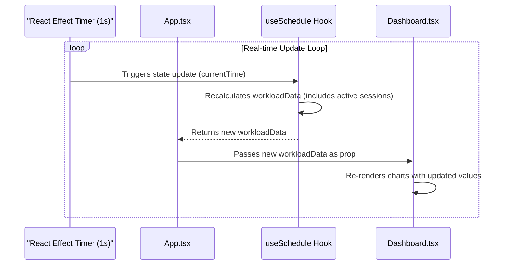
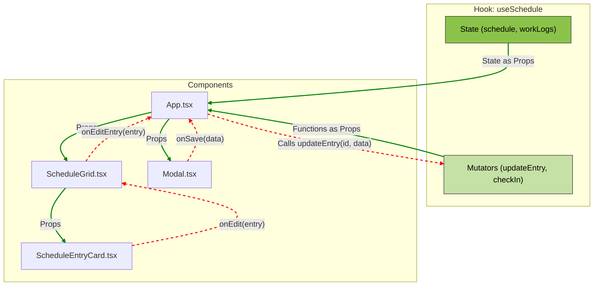
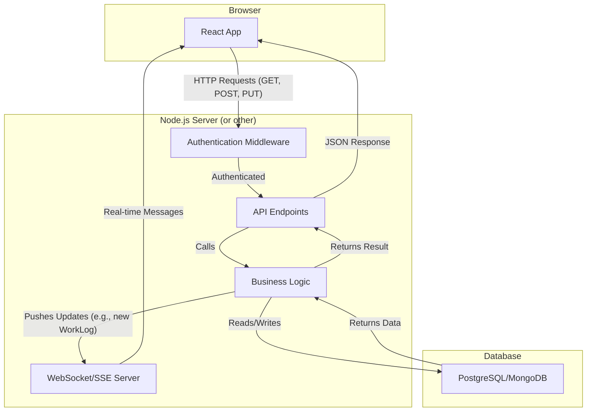

<div align="center">

<h1>Gestor de Grade Horária</h1>
  
    
  <p>
    
    
    
  </p>
</div>

Uma aplicação web sofisticada e rica em funcionalidades para gerenciar horários de professores, rastrear horas de trabalho em tempo real e visualizar dados de desempenho. Construída com uma stack de tecnologia moderna, esta aplicação oferece uma experiência de usuário altamente interativa e responsiva, projetada para otimizar o planejamento operacional.

<div>

<div>

## ✨ Funcionalidades Inovadoras

* **Interactive Weekly Schedule:** A responsive grid displaying all classes and work shifts, repeating consistently across any week.
* **Automated Supervision Scheduling:** Automatically assigns and visualizes "Horário Livre" supervision shifts, ensuring accountability for facility and equipment oversight.
* **Schedule Focus Mode:** A full-screen, distraction-free view of the schedule grid, perfect for detailed planning.
* **Teacher Filtering:** Instantly filter the schedule to view classes for a specific teacher.
* **Dynamic Event Layout:** Intelligently handles overlapping events and displays key information at a glance, including class type and a list of assigned teachers' names.
* **Real-time Check-in/Check-out:** Teachers can clock in and out, with their status and work duration updated live.
* **Real-time Dashboard Sync:** The performance dashboard updates every second, reflecting the hours from both completed and currently active work sessions.
* **Unplanned Work Logging:** Automatically creates schedule entries for check-ins that don't align with a planned class, ensuring all work is visually accounted for.
* **Rich Data Editing:** In-place time editing via popovers and detailed editing via modals.
* **Toast Notifications:** A sleek, non-intrusive notification system for user feedback on actions and errors.
* **Light & Dark Mode:** A sleek, modern UI with a user-toggleable dark theme, which is the default.

---

## 🚀 Guia de Execução

This is a client-side single-page application. No build step is required.

1. Clone the repository.
2. Open the `index.html` file in your web browser.

---

## 🚀 Tecnologias de Ponta

* **Frontend Library:** React 19
* **Language:** TypeScript
* **Styling:** Tailwind CSS (configured directly in `index.html`) with a custom theme for colors and dark mode.
* **Charts:** Recharts for data visualization.
* **Icons:** A custom set of SVG icons as React components.
* **State Management:** A custom React hook (`useSchedule`) serves as the centralized state management solution.

---

## 📂 Estrutura de Arquivos

The project is organized to promote separation of concerns, making it scalable and maintainable.

```
/
├── components/      # Reusable React components
│   ├── icons.tsx    # SVG icons as components
│   └── ...          # All other UI components
├── docs/            # Documentation files
├── hooks/           # Custom React hooks for state and logic
│   └── useSchedule.ts # Central state management
├── services/        # Data fetching and business logic
│   └── api.ts       # Mock backend API
├── index.html       # Main HTML entry point
├── index.tsx        # React application root
├── types.ts         # TypeScript type definitions
└── README.md        # You are here
```

---

## 🎨 Filosofia de Design UI/UX

The application's design is driven by a focus on clarity, efficiency, and a modern aesthetic.

### Dark-First, High-Contrast Aesthetics

* **Default Dark Mode:** The app defaults to a dark theme to reduce eye strain in typical office or home lighting conditions. The color palette (`charcoal-black`, `army-olive`, `lime-green`) was chosen to create a professional, calming, yet visually striking interface.
* **High Contrast:** The vibrant `lime-green` acts as a primary accent color, drawing attention to key actions and active states, ensuring excellent legibility against the dark backgrounds.

### Responsiveness & Accessibility

* **Mobile-First Approach:** The layout is built with responsiveness in mind, ensuring a seamless experience from large desktop monitors down to mobile devices.
* **Accessibility (a11y):** Semantic HTML5 elements (`button`, `header`, `main`) and ARIA attributes (`aria-label`, `aria-expanded`) are used throughout to ensure the application is navigable and understandable for users of assistive technologies.

### Progressive Disclosure

To avoid overwhelming the user, the UI employs a "progressive disclosure" strategy.

* **Schedule Grid:** Shows essential information at a glance.
* **Popovers:** Quick, in-context actions like editing an event's time are handled in small popovers that don't interrupt the user's workflow.
* **Modals:** More complex operations, like editing all details of a class or adding a manual work log, are handled in full-featured modals that command the user's full attention.

### Component Standardization

* **Consistent Controls:** To provide a cohesive and predictable user experience, all date and time selection tasks are handled by a standardized set of popover components. The native browser date/time pickers have been replaced with custom, theme-aware controls (`CalendarPopover`, `WheelTimePickerPopover`) that ensure a consistent look and feel across all platforms.
* **Ergonomic Time Selection:** The `WheelTimePicker` component was chosen as the standard for time input due to its excellent usability on both touch and mouse-based devices, offering a modern and intuitive alternative to text entry.

---

## ⚙️ Arquitetura Detalhada

The application is architected to be robust, scalable, and ready for a transition to a real backend. It's built on a clear separation of the view, state management, and service layers.

### The API Service Layer (`services/api.ts`)

This file acts as the **single source of truth** for all data interactions. It perfectly simulates a backend API.

* **Decoupling:** Components and hooks **never** mutate data directly. They call functions from `api.ts` (e.g., `fetchInitialData`, `updateEntry`). This means the mock API can be replaced with real HTTP requests (e.g., using `fetch` or `axios`) without changing any other part of the application.
* **Async Simulation:** Each function returns a `Promise` and uses a `delay` to simulate network latency, ensuring the UI is built to handle real-world loading and error states gracefully.
* **Immutability:** All data mutation functions are designed to be immutable, creating new data structures instead of modifying them in place. This prevents side effects and ensures a predictable, reliable state management flow.

### State Management: The `useSchedule` Hook

For an application of this scale, a custom React hook provides a lightweight yet powerful state management solution, avoiding the boilerplate of libraries like Redux. The `useSchedule` hook is the "brain" of the application.

* **Centralized Logic:** It encapsulates all client-side state (teachers, schedule, work logs) and the logic for mutating it.
* **Asynchronous Handling:** It manages `isLoading` and `error` states, allowing the root `App.tsx` component to render loading spinners or error messages.
* **Performance Optimization:** The hook leverages memoization (`useMemo`) to compute derived data like `workloadData`, preventing expensive recalculations on every render. Consuming components also use `useCallback` and `React.memo` to prevent unnecessary re-renders, keeping the UI highly responsive even with complex schedules.

### Real-time Data Synchronization

The live-updating dashboard is a core feature, achieved through a clever combination of state management and timers.

1. An `useEffect` hook inside `useSchedule` sets up a `setInterval` that updates a `currentTime` state variable every second.
2. The `workloadData` memoized calculation depends on `currentTime`. Therefore, it re-runs every second.
3. The calculation logic is designed to handle active work sessions (where `checkOut` is `undefined`). It uses `currentTime` as the temporary end time for these sessions.
4. This newly calculated `workloadData` is passed as a prop to the `Dashboard`, which re-renders its charts, creating a live view of the team's performance.



### Uni-directional Data Flow

The application strictly follows React's uni-directional data flow model, which makes the app predictable and easier to debug.



* **Green Arrows (Data Down):** State flows down from the `useSchedule` hook to child components as props.
* **Red Arrows (Events Up):** User interactions in child components trigger callback functions passed down as props, which ultimately call the mutator functions in the hook to update the state.

To optimize this flow, components like `ScheduleEntryCard` are wrapped in `React.memo`, ensuring they only re-render when their specific props have actually changed, rather than re-rendering every time their parent does.

---

## 🧬 Guia de Dados Operacionais

The application's logic revolves around a set of interconnected data structures defined in `types.ts`. Understanding their relationship is key to understanding the app's functionality.

### Core Data Models

* **`ScheduleEntry`**: Represents a **planned** block of time. This is a class, a meeting, or any pre-scheduled event. It has a start time, end time, teacher, and class type.
* **`WorkLog`**: Represents an **actual** period of work. It is created when a teacher `checkIn` and completed when they `checkOut`. It is the source of truth for calculating worked hours.

### The Link: Planned vs. Actual

The system is designed to connect the planned schedule with the actual work performed.

1. **Check-in Logic:** When a teacher checks in, the system searches for a `ScheduleEntry` for that teacher at that specific time.

   * **Match Found:** If a planned `ScheduleEntry` exists, the new `WorkLog` is linked to it via the `ScheduleEntry.workLogId` property. This signifies that the teacher has started their planned class.
   * **No Match (Unplanned Work):** If no `ScheduleEntry` is found, the system assumes this is unplanned work (e.g., covering a shift, extra hours). To ensure this time is visually represented, it automatically creates a *new* `ScheduleEntry` with the `isUnplanned: true` flag and links the `WorkLog` to it.
2. **Check-out Logic:** When a teacher checks out, the corresponding `WorkLog` is updated with an `checkOut` time.

   * If this `WorkLog` was linked to an `unplanned` `ScheduleEntry`, the system also updates that entry's `endTime` to match the `checkOut` time, accurately reflecting the duration of the unplanned work on the schedule grid.

This clear separation and linking mechanism ensures that the schedule grid always provides a complete picture of both planned and actual activities, while the dashboard's performance metrics are accurately derived from the `WorkLog` data. The system also demonstrates more advanced business logic, such as automatically generating the three-hour `SUPERVISAO_LIVRE` (Supervision) entry and assigning the afternoon shift teachers to it, ensuring this critical period is always covered.

---

## 🛣️ Roadmap para Ambiente de Produção

This section outlines the steps to transition the application from using a mock API to a full-fledged production environment.

### Phase 1. Backend API & Database Migration

* **API Endpoints:** Design REST or GraphQL endpoints that mirror the functions in `services/api.ts`.
* **Database Schema:** The schemas for your database tables (e.g., in PostgreSQL or MongoDB) can be directly derived from the interfaces in `types.ts`.
* **Business Logic Transfer:** Move business logic from the client (`api.ts`) to the server to ensure data integrity and security. The client should only send requests and receive data. For example, the logic for creating linked or unplanned entries during a `checkIn` belongs on the server.

### Phase 2. Frontend Integration & Real-time Upgrade

* **API Client Update:** Update `services/api.ts` to replace the mock logic with `fetch` or `axios` calls to your new backend endpoints. No other frontend files should need to change.
* **Production Real-time**: The client-side timer for dashboard updates is great for a demo but not robust for production. This should be replaced with a more reliable method like **WebSockets** or **Server-Sent Events (SSE)**, where the server pushes updates to the client.

### Phase 3. Authentication & Authorization

* Implement a login system (e.g., using JWTs) and protect API endpoints. Define roles (Admin vs. Teacher) to control access to different features.

### Final Production Architecture Diagram



### Future Enhancements

* **User Roles & Permissions:** Granular control over what admins, teachers, and potentially students can see and do.
* **Student Portal:** A view for students to see their upcoming classes.
* **Advanced Reporting:** Generate and export PDF or CSV reports for payroll and performance analysis.
* **Automated Conflict Resolution:** An interface to flag and help resolve scheduling conflicts.
* **Notifications System:** In-app and/or email notifications for announcements and schedule changes.

---

## 🤝 Contribuição

While this is a showcase project, following contribution guidelines is good practice.

1. **Branching:** Create a new feature branch from `main` (e.g., `feature/add-student-profiles`).
2. **Code Style:** Keep code clean and readable. Follow the patterns established in the existing codebase.
3. **Commit Messages:** Use conventional commit messages (e.g., `feat: Add announcement editing`, `fix: Correct schedule layout overlap`).
4. **Pull Request:** Open a pull request back to `main` with a clear description of the changes.

