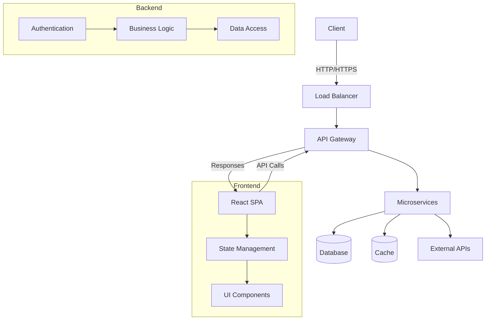
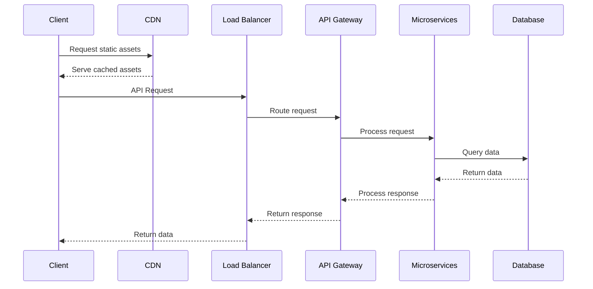
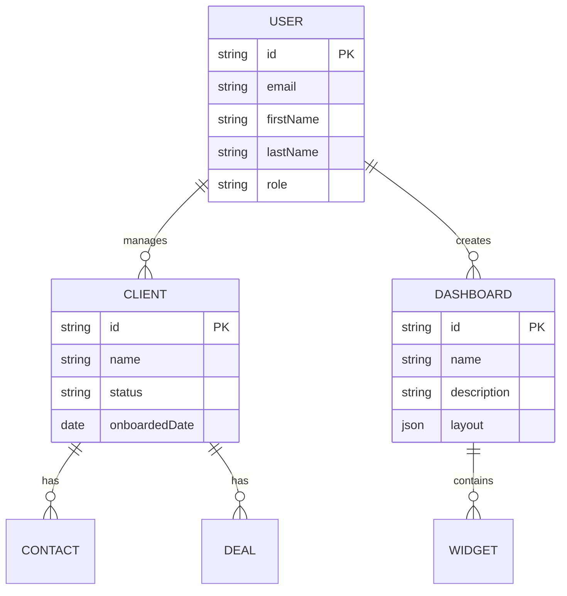
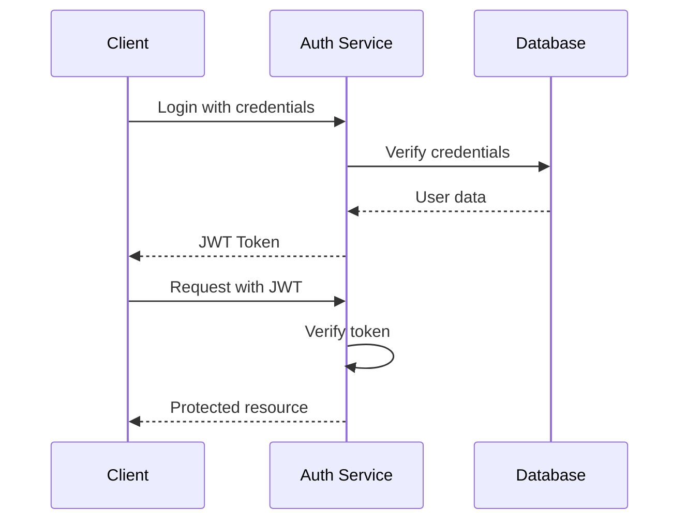
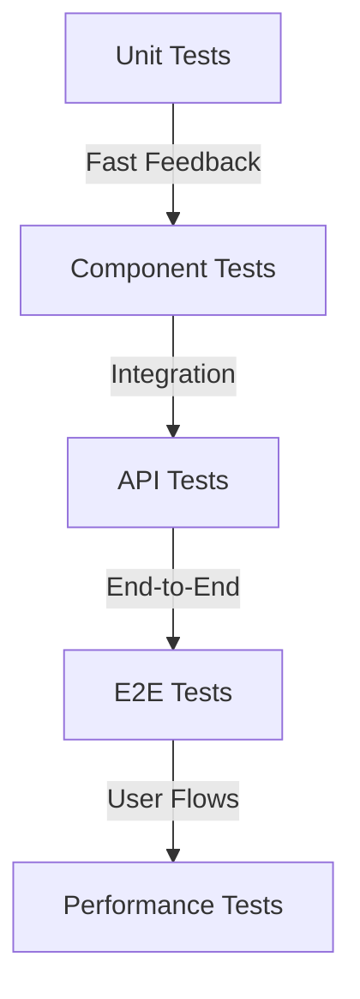

# 📊 Plataforma de Business Intelligence SaaS

<div align="center">
  
  
  <p>Solução de BI moderna, escalável e intuitiva para organizações orientadas a dados</p>
  
  <p>Transforme dados em insights acionáveis com nossa plataforma completa de análise de negócios. Desenvolvida para equipes que buscam eficiência e clareza na tomada de decisões baseadas em dados.</p>

  <!-- Project Status -->
  <p>
    <a href="LICENSE">
      
    </a>
    <a href="https://github.com/your-org/saas-platform/releases">
      
    </a>
    <a href="https://github.com/your-org/saas-platform/actions">
      
    </a>
  </p>

  <!-- Tech Stack -->
  <p>
    <a href="https://reactjs.org/">
      
    </a>
    <a href="https://www.typescriptlang.org/">
      
    </a>
    <a href="https://nodejs.org/">
      
    </a>
  </p>

  <!-- Documentation -->
  <p>
    <a href="https://docs.saas-platform.com">
      
    </a>
    <a href="CONTRIBUTING.md">
      
    </a>
  </p>
</div>

## 📑 Sumário Rápido

- [🔄 Controle de Versão e Fluxo de Trabalho](#-controle-de-versão-e-fluxo-de-trabalho)
  - [Começando Rápido](#-começando-rápido)
  - [Formato das Mensagens de Commit](#-formato-das-mensagens-de-commit)
  - [Processo de Pull Request](#-processo-de-pull-request)
- [📚 Documentação](#-documentação)
  - [📄 Documentação Principal](docs/INDEX.md)
    - [Visão Geral do Projeto](docs/README.md)
    - [Fluxo de Trabalho Git](docs/GIT_WORKFLOW.md)
    - [Guia do Desenvolvedor](docs/DEVELOPER_GUIDE.md)
  - [🏗️ Arquitetura](docs/ARCHITECTURE.md)
    - [Componentes do Sistema](docs/COMPONENTS.md)
    - [Modelos de Dados](docs/DATA_MODELS.md)
  - [🔌 API e Integração](docs/API_REFERENCE.md)
    - [Referência da API](docs/API_REFERENCE.md)
    - [Versionamento da API](docs/API_VERSIONING.md)
  - [🚀 Implantação](docs/DEPLOYMENT.md)
  - [🔒 Segurança](docs/SECURITY.md)
  - [🧪 Testes](docs/TESTING.md)
  - [📅 Planejamento](docs/ROADMAP.md)

## 🔄 Controle de Versão e Fluxo de Trabalho

Seguimos um fluxo de trabalho estruturado com Git para manter a qualidade do código e permitir uma colaboração suave. Para diretrizes detalhadas, consulte nossa [Documentação de Fluxo de Trabalho Git](docs/GIT_WORKFLOW.md).

### 🚀 Começando Rápido

```bash
# Clonar o repositório
git clone https://github.com/your-org/saas-platform.git
cd saas-platform

# Inicializar e atualizar submódulos
git submodule update --init --recursive

# Criar uma nova branch de funcionalidade
git checkout -b feature/nome-da-sua-funcionalidade
```

### ✍️ Formato das Mensagens de Commit

```
<tipo>[escopo opcional]: <descrição>

[corpo opcional]

[rodapé opcional]
```

Exemplo:
```
feat(autenticacao): implementar autenticação JWT

- Adicionar geração de token JWT
- Atualizar endpoint de login
- Adicionar middleware de validação de token

Fecha #123
```

### 🔄 Processo de Pull Request
1. Crie uma branch de funcionalidade a partir de `develop`
2. Faça suas alterações com commits atômicos e claros
3. Envie para seu fork e abra um PR para `develop`
4. Responda aos comentários de revisão
5. Faça squash e merge quando aprovado

Para gerenciamento de submódulos e fluxos de trabalho avançados, consulte a [documentação detalhada do Git](docs/GIT_WORKFLOW.md).

## 📚 Documentação

### 📦 Módulos do Projeto

| Módulo | Descrição | Documentação | Status |
|--------|-----------|---------------|--------|
| **Painel de BI** | Painel principal de análise e relatórios | [Ver Documentação](src/pages/base_business-intelligence-dashboard/README-Dash.md) | ✅ Ativo |
| **Painel Cliente 360°** | Gerenciamento de dados e interações com clientes | [Ver Documentação](src/pages/painel-cliente-360/README-360.md) | ✅ Ativo |
| **Gerenciador de Horários** | Controle de escalas e ponto de funcionários | [Ver Documentação](src/pages/schedule-manager/README-Ponto.md) | ✅ Ativo |

### 📖 Primeiros Passos

| Documento | Descrição | Última Atualização |
|-----------|-----------|-------------------|
| [📋 Guia Rápido](docs/GETTING_STARTED.md) | Guia de instalação em 5 minutos | 2025-08-12 |
| [🔧 Guia de Desenvolvimento](CONTRIBUTING.md) | Configuração, fluxos de trabalho e diretrizes de contribuição | 2025-08-12 |
| [🚀 Status do Projeto](PROJECT_STATUS.md) | Progresso atual, roteiro e marcos | 2025-08-12 |

### 📚 Central de Documentação

#### Documentação Principal

| Documento | Descrição | Última Atualização |
|-----------|-----------|-------------------|
| [📖 Guia do Desenvolvedor](docs/DEVELOPER_GUIDE.md) | Guia abrangente para desenvolvedores | 2025-08-13 |
| [🔍 Referência da API](docs/API_REFERENCE.md) | Documentação completa da API | 2025-08-13 |
| [🗃️ Modelos de Dados](docs/DATA_MODELS.md) | Esquemas e estruturas do banco de dados | 2025-08-13 |
| [🧩 Componentes](docs/COMPONENTS.md) | Arquitetura dos componentes de interface | 2025-08-13 |

#### Referências Técnicas

| Referência | Descrição | Status |
|------------|-----------|--------|
| [🚀 Primeiros Passos](docs/GETTING_STARTED.md) | Guia de início rápido | Em Breve |
| [🧪 Estratégia de Testes](docs/TESTING.md) | Abordagem e diretrizes de teste | Em Breve |
| [🔒 Diretrizes de Segurança](docs/SECURITY.md) | Melhores práticas de segurança | Em Breve |
| [🚀 Guia de Implantação](docs/DEPLOYMENT.md) | CI/CD e infraestrutura | Em Breve |

#### Documentação dos Módulos

| Módulo | Descrição | Documentação | Status |
|--------|-----------|---------------|--------|
| 📊 Painel de BI | Plataforma central de análise e relatórios | [Ver Documentação](src/pages/base_business-intelligence-dashboard/README.md) | ✅ Ativo |
| 👥 Painel Cliente 360° | Gerenciamento abrangente de dados e interações com clientes | [Ver Documentação](src/pages/painel-cliente-360/README.md) | ✅ Ativo |
| 📅 Gerenciador de Horários | Sistema de controle de escalas e ponto de funcionários | [Ver Documentação](src/pages/schedule-manager/README.md) | ✅ Ativo |

### 🔍 Links Rápidos

- [📋 Status do Projeto](PROJECT_STATUS.md)
- [📝 Registro de Mudanças](CHANGELOG.md)
- [🤝 Como Contribuir](CONTRIBUTING.md)
- [❓ Perguntas Frequentes](docs/FAQ.md)

### 🔍 Buscar Documentação

<!-- Adicionar funcionalidade de busca aqui quando o site de documentação estiver configurado -->

```markdown
[Search Documentation](https://your-org.github.io/saas-platform/search)
```

## Visão Geral

Uma plataforma de Business Intelligence completa, construída com tecnologias web modernas, fornecendo visualização de dados, gerenciamento de clientes e agendamento em uma interface unificada.

### Recursos

### Painel de Business Intelligence
- **Dashboards Interativos**: Visualização de dados em tempo real
- **Análises Avançadas**: Insights e previsões com IA
- **Relatórios Personalizados**: Gere e exporte relatórios detalhados
- **Integração de Dados**: Conecte múltiplas fontes de dados

### Painel Cliente 360°
- **Visão Unificada do Cliente**: Todos os dados do cliente em um só lugar
- **Histórico de Interações**: Acompanhe todos os pontos de contato
- **Segmentação**: Crie segmentos de clientes dinâmicos
- **Fluxos de Trabalho Automatizados**: Simplifique o engajamento com clientes

### Gerenciador de Horários
- **Agendamento Intuitivo**: Interface de arrastar e soltar
- **Gestão de Recursos**: Acompanhe a disponibilidade da equipe
- **Lembretes Automatizados**: Reduza faltas
- **Análise de Desempenho**: Monitore a produtividade da equipe

### Pilha de Tecnologia

- **Frontend**: 
  - React 19 com TypeScript
  - Vite para build tooling
  - TailwindCSS para styling
  - React Query para data fetching
  - Chart.js para visualização de dados

- **Testing**:
  - Vitest para unit testing
  - Playwright para E2E testing
  - React Testing Library para component testing
  - React Testing Library for component testing

- **Development Tools**:
  - ESLint + Prettier for code quality
  - TypeScript for type safety
  - Vite for fast development server

## 🚀 Getting Started

### Prerequisites

- Node.js 18+ and npm/yarn
- Git
- (Optional) Docker for containerization

### 🛠 Installation

#### 1. Clone the Repository
```bash
git clone https://github.com/your-org/saas-platform.git
cd saas-platform
```

#### 2. Install Dependencies
```bash
# Using npm
npm install

# Or using Yarn
yarn

# Or using pnpm (recommended for monorepos)
corepack enable
pnpm install
```

#### 3. Environment Setup
```bash
# Copy example environment file
cp .env.example .env

# Configure environment variables
nano .env  # or open in your preferred editor
```

#### 4. Database Setup
```bash
# Start local database (requires Docker)
docker-compose up -d db

# Run database migrations
npm run db:migrate
```

#### 5. Start Development Server
```bash
# Start frontend development server
npm run dev

# In a separate terminal, start backend server
npm run dev:server
```

### Development

Start the development server:
```bash
npm run dev
# or
yarn dev
```

### Building for Production

```bash
# Build the application
npm run build
# or
yarn build

# Preview the production build
npm run preview
# or
yarn preview
```

## 🏗 Architecture

### High-Level Overview



### Core Components

#### 1. Frontend Architecture
- **React 19** with TypeScript
- **Vite** for build tooling
- **React Query** for data fetching and caching
- **Redux Toolkit** for global state management
- **TailwindCSS** for utility-first styling
- **React Router** for navigation

#### 2. Backend Services
- **RESTful API** with Express.js
- **JWT** for authentication
- **PostgreSQL** for relational data
- **MongoDB** for document storage
- **Redis** for caching and real-time features
- **Message Queue** for background processing

#### 3. Data Flow



### System Architecture

For a detailed breakdown of the system architecture, please refer to the [Architecture Documentation](ARCHITECTURE.md).

## 📊 Data Models

The application uses a combination of relational and document-based data models. Below is a high-level overview of the core entities and their relationships.



### Key Entities

#### 1. User Management
- **User**: System users with authentication details
- **Role**: Permission groups (Admin, Manager, User)
- **Permission**: Granular access controls

#### 2. Client Management
- **Client**: Business customers
- **Contact**: Individual contacts within client organizations
- **Deal**: Sales opportunities

#### 3. Analytics
- **Dashboard**: Collection of visualizations
- **Widget**: Individual data visualizations
- **Dataset**: Data sources for visualizations

For a comprehensive reference of all data models, relationships, and schemas, please see the [Data Models Documentation](docs/DATA_MODELS.md).

## 🔒 Security

### Authentication & Authorization



### Security Measures

#### 1. Authentication
- **JWT** with short-lived access tokens
- **Refresh tokens** for session management
- **Multi-factor authentication** (MFA) support
- **OAuth 2.0** for third-party integrations

#### 2. Authorization
- **Role-Based Access Control (RBAC)**
- **Attribute-Based Access Control (ABAC)**
- **Row-Level Security** in database

#### 3. Data Protection
- **Encryption at rest** for sensitive data
- **TLS 1.3** for data in transit
- **Input validation** and output encoding
- **CORS** policy enforcement
- **Rate limiting** and DDoS protection

#### 4. Compliance
- **GDPR** compliant data handling
- **SOC 2** Type II certification (in progress)
- Regular security audits and penetration testing

For detailed security policies and procedures, please refer to the [Security Documentation](docs/SECURITY.md).

## 🧪 Testing

### Testing Strategy



### Test Suite

#### 1. Unit Testing
- **Framework**: Vitest
- **Coverage**: >80% statement coverage required
- **Location**: `src/**/*.test.ts`

#### 2. Component Testing
- **Framework**: React Testing Library
- **Focus**: Component rendering and interactions
- **Location**: `src/components/**/__tests__`

#### 3. Integration Testing
- **Framework**: Vitest + MSW
- **Focus**: API interactions and state management
- **Location**: `src/__tests__/integration`

#### 4. E2E Testing
- **Framework**: Playwright
- **Focus**: Critical user journeys
- **Location**: `e2e/tests`

### Running Tests

```bash
# Run all tests
npm test

# Run unit tests in watch mode
npm run test:unit

# Run component tests
npm run test:components

# Run E2E tests
npm run test:e2e

# Generate coverage report
npm run test:coverage

# Run performance tests
npm run test:performance
```

For more details on testing practices and guidelines, see the [Testing Documentation](docs/TESTING.md).

## 🚀 Deployment

### Deployment Options

#### 1. Cloud Platform (Recommended)
[](https://vercel.com/new/git/external?repository-url=https%3A%2F%2Fgithub.com%2Fyour-org%2Fsaas-platform)
[](https://app.netlify.com/start/deploy?repository=https://github.com/your-org/saas-platform)

#### 2. Self-Hosted

##### Prerequisites
- Node.js 18+
- PostgreSQL 14+
- Redis 6+
- Nginx (recommended)

##### Production Build

```bash
# Install dependencies
npm ci --production

# Build the application
npm run build

# Start the production server
NODE_ENV=production node server.js
```

### Containerization

#### Docker Compose (Development)

```yaml
version: '3.8'
services:
  web:
    build: .
    ports:
      - "3000:3000"
    environment:
      - NODE_ENV=development
      - DATABASE_URL=postgres://user:pass@db:5432/dbname
    depends_on:
      - db
      - redis

  db:
    image: postgres:14
    environment:
      - POSTGRES_USER=user
      - POSTGRES_PASSWORD=pass
      - POSTGRES_DB=dbname
    volumes:
      - postgres_data:/var/lib/postgresql/data

  redis:
    image: redis:6
    ports:
      - "6379:6379"

volumes:
  postgres_data:
```

#### Kubernetes (Production)

```yaml
# Example deployment.yaml
apiVersion: apps/v1
kind: Deployment
metadata:
  name: saas-platform
spec:
  replicas: 3
  selector:
    matchLabels:
      app: saas-platform
  template:
    metadata:
      labels:
        app: saas-platform
    spec:
      containers:
      - name: saas-platform
        image: your-registry/saas-platform:latest
        ports:
        - containerPort: 3000
        env:
        - name: NODE_ENV
          value: production
        - name: DATABASE_URL
          valueFrom:
            secretKeyRef:
              name: db-secrets
              key: connection-string
---
apiVersion: v1
kind: Service
metadata:
  name: saas-platform
spec:
  selector:
    app: saas-platform
  ports:
    - protocol: TCP
      port: 80
      targetPort: 3000
  type: LoadBalancer
```

For detailed deployment instructions, see the [Deployment Guide](docs/DEPLOYMENT.md).

## 🤝 Contributing

We welcome contributions from the community! Before you start, please read our [Contributing Guidelines](CONTRIBUTING.md).

### Quick Start for Contributors

1. **Setup Development Environment**
   ```bash
   # Fork and clone the repository
   git clone https://github.com/your-username/saas-platform.git
   cd saas-platform
   
   # Install dependencies
   npm install
   
   # Set up pre-commit hooks
   npm run prepare
   ```

2. **Create a Feature Branch**
   ```bash
   git checkout -b feat/your-feature-name
   ```

3. **Make Your Changes**
   - Follow the [code style guide](CONTRIBUTING.md#code-style)
   - Write tests for new features
   - Update documentation as needed

4. **Run Tests**
   ```bash
   npm test
   ```

5. **Commit Your Changes**
   ```bash
   git add .
   git commit -m "feat: add your feature description"
   ```

6. **Push and Open a Pull Request**
   ```bash
   git push origin feat/your-feature-name
   # Then create a PR on GitHub
   ```

### Reporting Issues
Found a bug or have a feature request? Please [open an issue](https://github.com/your-org/saas-platform/issues/new/choose).

### Code of Conduct
Please note that this project is released with a [Contributor Code of Conduct](CODE_OF_CONDUCT.md). By participating in this project you agree to abide by its terms.

## 📝 License

This project is licensed under the MIT License - see the [LICENSE](LICENSE) file for details.

## 📧 Contact

### Short-term Enhancements
- [ ] Implement user authentication
- [ ] Add role-based access control
- [ ] Enhance dashboard customization
- [ ] Improve mobile responsiveness

### Long-term Goals
- [ ] Advanced analytics with machine learning
- [ ] Custom report builder
- [ ] Third-party integrations
- [ ] Mobile application

## 📞 Contact

For support, email support@saasplatform.com or open an issue in the repository.

---

<div align="center">
  Made with ❤️ by the SaaS Platform Team
</div>

