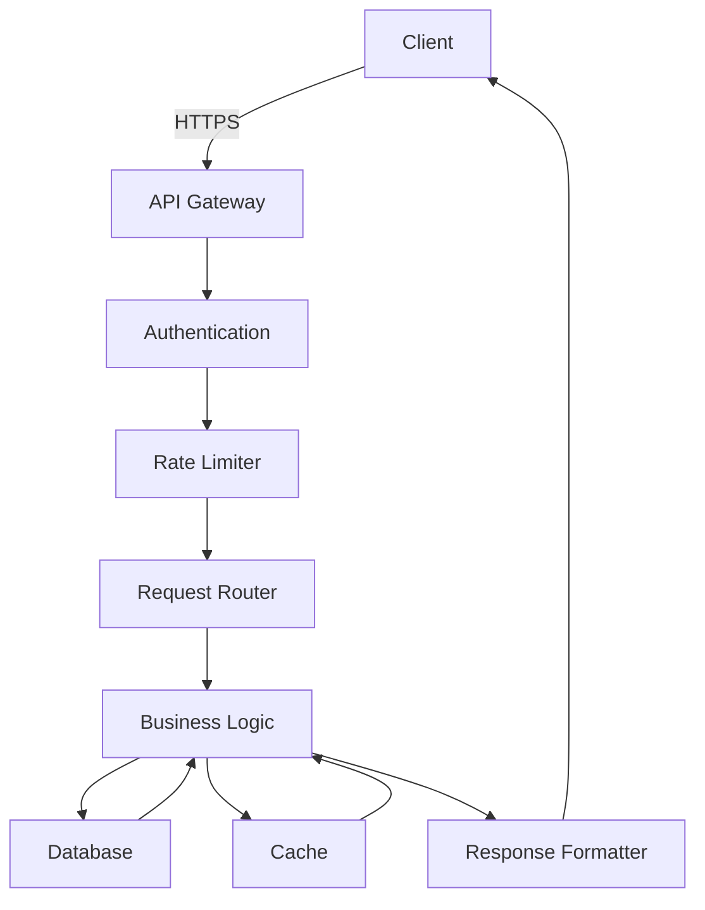

# 🏗 System Architecture

## Overview

This document provides a high-level overview of the system architecture, including components, data flow, and deployment topology.

## System Components

### 1. Frontend
- **Framework**: React with TypeScript
- **State Management**: Redux Toolkit
- **Key Features**:
  - Responsive UI components
  - Real-time data visualization
  - Role-based access control
  - Offline support

### 2. Backend
- **Framework**: FastAPI
- **Database**: PostgreSQL with SQLAlchemy ORM
- **Key Features**:
  - RESTful API endpoints
  - JWT authentication
  - Background task processing
  - Caching layer (Redis)

### 3. Data Processing
- **ETL Pipelines**: Custom Python scripts
- **Analytics Engine**: Pandas/Numpy
- **AI/ML Integration**:
  - Predictive analytics
  - Natural language processing

## Data Flow

## Deployment Architecture

### Development Environment
- Local development with Docker Compose
- Hot-reload for both frontend and backend
- Mock services for external dependencies

### Staging Environment
- Containerized deployment
- Automated testing
- Performance monitoring

### Production Environment
- Kubernetes cluster
- Horizontal scaling
- Zero-downtime deployments
- Multi-region support

## Security Considerations

- All communications over HTTPS
- JWT-based authentication
- Role-based access control
- Input validation and sanitization
- Regular security audits

## Performance Considerations

- Database query optimization
- Caching strategy
- CDN for static assets
- Load balancing
- Connection pooling

## Monitoring and Logging

- Centralized logging with ELK stack
- Application performance monitoring
- Error tracking
- Usage analytics

## Future Considerations

- Microservices architecture
- Event-driven architecture
- Serverless components
- Multi-tenant support
