# 🧩 Component Architecture

## 📌 Core Components

### 1. Layout Structure
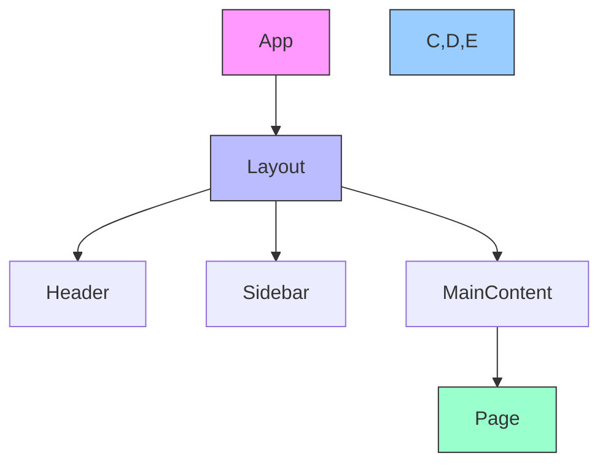

### 2. Component Hierarchy
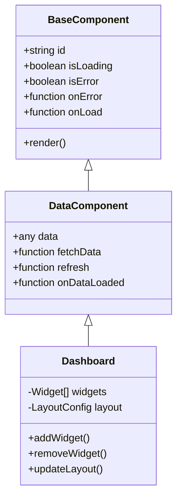

## 🎨 UI Components

### 1. DataTable Component
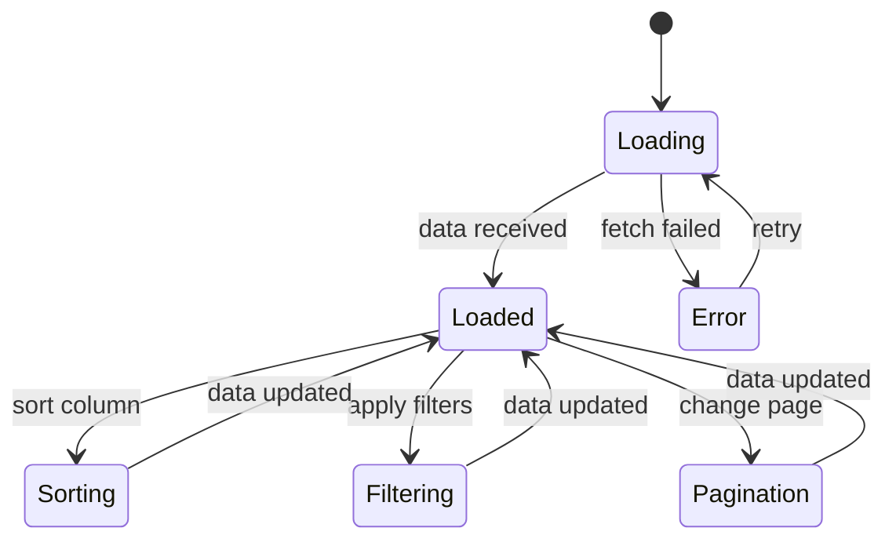

### 2. Chart Components
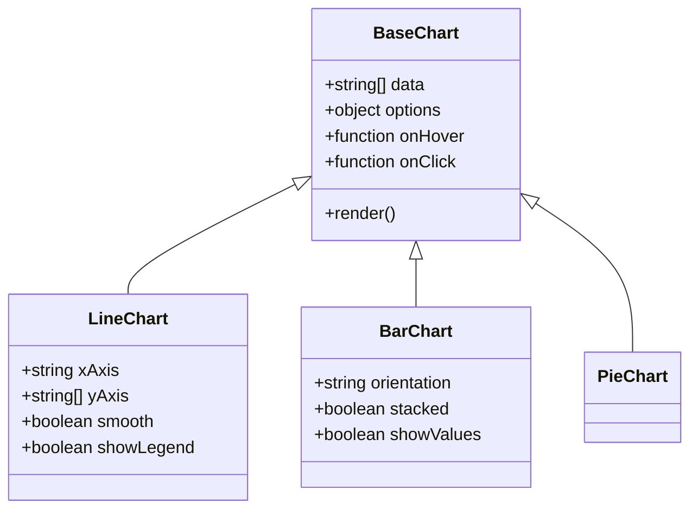

## 🔄 Component Communication

### 1. Props & Events
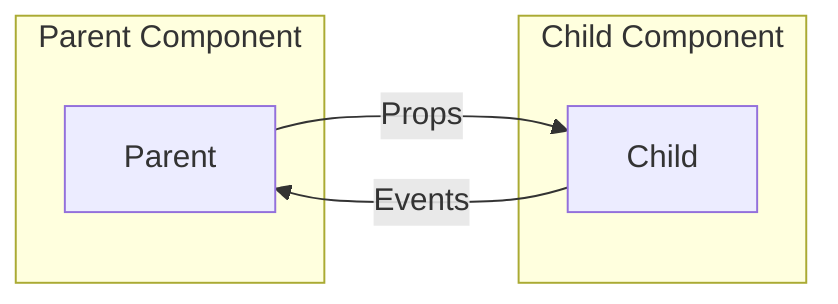

### 2. State Management
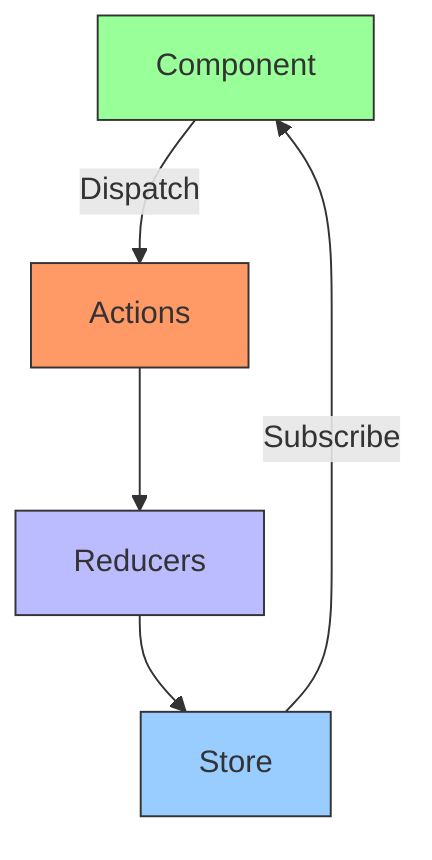

## 🎯 Component Lifecycle

### 1. Mounting Phase
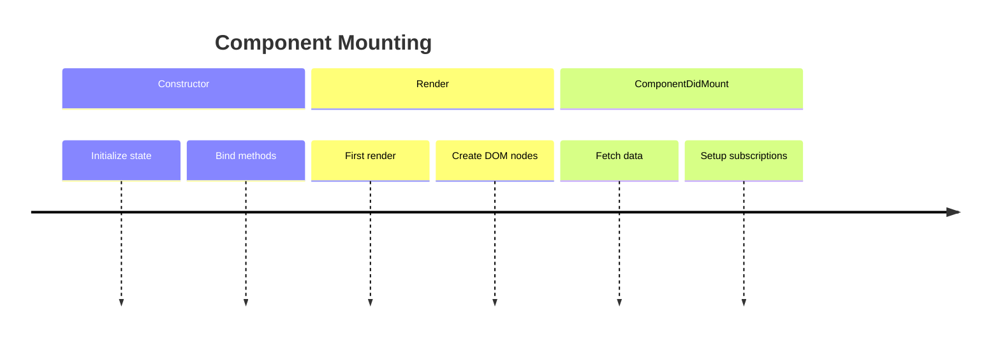

### 2. Updating Phase
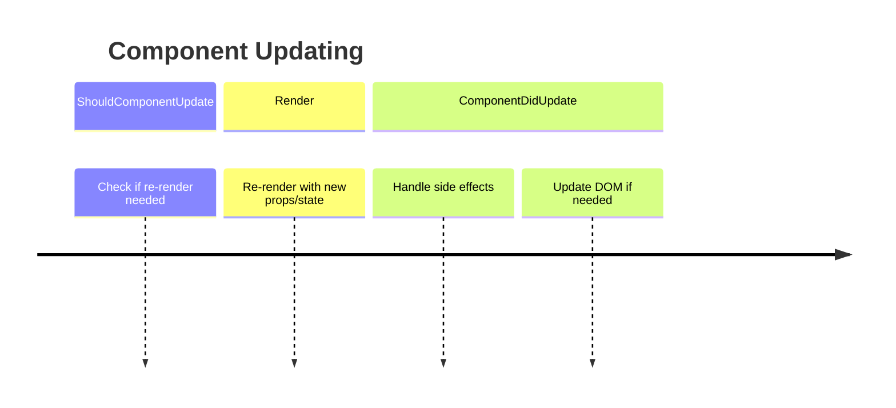

## 🧪 Component Testing

### Test Structure
```javascript
describe('Button Component', () => {
  it('renders with default props', () => {
    render(<Button>Click me</Button>);
    expect(screen.getByText('Click me')).toBeInTheDocument();
  });
  
  it('calls onClick when clicked', () => {
    const handleClick = jest.fn();
    render(<Button onClick={handleClick}>Click me</Button>);
    fireEvent.click(screen.getByText('Click me'));
    expect(handleClick).toHaveBeenCalledTimes(1);
  });
});
```

## 🎨 Styling Approach

### CSS-in-JS Example
```javascript
const StyledButton = styled.button`
  background: ${props => props.primary ? '#007bff' : '#6c757d'};
  color: white;
  padding: 0.5rem 1rem;
  border: none;
  border-radius: 4px;
  cursor: pointer;
  
  &:hover {
    opacity: 0.9;
  }
  
  &:disabled {
    opacity: 0.6;
    cursor: not-allowed;
  }
`;
```

## 🔗 Component Integration

### 1. Dashboard Integration
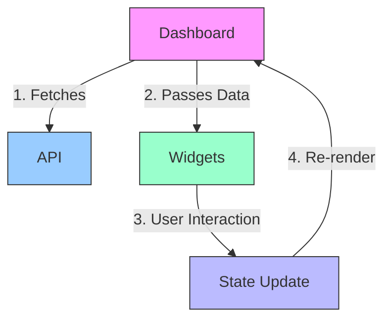

### 2. Form Handling
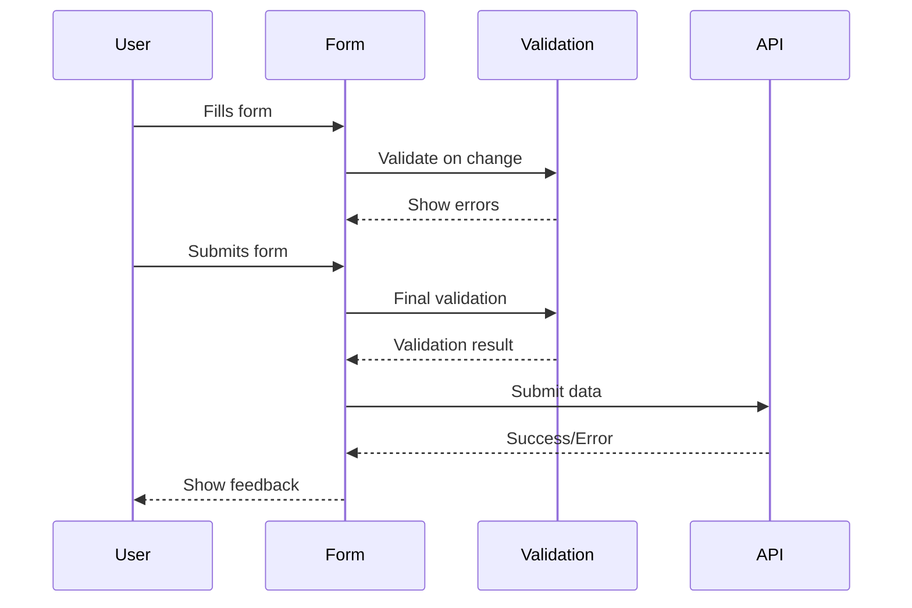

## 🛠️ Component Patterns

### 1. Higher-Order Components
```typescript
function withLoading(Component) {
  return function WithLoading({ isLoading, ...props }) {
    if (isLoading) {
      return <LoadingSpinner />;
    }
    return <Component {...props} />;
  };
}

// Usage
const UserProfileWithLoading = withLoading(UserProfile);
```

### 2. Render Props
```typescript
<DataFetcher url="/api/users">
  {({ data, loading, error }) => {
    if (loading) return <LoadingSpinner />;
    if (error) return <Error message={error.message} />;
    return <UserList users={data} />;
  }}
</DataFetcher>
```

## 📱 Responsive Design

### Breakpoints
```javascript
const breakpoints = {
  mobile: '320px',
  tablet: '768px',
  desktop: '1024px',
  large: '1440px'
};

// Usage in styled-components
const Container = styled.div`
  padding: 1rem;
  
  @media (min-width: ${breakpoints.tablet}) {
    padding: 2rem;
  }
  
  @media (min-width: ${breakpoints.desktop}) {
    max-width: 1200px;
    margin: 0 auto;
  }
`;
```

## 🔄 Performance Optimization

### 1. Memoization
```typescript
const ExpensiveComponent = React.memo(({ data }) => {
  // Component logic
  return <div>{/* ... */}</div>;
}, (prevProps, nextProps) => {
  // Custom comparison function
  return prevProps.data.id === nextProps.data.id;
});
```

### 2. Lazy Loading
```typescript
const LazyComponent = React.lazy(() => import('./HeavyComponent'));

function App() {
  return (
    <Suspense fallback={<LoadingSpinner />}>
      <LazyComponent />
    </Suspense>
  );
}
```

## 📝 Component Documentation

### Storybook Stories
```typescript
export default {
  title: 'Components/Button',
  component: Button,
  argTypes: {
    variant: {
      control: {
        type: 'select',
        options: ['primary', 'secondary', 'danger']
      }
    },
    size: {
      control: {
        type: 'select',
        options: ['small', 'medium', 'large']
      }
    },
    onClick: { action: 'clicked' }
  }
};

const Template = (args) => <Button {...args} />;

export const Primary = Template.bind({});
Primary.args = {
  variant: 'primary',
  children: 'Primary Button'
};
```

## 🔍 Accessibility (a11y)

### ARIA Attributes
```jsx
<button
  aria-label="Close modal"
  aria-expanded={isOpen}
  aria-controls="modal-content"
  onClick={toggleModal}
>
  <CloseIcon />
</button>

{isOpen && (
  <div id="modal-content" role="dialog" aria-modal="true">
    {/* Modal content */}
  </div>
)}
```

## 🚀 Component Deployment

### Versioning Strategy
```json
{
  "name": "@saas/ui-components",
  "version": "1.2.3",
  "publishConfig": {
    "access": "public",
    "registry": "https://npm.pkg.github.com"
  }
}
```

## 📚 Component Library

### Directory Structure
```
components/
├── common/
│   ├── Button/
│   │   ├── Button.jsx
│   │   ├── Button.stories.jsx
│   │   ├── Button.test.jsx
│   │   └── index.js
│   └── Input/
│       ├── Input.jsx
│       └── ...
├── layout/
│   ├── Header/
│   └── Sidebar/
└── features/
    ├── Dashboard/
    └── UserProfile/
```

## 🔄 Component Updates

### Changelog Example
```markdown
## [1.2.0] - 2025-08-12

### Added
- New `variant` prop to Button component
- Support for custom icons in Input component

### Changed
- Improved accessibility in modal components
- Updated color palette to match brand guidelines

### Fixed
- Fixed issue with dropdown positioning
- Resolved memory leak in data fetching hook
```

## 🎨 Theming System

### Theme Provider
```jsx
const theme = {
  colors: {
    primary: '#007bff',
    secondary: '#6c757d',
    success: '#28a745',
    // ...
  },
  spacing: {
    xs: '4px',
    sm: '8px',
    md: '16px',
    // ...
  },
  // ...
};

function App() {
  return (
    <ThemeProvider theme={theme}>
      <GlobalStyles />
      <AppContent />
    </ThemeProvider>
  );
}
```

## 🔄 Component Refresh

### Hot Module Replacement
```javascript
if (module.hot) {
  module.hot.accept('./App', () => {
    const NextApp = require('./App').default;
    ReactDOM.render(
      <React.StrictMode>
        <AppContainer>
          <NextApp />
        </AppContainer>
      </React.StrictMode>,
      document.getElementById('root')
    );
  });
}
```

## 📱 Mobile Considerations

### Touch Interactions
```jsx
const Touchable = styled.div`
  -webkit-tap-highlight-color: transparent;
  user-select: none;
  
  &:active {
    transform: scale(0.98);
  }
  
  @media (hover: hover) {
    &:hover {
      /* Hover styles for non-touch devices */
    }
  }
`;
```

## 🌐 Internationalization (i18n)

### Translation Setup
```jsx
// i18n.js
import i18n from 'i18next';
import { initReactI18next } from 'react-i18next';

i18n.use(initReactI18next).init({
  resources: {
    en: {
      translation: {
        welcome: 'Welcome to our app',
        // ...
      }
    },
    es: {
      translation: {
        welcome: 'Bienvenido a nuestra aplicación',
        // ...
      }
    }
  },
  lng: 'en',
  fallbackLng: 'en'
});

export default i18n;
```

## 🛠️ Development Tools

### Recommended VS Code Extensions
- ESLint
- Prettier
- Stylelint
- GraphQL
- Docker
- GitLens
- Import Cost
- Path IntelliSense
- Auto Rename Tag
- Bracket Pair Colorizer

## 📝 Component Guidelines

### Naming Conventions
- Use PascalCase for component files (e.g., `UserProfile.jsx`)
- Use kebab-case for utility files (e.g., `format-date.js`)
- Prefix HOCs with `with` (e.g., `withAuth`)
- Suffix context providers with `Provider` (e.g., `ThemeProvider`)
- Use descriptive prop names that indicate type (e.g., `isLoading`, `onClick`)

### Prop Types
```jsx
import PropTypes from 'prop-types';

function UserProfile({ user, isLoading, onSave }) {
  // Component logic
}

UserProfile.propTypes = {
  user: PropTypes.shape({
    id: PropTypes.string.isRequired,
    name: PropTypes.string.isRequired,
    email: PropTypes.string.isRequired,
    avatar: PropTypes.string,
  }).isRequired,
  isLoading: PropTypes.bool,
  onSave: PropTypes.func.isRequired,
};

UserProfile.defaultProps = {
  isLoading: false,
};

export default UserProfile;
```

## 🚀 Performance Budget

### Asset Optimization
- JavaScript: < 200KB gzipped
- CSS: < 50KB gzipped
- Images: < 100KB each
- Fonts: < 100KB total
- Time to Interactive: < 3s
- First Contentful Paint: < 1.5s

### Code Splitting
```jsx
// Route-based code splitting
const Dashboard = React.lazy(() => import('./pages/Dashboard'));
const Reports = React.lazy(() => import('./pages/Reports'));

function App() {
  return (
    <Suspense fallback={<LoadingSpinner />}>
      <Routes>
        <Route path="/" element={<Dashboard />} />
        <Route path="/reports" element={<Reports />} />
      </Routes>
    </Suspense>
  );
}
```

## 🔍 Testing Strategy

### Test Pyramid
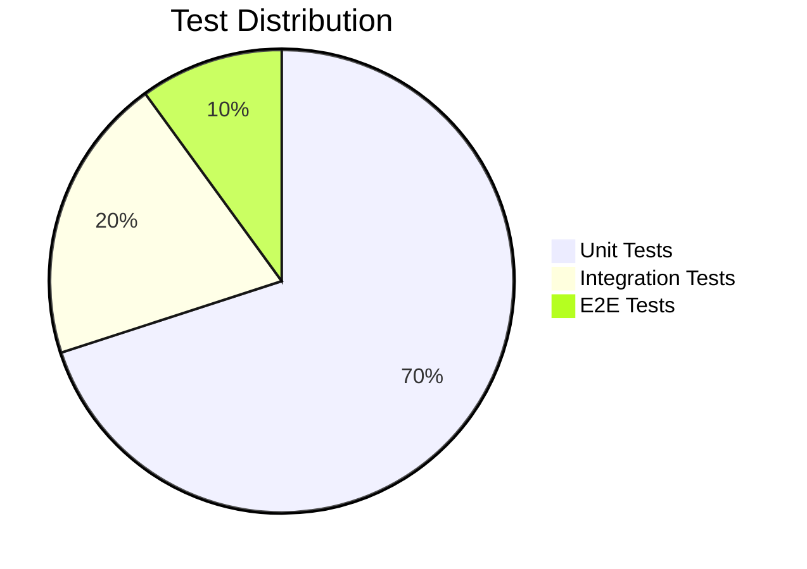

### Testing Library Example
```jsx
import { render, screen, fireEvent } from '@testing-library/react';
import userEvent from '@testing-library/user-event';
import LoginForm from './LoginForm';

describe('LoginForm', () => {
  it('submits the form with email and password', async () => {
    const handleSubmit = jest.fn();
    render(<LoginForm onSubmit={handleSubmit} />);
    
    const email = 'test@example.com';
    const password = 'password123';
    
    await userEvent.type(screen.getByLabelText(/email/i), email);
    await userEvent.type(screen.getByLabelText(/password/i), password);
    fireEvent.click(screen.getByRole('button', { name: /sign in/i }));
    
    expect(handleSubmit).toHaveBeenCalledWith({
      email,
      password,
    });
  });
});
```

## 🎨 Design Tokens

### Theme Variables
```javascript
// theme.js
export const colors = {
  primary: {
    50: '#e6f7ff',
    100: '#b3e0ff',
    // ...
    900: '#003366',
  },
  // ...
};

export const spacing = {
  xs: '0.25rem',
  sm: '0.5rem',
  md: '1rem',
  lg: '1.5rem',
  xl: '2rem',
};

export const breakpoints = {
  sm: '640px',
  md: '768px',
  lg: '1024px',
  xl: '1280px',
};

export const theme = {
  colors,
  spacing,
  breakpoints,
  // ...
};
```

## 🔄 Component Refresh

### Hot Module Replacement
```javascript
// webpack.config.js
module.exports = {
  // ...
  devServer: {
    hot: true,
    // ...
  },
  // ...
};

// In your main entry file
if (module.hot) {
  module.hot.accept('./App', () => {
    const NextApp = require('./App').default;
    ReactDOM.render(<NextApp />, document.getElementById('root'));
  });
}
```

## 📱 Mobile-First Approach

### Responsive Mixins
```javascript
// mixins.js
import { css } from 'styled-components';

export const breakpoints = {
  phone: '576px',
  tablet: '768px',
  desktop: '992px',
  large: '1200px',
};

export const media = Object.keys(breakpoints).reduce((acc, label) => {
  acc[label] = (...args) => css`
    @media (min-width: ${breakpoints[label]}) {
      ${css(...args)};
    }
  `;
  return acc;
}, {});

// Usage
const Container = styled.div`
  padding: 1rem;
  
  ${media.tablet`
    padding: 2rem;
  `}
  
  ${media.desktop`
    max-width: 1200px;
    margin: 0 auto;
  `}
`;
```

## 🌐 Browser Support

### Polyfills
```javascript
// polyfills.js
import 'core-js/stable';
import 'regenerator-runtime/runtime';
import 'whatwg-fetch';

// Add any other necessary polyfills
```

### Browserslist
```
# .browserslistrc
> 0.5%
last 2 versions
Firefox ESR
not dead
not ie 11
```

## 🛠️ Development Scripts

### Package.json
```json
{
  "scripts": {
    "start": "vite",
    "build": "vite build",
    "preview": "vite preview",
    "test": "vitest",
    "test:watch": "vitest watch",
    "test:coverage": "vitest run --coverage",
    "lint": "eslint src --ext .js,.jsx,.ts,.tsx",
    "lint:fix": "eslint src --ext .js,.jsx,.ts,.tsx --fix",
    "format": "prettier --write \"src/**/*.{js,jsx,ts,tsx,json,css,md}\"",
    "typecheck": "tsc --noEmit",
    "storybook": "start-storybook -p 6006",
    "build-storybook": "build-storybook"
  }
}
```

## 🔍 Debugging Tips

### React DevTools
- Use the React DevTools extension for component inspection
- Check component props and state in real-time
- Profile component performance
- Debug hooks and context

### Browser DevTools
- Use the Performance tab to identify bottlenecks
- Check the Network tab for API requests
- Use the Console for debugging JavaScript
- Inspect accessibility with the Accessibility tab

## 🚀 Production Optimization

### Bundle Analysis
```bash
# Install the analyzer plugin
npm install --save-dev @bundle-analyzer/webpack-plugin

# Add to webpack config
const { BundleAnalyzerPlugin } = require('@bundle-analyzer/webpack-plugin');

module.exports = {
  plugins: [
    new BundleAnalyzerPlugin({
      analyzerMode: 'static',
      reportFilename: 'bundle-report.html',
      openAnalyzer: false,
    }),
  ],
};
```

### Code Splitting
```jsx
// Dynamic imports for code splitting
const HeavyComponent = React.lazy(() => import('./HeavyComponent'));

function App() {
  return (
    <Suspense fallback={<div>Loading...</div>}>
      <HeavyComponent />
    </Suspense>
  );
}
```

## 📚 Additional Resources

### Recommended Reading
- [React Documentation](https://reactjs.org/)
- [React Patterns](https://reactpatterns.com/)
- [React Performance](https://reactjs.org/docs/optimizing-performance.html)
- [Testing Library](https://testing-library.com/)
- [Styled Components](https://styled-components.com/)
- [React TypeScript Cheatsheet](https://react-typescript-cheatsheet.netlify.app/)

### Useful Tools
- [Create React App](https://create-react-app.dev/)
- [Vite](https://vitejs.dev/)
- [Storybook](https://storybook.js.org/)
- [React DevTools](https://reactjs.org/blog/2019/08/15/new-react-devtools.html)
- [React Query](https://react-query.tanstack.com/)
- [React Hook Form](https://react-hook-form.com/)
- [Framer Motion](https://www.framer.com/motion/)

## 🎉 Getting Started

### Installation
```bash
# Clone the repository
git clone https://github.com/your-org/saas-platform.git
cd saas-platform

# Install dependencies
npm install

# Start development server
npm start

# Run tests
npm test

# Build for production
npm run build
```

### Development Workflow
1. Create a new branch for your feature
2. Write tests for your changes
3. Implement your feature
4. Ensure all tests pass
5. Submit a pull request
6. Get code review approval
7. Merge to main branch

## 🤝 Contributing

We welcome contributions! Please see our [Contributing Guidelines](CONTRIBUTING.md) for details.

## 📄 License

This project is licensed under the MIT License - see the [LICENSE](LICENSE) file for details.
