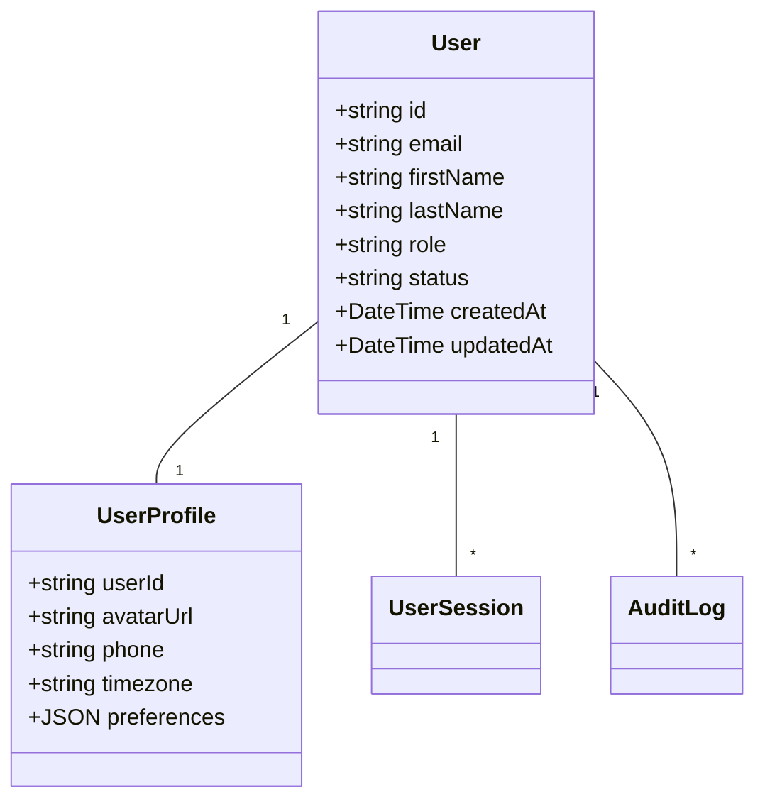
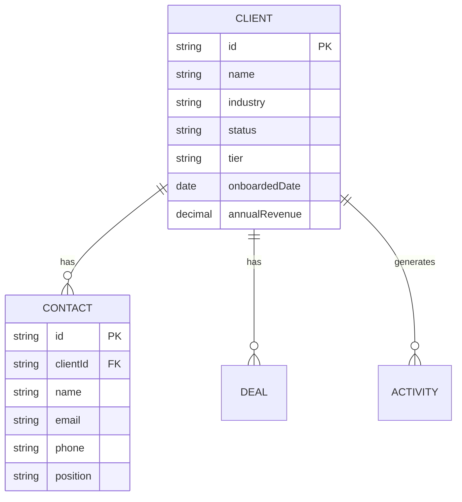
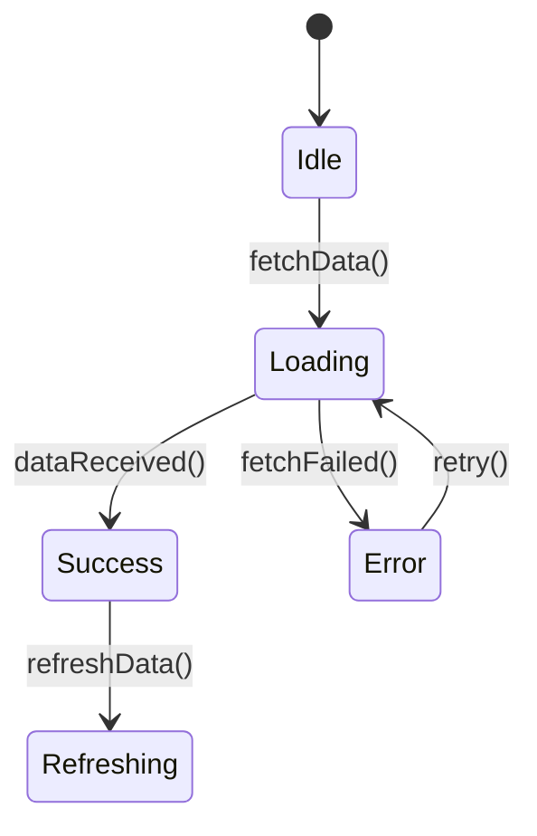
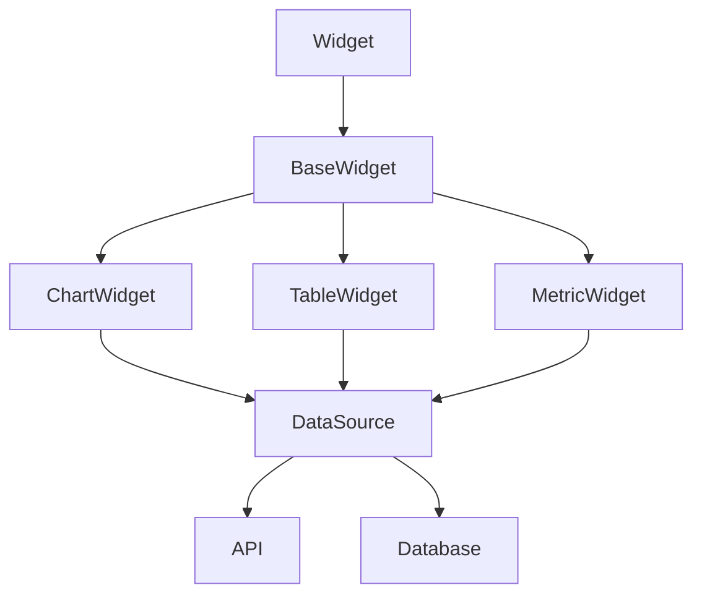
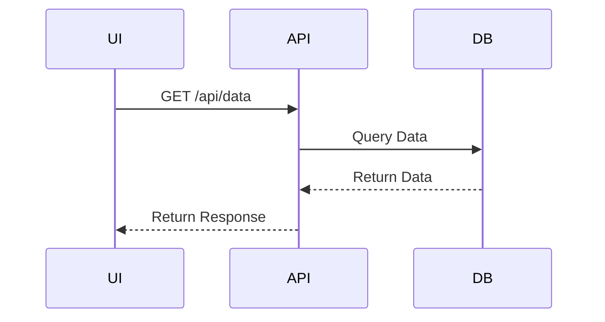
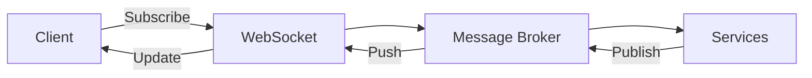

'# 📊 Data Models & Schemas

## 📌 Core Models

### 1. User Model


### 2. Client Model


## 🔄 State Management

### Auth State
```typescript
interface AuthState {
  user: User | null;
  token: string | null;
  isAuthenticated: boolean;
  isLoading: boolean;
  error: string | null;
  permissions: string[];
  
  login: (credentials: LoginDTO) => Promise<void>;
  logout: () => void;
  refreshToken: () => Promise<boolean>;
}
```

### Dashboard State


## 📊 Dashboard Data Models

### Report Model
```typescript
interface Report {
  id: string;
  name: string;
  type: 'table' | 'line' | 'bar' | 'pie';
  dataSource: string;
  columns: ReportColumn[];
  filters: ReportFilter[];
  createdBy: string;
  updatedAt: Date;
}
```

### Widget Model


## 🗃️ Database Schema

### Users Table
```sql
CREATE TABLE users (
    id UUID PRIMARY KEY,
    email VARCHAR(255) UNIQUE NOT NULL,
    first_name VARCHAR(100) NOT NULL,
    last_name VARCHAR(100) NOT NULL,
    hashed_password VARCHAR(255) NOT NULL,
    role VARCHAR(50) NOT NULL,
    status VARCHAR(20) DEFAULT 'active',
    created_at TIMESTAMPTZ DEFAULT NOW(),
    updated_at TIMESTAMPTZ DEFAULT NOW()
);
```

### Clients Table
```sql
CREATE TABLE clients (
    id UUID PRIMARY KEY,
    name VARCHAR(255) NOT NULL,
    industry VARCHAR(100),
    status VARCHAR(50) NOT NULL,
    tier VARCHAR(50) DEFAULT 'standard',
    onboarded_date DATE NOT NULL,
    annual_revenue DECIMAL(15, 2),
    created_at TIMESTAMPTZ DEFAULT NOW(),
    updated_at TIMESTAMPTZ DEFAULT NOW()
);
```

## 🔄 Data Flow

### API Request/Response


### Real-time Updates


## 📝 Data Dictionary

| Entity  | Description                | Key Fields                     |
|---------|----------------------------|-------------------------------|
| User    | System users               | id, email, role, status       |
| Client  | Business clients           | id, name, industry, status    |
| Contact | Client contacts            | id, clientId, email, phone    |
| Report  | Custom reports             | id, name, type, dataSource    |
| Widget  | Dashboard components       | id, type, dataSource, layout  |
