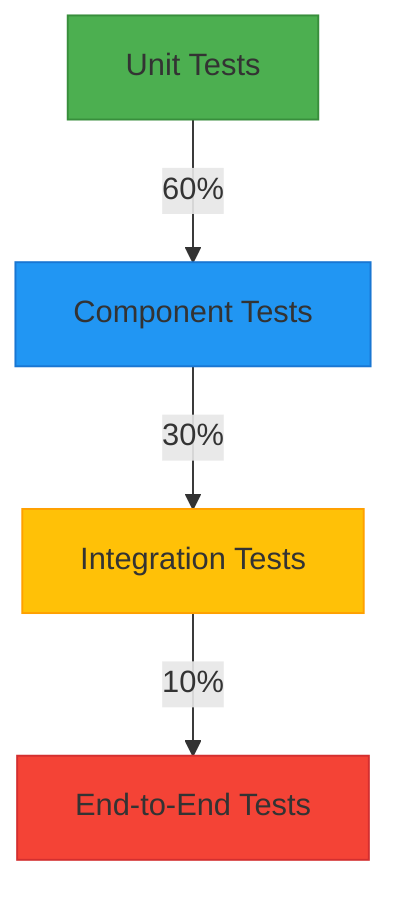

# 🧪 Testing Strategy

## 📋 Overview

This document outlines the testing strategy for the SaaS Business Intelligence Platform. Our goal is to maintain high code quality, catch regressions early, and ensure reliable functionality across the application.

## 🎯 Testing Pyramid



## 🧩 Unit Testing

### What to Test
- Individual functions and methods
- Utility functions
- Pure functions
- Simple components

### Tools
- **Jest**: Test runner and assertion library
- **React Testing Library**: For React component testing
- **MSW (Mock Service Worker)**: For API mocking

### Example: Testing a Utility Function

```typescript
// src/utils/formatDate.test.ts
import { formatDate } from './formatDate';

describe('formatDate', () => {
  it('formats a date string correctly', () => {
    const date = '2023-01-01T00:00:00.000Z';
    expect(formatDate(date, 'en-US')).toBe('1/1/2023');
  });

  it('handles invalid dates', () => {
    expect(formatDate('invalid-date', 'en-US')).toBe('Invalid Date');
  });
});
```

### Example: Testing a React Component

```typescript
// src/components/Button/Button.test.tsx
import { render, screen, fireEvent } from '@testing-library/react';
import { Button } from './Button';

describe('Button', () => {
  it('renders with default props', () => {
    render(<Button>Click me</Button>);
    const button = screen.getByRole('button', { name: /click me/i });
    expect(button).toBeInTheDocument();
    expect(button).toHaveClass('btn', 'btn--primary');
  });

  it('calls onClick when clicked', () => {
    const handleClick = jest.fn();
    render(<Button onClick={handleClick}>Click me</Button>);
    
    fireEvent.click(screen.getByText(/click me/i));
    expect(handleClick).toHaveBeenCalledTimes(1);
  });
});
```

## 🧱 Component Testing

### What to Test
- Component rendering
- User interactions
- Conditional rendering
- Props and state changes

### Tools
- **React Testing Library**
- **Jest DOM**
- **MSW** for API calls

### Example: Testing a Form Component

```typescript
// src/components/LoginForm/LoginForm.test.tsx
import { render, screen, fireEvent, waitFor } from '@testing-library/react';
import { LoginForm } from './LoginForm';
import { rest } from 'msw';
import { setupServer } from 'msw/node';

const server = setupServer(
  rest.post('/api/login', (req, res, ctx) => {
    return res(ctx.json({ token: 'fake-token' }));
  })
);

beforeAll(() => server.listen());
afterEach(() => server.resetHandlers());
afterAll(() => server.close());

describe('LoginForm', () => {
  it('submits the form with email and password', async () => {
    const onSuccess = jest.fn();
    
    render(<LoginForm onSuccess={onSuccess} />);
    
    // Fill out the form
    fireEvent.change(screen.getByLabelText(/email/i), {
      target: { value: 'test@example.com' },
    });
    
    fireEvent.change(screen.getByLabelText(/password/i), {
      target: { value: 'password123' },
    });
    
    // Submit the form
    fireEvent.click(screen.getByRole('button', { name: /sign in/i }));
    
    // Verify loading state
    expect(screen.getByRole('button', { name: /signing in/i })).toBeDisabled();
    
    // Wait for the API call to complete
    await waitFor(() => {
      expect(onSuccess).toHaveBeenCalledWith({ token: 'fake-token' });
    });
  });
  
  it('shows validation errors', async () => {
    render(<LoginForm onSuccess={jest.fn()} />);
    
    // Submit without filling out the form
    fireEvent.click(screen.getByRole('button', { name: /sign in/i }));
    
    // Check for validation errors
    expect(await screen.findByText(/email is required/i)).toBeInTheDocument();
    expect(screen.getByText(/password is required/i)).toBeInTheDocument();
  });
});
```

## 🔗 Integration Testing

### What to Test
- Component interactions
- API integrations
- State management
- Navigation

### Tools
- **React Testing Library**
- **MSW**
- **React Router** test utilities

### Example: Testing a Dashboard Page

```typescript
// src/pages/Dashboard/Dashboard.test.tsx
import { render, screen, waitFor } from '@testing-library/react';
import { rest } from 'msw';
import { setupServer } from 'msw/node';
import { MemoryRouter } from 'react-router-dom';
import { Dashboard } from './Dashboard';

const server = setupServer(
  rest.get('/api/dashboard', (req, res, ctx) => {
    return res(ctx.json({
      id: '1',
      name: 'Analytics Dashboard',
      widgets: [
        { id: 'w1', type: 'chart', title: 'Monthly Sales' },
        { id: 'w2', type: 'metrics', title: 'Key Metrics' },
      ],
    }));
  })
);

beforeAll(() => server.listen());
afterEach(() => server.resetHandlers());
afterAll(() => server.close());

describe('Dashboard', () => {
  it('loads and displays the dashboard', async () => {
    render(
      <MemoryRouter>
        <Dashboard />
      </MemoryRouter>
    );
    
    // Check loading state
    expect(screen.getByRole('progressbar')).toBeInTheDocument();
    
    // Wait for data to load
    await waitFor(() => {
      expect(screen.getByText('Analytics Dashboard')).toBeInTheDocument();
      expect(screen.getByText('Monthly Sales')).toBeInTheDocument();
      expect(screen.getByText('Key Metrics')).toBeInTheDocument();
    });
  });
  
  it('handles API errors', async () => {
    server.use(
      rest.get('/api/dashboard', (req, res, ctx) => {
        return res(ctx.status(500), ctx.json({ message: 'Server Error' }));
      })
    );
    
    render(
      <MemoryRouter>
        <Dashboard />
      </MemoryRouter>
    );
    
    // Check error state
    await waitFor(() => {
      expect(screen.getByText(/failed to load dashboard/i)).toBeInTheDocument();
    });
  });
});
```

## 🎭 End-to-End Testing

### What to Test
- Critical user flows
- Authentication
- Navigation
- Form submissions
- Data persistence

### Tools
- **Playwright**: For cross-browser testing
- **Testing Library**: For querying elements
- **MSW**: For API mocking in E2E tests

### Example: E2E Test for User Authentication

```typescript
// tests/e2e/auth.spec.ts
import { test, expect } from '@playwright/test';
import { mockApi } from '../support/mockApi';

test.describe('Authentication', () => {
  test('user can log in and log out', async ({ page }) => {
    // Mock API responses
    await mockApi(page, [
      {
        url: '/api/auth/login',
        method: 'POST',
        response: { token: 'fake-token' },
        status: 200,
      },
      {
        url: '/api/user/me',
        method: 'GET',
        response: { id: '1', email: 'user@example.com', name: 'Test User' },
        status: 200,
      },
    ]);

    // Navigate to login page
    await page.goto('/login');

    // Fill out and submit login form
    await page.fill('input[name="email"]', 'user@example.com');
    await page.fill('input[name="password"]', 'password123');
    await page.click('button[type="submit"]');

    // Verify successful login redirect
    await page.waitForURL('/dashboard');
    await expect(page.getByText('Welcome, Test User')).toBeVisible();

    // Log out
    await page.click('button[aria-label="User menu"]');
    await page.click('text=Sign out');

    // Verify redirect to login page
    await page.waitForURL('/login');
    await expect(page.getByRole('heading', { name: 'Sign in' })).toBeVisible();
  });
});
```

## 🧪 Test Coverage

We aim to maintain high test coverage across the codebase. The current coverage goals are:

- **Unit Tests**: 80%+ coverage
- **Component Tests**: 70%+ coverage
- **Integration Tests**: 60%+ coverage
- **E2E Tests**: Critical paths only

To generate a coverage report:

```bash
# Run tests with coverage
npm test -- --coverage

# View HTML report (opens in browser)
npx serve -s coverage/lcov-report
```

## 🚦 Continuous Integration

Tests are automatically run on every push and pull request using GitHub Actions. The CI pipeline includes:

1. Linting and type checking
2. Unit and component tests
3. Integration tests
4. E2E tests (on merge to main)
5. Coverage reporting

## 🧪 Test Data Management

### Factory Functions
Use factory functions to generate consistent test data:

```typescript
// tests/factories/user.ts
export const createUser = (overrides = {}) => ({
  id: faker.datatype.uuid(),
  name: faker.name.fullName(),
  email: faker.internet.email().toLowerCase(),
  role: 'user',
  createdAt: new Date().toISOString(),
  updatedAt: new Date().toISOString(),
  ...overrides,
});
```

### Mock Data
Store mock data in JSON files for complex responses:

```json
// tests/mocks/dashboard.json
{
  "id": "dashboard-1",
  "name": "Analytics Dashboard",
  "widgets": [
    {
      "id": "widget-1",
      "type": "line-chart",
      "title": "Monthly Sales",
      "data": {
        "labels": ["Jan", "Feb", "Mar"],
        "datasets": [{"data": [65, 59, 80]}]
      }
    }
  ]
}
```

## 🛠 Testing Utilities

### Custom Render
Create a custom render function with common providers:

```typescript
// tests/test-utils.tsx
import { render as rtlRender } from '@testing-library/react';
import { QueryClient, QueryClientProvider } from '@tanstack/react-query';
import { BrowserRouter } from 'react-router-dom';

export function render(
  ui: React.ReactElement,
  { route = '/', ...options } = {}
) {
  window.history.pushState({}, 'Test page', route);
  
  const queryClient = new QueryClient({
    defaultOptions: {
      queries: {
        retry: false,
      },
    },
  });
  
  const Wrapper: React.FC<{ children: React.ReactNode }> = ({ children }) => (
    <QueryClientProvider client={queryClient}>
      <BrowserRouter>
        {children}
      </BrowserRouter>
    </QueryClientProvider>
  );
  
  return rtlRender(ui, { wrapper: Wrapper, ...options });
}

export * from '@testing-library/react';
```

### Custom Matchers
Add custom Jest matchers for better test assertions:

```typescript
// tests/matchers.ts
expect.extend({
  toBeInTheDocument(received) {
    const pass = document.body.contains(received);
    return {
      pass,
      message: () => `Expected ${received} ${pass ? 'not ' : ''}to be in the document`,
    };
  },
});

// Add to setupTests.ts
expect.extend({
  // @ts-ignore
  toBeInTheDocument,
});
```

## 🐛 Debugging Tests

### Debugging with Chrome DevTools

1. Add `debugger` statements in your test or component code
2. Run tests in debug mode:
   ```bash
   node --inspect-brk node_modules/.bin/jest --runInBand
   ```
3. Open `chrome://inspect` in Chrome
4. Click "Open dedicated DevTools for Node"
5. The debugger will pause at the first line
6. Click the resume button to continue to your breakpoint

### Debugging with VS Code

Add this configuration to `.vscode/launch.json`:

```json
{
  "version": "0.2.0",
  "configurations": [
    {
      "type": "node",
      "request": "launch",
      "name": "Jest Current File",
      "program": "${workspaceFolder}/node_modules/.bin/jest",
      "args": [
        "${fileBasename}",
        "--config",
        "jest.config.js",
        "--runInBand",
        "--watch"
      ],
      "console": "integratedTerminal",
      "internalConsoleOptions": "neverOpen",
      "cwd": "${workspaceFolder}"
    }
  ]
}
```

## 📝 Best Practices

1. **Test Behavior, Not Implementation**
   - Test what the component does, not how it does it
   - Avoid testing implementation details

2. **Use Descriptive Test Names**
   ```typescript
   // Bad
   test('works', () => { ... });
   
   // Good
   test('displays an error message when form is submitted with invalid data', () => { ... });
   ```

3. **Follow the Arrange-Act-Assert Pattern**
   ```typescript
   test('increments counter when button is clicked', () => {
     // Arrange
     render(<Counter />);
     const button = screen.getByRole('button', { name: /increment/i });
     
     // Act
     fireEvent.click(button);
     
     // Assert
     expect(screen.getByText('Count: 1')).toBeInTheDocument();
   });
   ```

4. **Keep Tests Isolated**
   - Each test should be independent
   - Reset state between tests
   - Use `beforeEach` and `afterEach` when needed

5. **Test Edge Cases**
   - Empty states
   - Loading states
   - Error states
   - Boundary conditions

6. **Use Mocks Wisely**
   - Only mock what's necessary
   - Prefer MSW for API mocking
   - Keep mock data close to tests

7. **Write Accessible Tests**
   - Use semantic queries (`getByRole`, `getByLabelText`)
   - Test keyboard navigation
   - Verify ARIA attributes

## 🚀 Running Tests

```bash
# Run all tests
npm test

# Run tests in watch mode
npm test -- --watch

# Run a specific test file
npm test -- path/to/test/file.test.tsx

# Update snapshots
npm test -- -u

# Run tests with coverage
npm test -- --coverage

# Run E2E tests
npm run test:e2e
```

## 📚 Additional Resources

- [React Testing Library](https://testing-library.com/docs/react-testing-library/intro/)
- [Jest Documentation](https://jestjs.io/docs/getting-started)
- [MSW Documentation](https://mswjs.io/docs/)
- [Playwright Documentation](https://playwright.dev/docs/intro)
- [Testing Library Cheatsheet](https://testing-library.com/docs/react-testing-library/cheatsheet/)

## 🤝 Contributing

When adding new features or fixing bugs, please include tests that cover your changes. Follow the existing patterns and conventions in the test files.

If you're adding a new component, create a `__tests__` directory next to it with corresponding test files.

For complex features, consider adding integration or E2E tests to verify the complete user flow.
