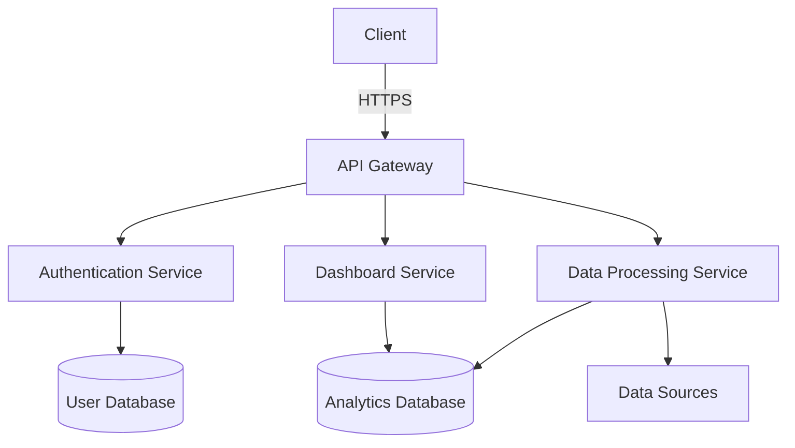

# System Architecture

This document provides an overview of the SaaS BI Platform's architecture, components, and data flow.

## High-Level Architecture

## Core Components

### 1. Frontend

- **Framework**: React with TypeScript
- **State Management**: Redux Toolkit
- **UI Components**: Material-UI
- **Data Visualization**: Recharts, D3.js

### 2. Backend Services

#### API Gateway
- Routes requests to appropriate services
- Handles authentication and rate limiting
- Manages API versioning

#### Authentication Service
- User authentication and authorization
- JWT token management
- Role-based access control

#### Dashboard Service
- Manages dashboards and widgets
- Handles widget configurations
- Processes and serves dashboard data

#### Data Processing Service
- ETL (Extract, Transform, Load) processes
- Data aggregation and transformation
- Scheduled report generation

### 3. Data Storage

#### Relational Database
- Stores user data, dashboards, and configurations
- Uses PostgreSQL with JSONB for flexible schema

#### Analytics Database
- Time-series data storage
- Optimized for fast aggregations
- Uses TimescaleDB (PostgreSQL extension)

#### Cache
- Redis for session storage
- Query result caching
- Rate limiting

## Data Flow

1. **Data Ingestion**
   - Scheduled imports from various data sources
   - Real-time data streaming
   - Manual data uploads

2. **Data Processing**
   - Data validation and cleaning
   - Transformation and enrichment
   - Aggregation and indexing

3. **Data Serving**
   - API endpoints for frontend consumption
   - Cached responses for improved performance
   - Real-time updates via WebSockets

## Security Considerations

- Data encryption at rest and in transit
- Regular security audits
- Role-based access control
- Audit logging

## Scalability

- Horizontal scaling of stateless services
- Database read replicas
- Caching strategies
- Background job processing

## Monitoring and Observability

- Application performance monitoring
- Error tracking
- Usage analytics
- Log aggregation
