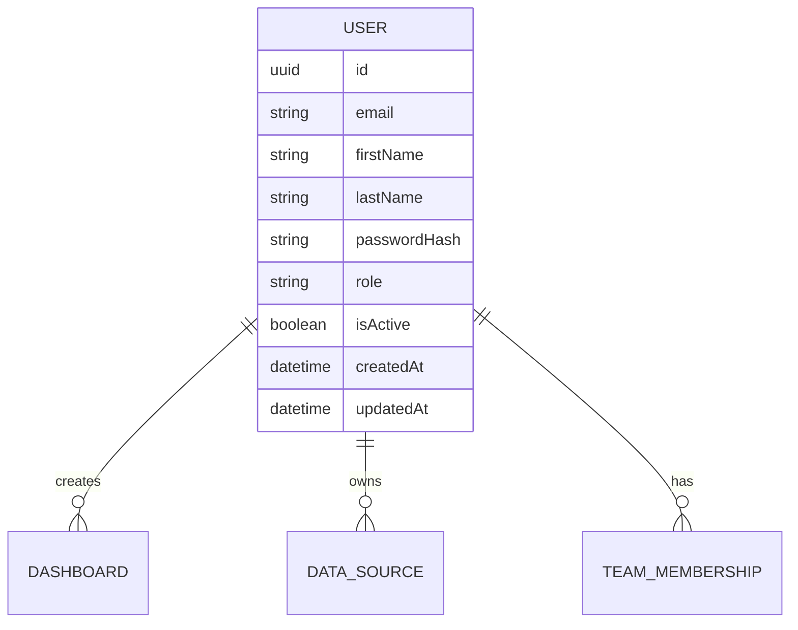
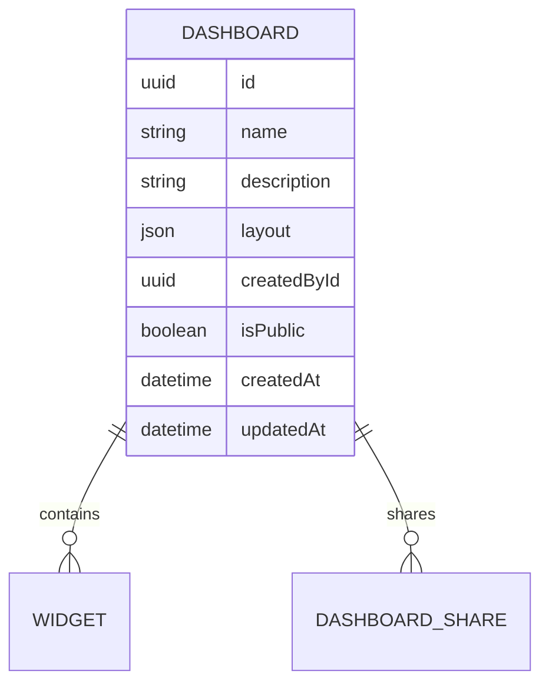
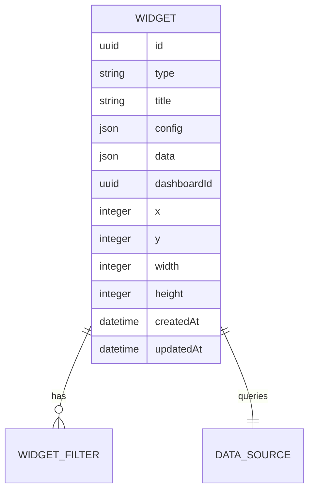
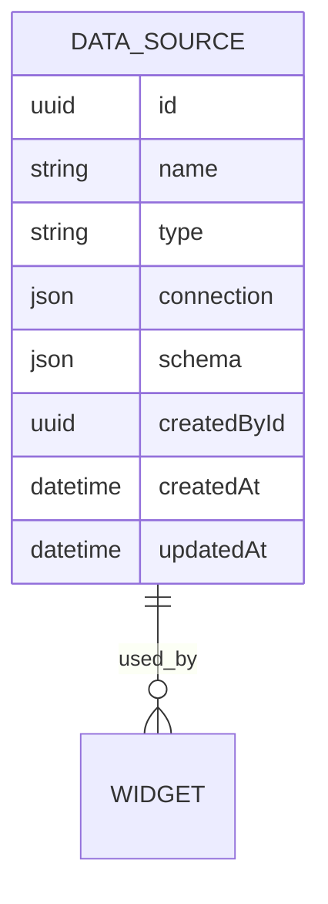

# Data Models

This document describes the core data models and their relationships in the SaaS BI Platform.

## Core Entities

### User



### Dashboard



### Widget



### Data Source



## Relationships

### User Relationships

- **One-to-Many**: A user can create multiple dashboards
- **One-to-Many**: A user can own multiple data sources
- **Many-to-Many**: Users can be members of multiple teams

### Dashboard Relationships

- **Many-to-One**: Each dashboard belongs to one user (owner)
- **One-to-Many**: A dashboard can contain multiple widgets
- **Many-to-Many**: Dashboards can be shared with multiple users/teams

### Widget Relationships

- **Many-to-One**: Each widget belongs to one dashboard
- **Many-to-One**: Each widget queries one data source
- **One-to-Many**: A widget can have multiple filters

## Data Types

### Common Field Types

- **UUID**: Unique identifier (v4)
- **Timestamps**: ISO 8601 format
- **JSON**: Flexible schema for configuration and data
- **Enums**: For fixed sets of values (e.g., widget types)

### Example: Widget Types

```typescript
type WidgetType =
  | 'line_chart'
  | 'bar_chart'
  | 'pie_chart'
  | 'table'
  | 'metric'
  | 'gauge'
  | 'funnel';
```

## Data Access Patterns

### Read Operations

- **Frequent**: Dashboard and widget data retrieval
- **Optimized**: Caching of query results
- **Pagination**: For large result sets

### Write Operations

- **Atomic**: All or nothing updates
- **Validation**: Before persistence
- **Audit**: Logging of changes

## Best Practices

### Naming Conventions

- Tables: Plural nouns (e.g., `users`, `dashboards`)
- Columns: snake_case
- Foreign Keys: `tableName_id`

### Indexing

- Primary keys (auto-indexed)
- Foreign keys
- Frequently queried columns

### Constraints

- NOT NULL where appropriate
- UNIQUE constraints
- Foreign key constraints
- Check constraints

## Schema Migrations

- Version controlled migrations
- Rollback support
- Data migration scripts when needed

## Performance Considerations

- Denormalization for read performance
- Materialized views for complex queries
- Query optimization and indexing
