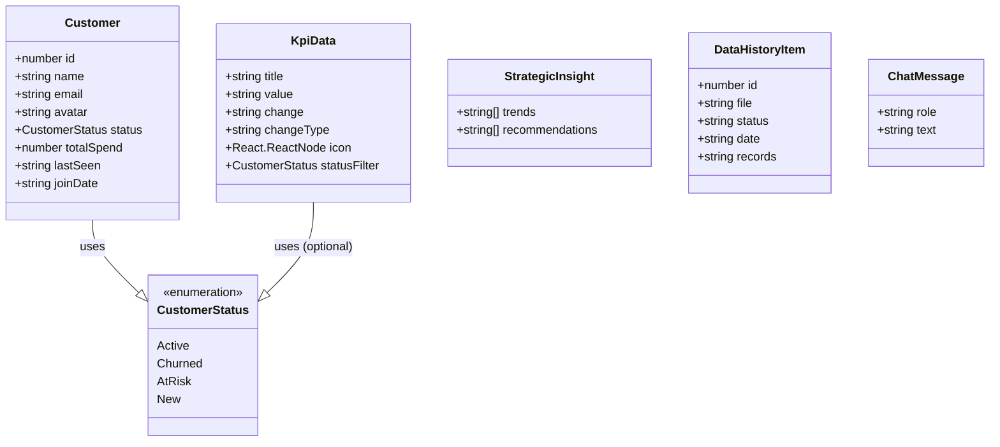
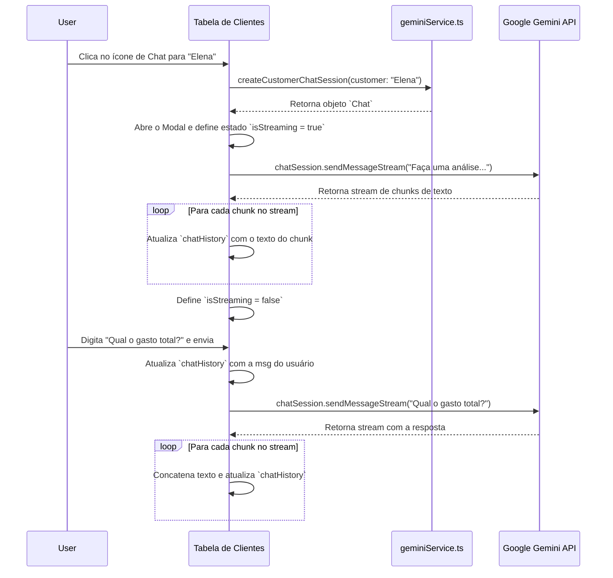
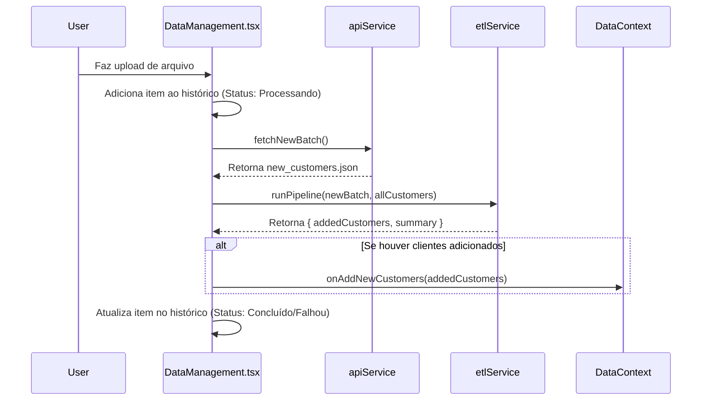
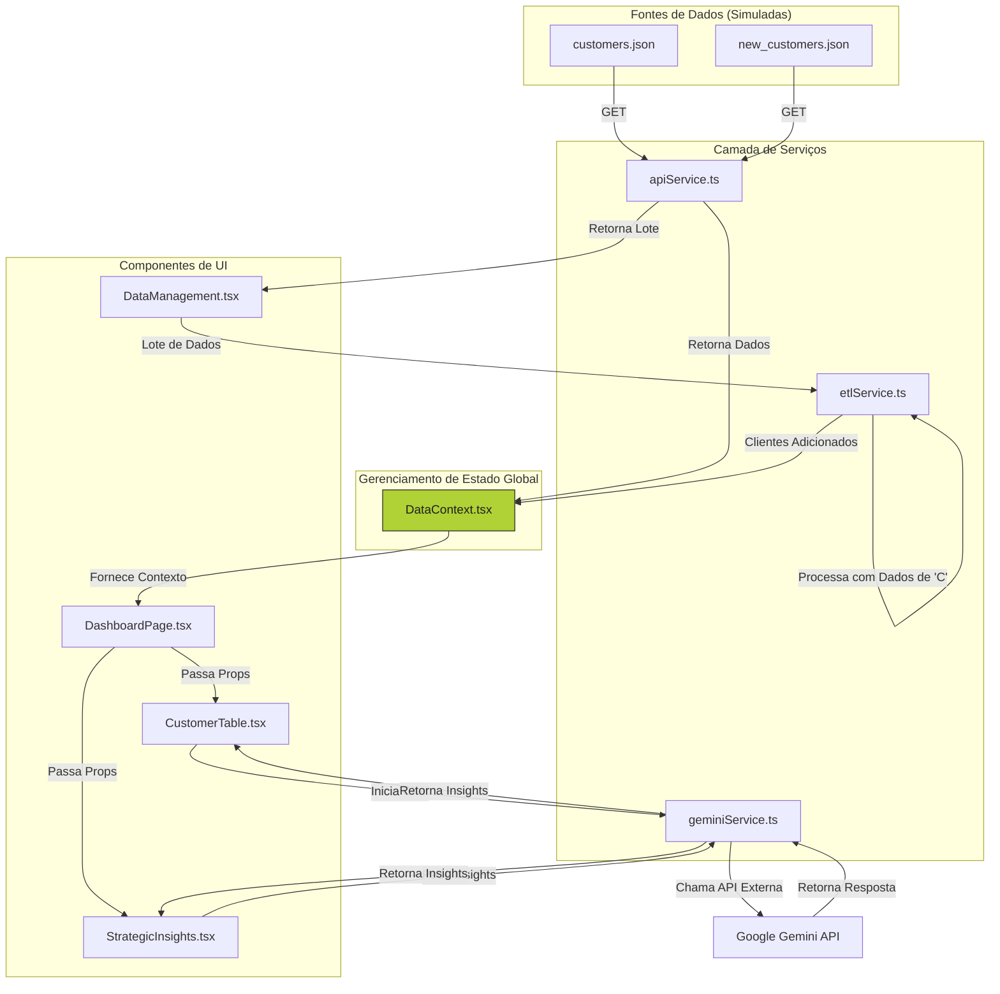
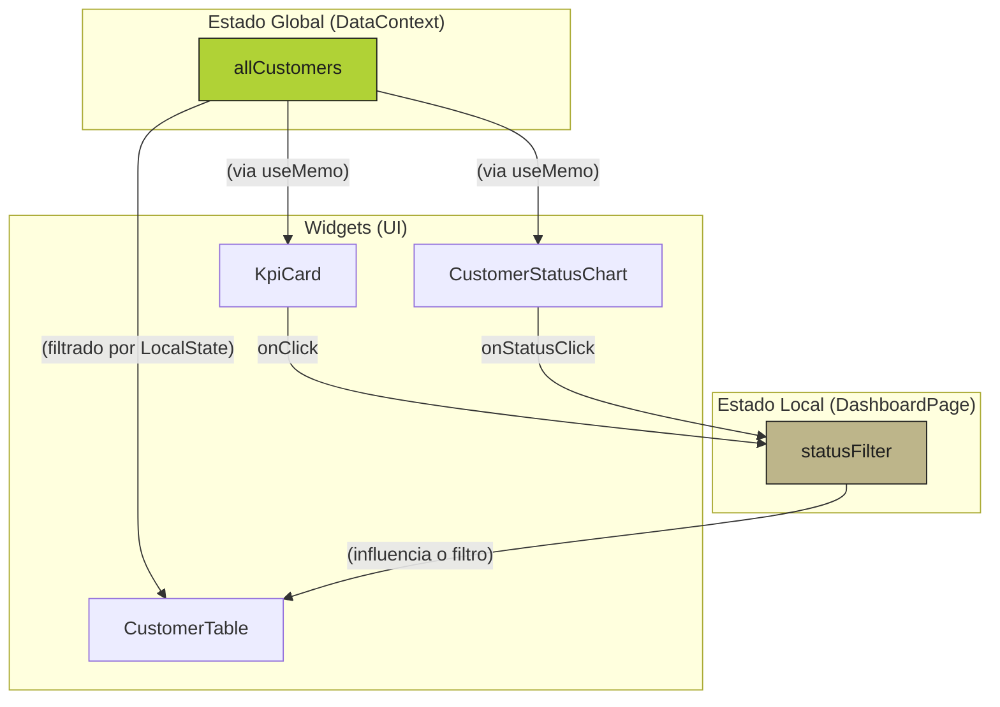

# Documento de Operações de Dados (DataOps) - Cliente 360

Este documento fornece uma análise aprofundada de todas as operações de dados, modelos, fluxos e arquitetura da aplicação **Painel Cliente 360**. Ele serve como um guia técnico para entender como os dados são originados, processados, armazenados (em memória) e apresentados.

## 1. Modelos de Dados e Esquemas

A base de toda a aplicação é um conjunto de interfaces TypeScript bem definidas que garantem a integridade e a consistência dos dados.

### 1.1. Esquemas de Tipos (`types.ts`)

Estas são as principais estruturas de dados utilizadas em toda a aplicação.

```typescript
// De: types.ts

export enum CustomerStatus {
    Active = 'Ativo',
    Churned = 'Cancelado',
    AtRisk = 'Em Risco',
    New = 'Novo',
}

export interface Customer {
  id: number;
  name: string;
  email: string;
  avatar: string;
  status: CustomerStatus;
  totalSpend: number;
  lastSeen: string;
  joinDate: string;
}

export interface KpiData {
  title: string;
  value: string;
  change: string;
  changeType: 'increase' | 'decrease';
  icon: React.Node;
  statusFilter?: CustomerStatus | 'all';
}

export interface StrategicInsight {
  trends: string[];
  recommendations: string[];
}

export interface DataHistoryItem {
  id: number;
  file: string;
  status: 'Concluído' | 'Falhou' | 'Processando';
  date: string;
  records: string;
}

export interface ChatMessage {
  role: 'user' | 'model';
  text: string;
}
```

### 1.2. Diagrama de Classes do Modelo de Dados

Este diagrama visualiza as principais entidades de dados e suas relações.



## 2. Fluxo de Dados por Componente

Aqui detalhamos como os principais componentes manipulam, recebem e exibem dados.

### 2.1. `contexts/DataContext.tsx`

É o coração do gerenciamento de estado da aplicação, atuando como a **fonte única da verdade** para os dados dos clientes.

*   **Inputs:** Nenhum (inicia a busca de dados por conta própria).
*   **Estado Interno:**
    *   `allCustomers: Customer[]`: A lista completa de clientes.
    *   `loading: boolean`: Indica se os dados iniciais estão sendo buscados.
    *   `error: string | null`: Armazena mensagens de erro da API.
*   **Funções de Processamento:**
    *   `fetchCustomers()`: Usa `apiService` para buscar a lista inicial de clientes e atualiza o estado (`allCustomers`, `loading`, `error`).
    *   `addNewCustomers(newCustomers)`: Recebe uma lista de novos clientes (do pipeline ETL) e os adiciona ao estado `allCustomers`, evitando duplicatas por ID.
*   **Outputs:** Fornece o `DataContextType` (`allCustomers`, `loading`, `error`, etc.) para qualquer componente filho que use o hook `useData()`.

### 2.2. `components/DashboardPage.tsx`

Orquestra a exibição da página principal, distribuindo dados e estado para os componentes de UI.

*   **Inputs:** `useData()` (consome `allCustomers`, `loading`, `error`).
*   **Estado Interno:**
    *   `activeTab: 'dashboard' | 'dataManagement'`: Controla a aba visível.
    *   `statusFilter: CustomerStatus | 'all'`: Armazena o filtro de status atual.
*   **Funções de Processamento:**
    *   `useMemo(dynamicKpiData)`: Calcula os dados para os `KpiCard` a partir de `allCustomers`. **Output:** `KpiData[]`.
    *   `useMemo(statusFilteredCustomers)`: Filtra `allCustomers` com base no `statusFilter` e no termo de busca (herdado de `App.tsx`). **Output:** `Customer[]` para a `CustomerTable`.
    *   `handleStatusFilterChange(status)`: Atualiza o estado `statusFilter`.
*   **Outputs:** Passa dados processados como props para os componentes de UI (`KpiCard`, `CustomerTable`, `CustomerStatusChart`, etc.).

### 2.3. `components/CustomerTable.tsx`

Exibe a lista de clientes e gerencia a interatividade do chat com IA.

*   **Inputs:** `customers: Customer[]`, `loading: boolean`.
*   **Estado Interno:**
    *   `sortConfig`: Controla a ordenação da tabela.
    *   `isModalOpen`, `selectedCustomer`: Controlam o modal do chat.
    *   `chatSession`, `chatHistory`, `isStreaming`, `chatError`: Gerenciam o estado do chat com a Gemini.
*   **Funções de Processamento:**
    *   `useMemo(sortedCustomers)`: Ordena os clientes recebidos via props.
    *   `handleOpenChat(customer)`: Inicia uma nova sessão de chat com a Gemini (`createCustomerChatSession`), abre o modal e busca a análise inicial.
    *   `handleSendMessage()`: Envia a mensagem do usuário para a sessão de chat ativa e processa a resposta em stream.
*   **Outputs:** Renderiza a tabela de clientes. A interação do usuário dispara chamadas para o `geminiService`.

#### Diagrama de Fluxo do Chat de IA



### 2.4. `App.tsx` & `Sidebar.tsx` - Fluxo do Estado de Busca

A funcionalidade de busca é gerenciada no nível mais alto (`App.tsx`) para que o termo de busca possa ser aplicado antes de os dados serem passados para qualquer componente.

*   **`App.tsx` (Estado):**
    *   `searchTerm: string`: Mantém o estado atual do texto de busca.
    *   `handleSearch(term)`: Função (memoizada com `useCallback`) para atualizar o `searchTerm`.
*   **`Sidebar.tsx` (Interação):**
    *   Recebe `searchTerm` e `onSearchChange` como props.
    *   O `<input>` de busca tem seu valor controlado por `searchTerm` e chama `onSearchChange` no evento `onChange`.
*   **`App.tsx` (Processamento):**
    *   Um `useMemo` em `searchedCustomers` é executado sempre que `allCustomers` (do `DataContext`) ou `searchTerm` mudam.
    *   Ele filtra `allCustomers` com base no `searchTerm` antes de passar a lista filtrada para `DashboardPage`.

### 2.5. `DataManagement.tsx` - Fluxo de Upload e Gatilho ETL

Este componente gerencia a interface de upload e orquestra a simulação do pipeline ETL.

*   **Inputs:** `onAddNewCustomers` (de `useData`), `allCustomers` (de `useData`).
*   **Estado Interno:** `history: DataHistoryItem[]`.
*   **Fluxo de Interação:**
    1.  O usuário arrasta ou seleciona um arquivo.
    2.  `handleFileUpload(file)` é chamado.
    3.  Imediatamente, um novo item é adicionado ao `history` com o status `'Processando'`.
    4.  Um `setTimeout` simula uma chamada assíncrona.
    5.  Dentro do `setTimeout`:
        a.  `apiService.customers.fetchNewBatch()` é chamado para obter os novos dados.
        b.  `etlService.runPipeline()` é chamado com o novo lote e a lista de clientes existentes.
        c.  `onAddNewCustomers()` (do `DataContext`) é chamado com os clientes validados e adicionados.
        d.  O item no `history` é atualizado para `'Concluído'` ou `'Falhou'` com base no resultado.

#### Diagrama de Sequência do Upload



## 3. Serviços de Dados e Processamento

Estes módulos desacoplam a lógica de negócios e o acesso a dados dos componentes de UI.

### 3.1. `services/apiService.ts`

Simula uma camada de acesso a uma API externa, buscando dados de arquivos JSON locais.

*   **Responsabilidade:** Centralizar todas as "chamadas de rede".
*   **Métodos:**
    *   `getAll()`: Busca `/data/customers.json`. **Output:** `Promise<Customer[]>`.
    *   `fetchNewBatch()`: Busca `/data/new_customers.json`. **Output:** `Promise<Customer[]>`.

### 3.2. `services/etlService.ts`

Implementa um pipeline de Extract, Transform, Load para processar novos lotes de dados de clientes.

*   **Responsabilidade:** Limpar, validar e carregar novos dados, prevenindo inconsistências e duplicatas.
*   **Input:** `newBatch: Customer[]`, `existingCustomers: Customer[]`.
*   **Lógica de Processamento (`runPipeline`):**
    1.  **Extract:** O lote `newBatch` já foi extraído pelo `apiService`.
    2.  **Transform:** Para cada cliente no lote, remove espaços em branco do nome (`trim()`) e converte o email para minúsculas.
    3.  **Validate:** Verifica se o cliente possui nome e email. Verifica se o email já existe no `Set` de emails existentes.
    4.  **Load:** Se o cliente for válido e não for duplicado, ele é adicionado à lista `addedCustomers`.
*   **Output:** `{ addedCustomers: Customer[], summary: string }`.

### 3.3. `services/geminiService.ts`

Encapsula todas as interações com a API do Google Gemini.

*   **Responsabilidade:** Construir prompts, definir esquemas de resposta e chamar a API Gemini de forma segura.
*   **Métodos:**
    *   `createCustomerChatSession(customer)`: Cria e retorna uma instância de chat da Gemini. O "system instruction" é preenchido dinamicamente com os dados do cliente para contextualizar o modelo.
    *   `generateStrategicInsights(customers)`: Agrega dados da lista de clientes, cria um prompt para análise macro e chama a Gemini com um `responseSchema` para garantir uma resposta JSON estruturada.

## 4. Diagrama de Fluxo de Dados Geral

Este diagrama oferece uma visão de ponta a ponta do fluxo de dados na aplicação.



## 5. Arquitetura de Produção e Roadmap

A aplicação atual usa arquivos JSON. Para produção, um banco de dados relacional e uma API backend são essenciais.

### 5.1. Modelo Conceitual

As principais entidades são Clientes, Usuários (para autenticação no painel), e um histórico de uploads.

*   **Cliente (Customer):** A entidade central, contendo todas as informações sobre os clientes da empresa.
*   **Usuário (User):** Representa um funcionário que pode acessar o painel.
*   **Histórico de Upload (UploadHistory):** Registra cada arquivo enviado e o resultado do processamento ETL.

### 5.2. Modelo Lógico (Esquema de Tabelas)

Este diagrama ER (Entidade-Relacionamento) detalha as tabelas, colunas e relacionamentos para um banco de dados PostgreSQL.

```mermaid
erDiagram
    CUSTOMERS {
        INT id PK "SERIAL"
        VARCHAR(255) name "NOT NULL"
        VARCHAR(255) email "UNIQUE NOT NULL"
        VARCHAR(255) avatar_url
        customer_status status "DEFAULT 'Novo'"
        DECIMAL(10, 2) total_spend "DEFAULT 0.00"
        TIMESTAMP last_seen_at
        DATE join_date "NOT NULL"
        TIMESTAMP created_at "DEFAULT CURRENT_TIMESTAMP"
        TIMESTAMP updated_at "DEFAULT CURRENT_TIMESTAMP"
    }

    USERS {
        INT id PK "SERIAL"
        VARCHAR(255) name "NOT NULL"
        VARCHAR(255) email "UNIQUE NOT NULL"
        VARCHAR(255) password_hash "NOT NULL"
        user_role role "DEFAULT 'viewer'"
        TIMESTAMP created_at "DEFAULT CURRENT_TIMESTAMP"
    }

    UPLOAD_HISTORY {
        INT id PK "SERIAL"
        VARCHAR(255) file_name "NOT NULL"
        upload_status status "DEFAULT 'Processing'"
        TEXT summary
        INT user_id FK
        TIMESTAMP created_at "DEFAULT CURRENT_TIMESTAMP"
    }

    CUSTOMERS ||--o{ UPLOAD_HISTORY : ""
    USERS ||--o{ UPLOAD_HISTORY : "uploaded by"

    %% Tipos ENUM para status e roles
    %% CREATE TYPE customer_status AS ENUM ('Ativo', 'Cancelado', 'Em Risco', 'Novo');
    %% CREATE TYPE upload_status AS ENUM ('Concluído', 'Falhou', 'Processando');
    %% CREATE TYPE user_role AS ENUM ('admin', 'editor', 'viewer');
```

### 5.3. Especificações da API Backend (Exemplo)

Mover a lógica para um backend é o passo mais crítico para a produção. Isso centraliza a lógica de negócios, protege as chaves de API e permite uma persistência de dados real.

**Endpoint 1: Obter Clientes com Filtros**

*   **Rota:** `GET /api/v1/customers`
*   **Query Params:**
    *   `search_term: string`: Termo para busca em nome e email.
    *   `status: string`: Filtra por status (e.g., 'Ativo').
    *   `sort_by: string`: Campo para ordenação (e.g., 'name').
    *   `sort_dir: string`: Direção da ordenação ('asc' ou 'desc').
    *   `page: number`: Número da página para paginação.
    *   `limit: number`: Itens por página.
*   **Resposta (Sucesso 200):**
    ```json
    {
      "data": [
        { "id": 1, "name": "Elena Rodriguez", ... }
      ],
      "pagination": {
        "total_items": 150,
        "total_pages": 15,
        "current_page": 1
      }
    }
    ```

**Endpoint 2: Upload de Arquivo e Início do ETL**

*   **Rota:** `POST /api/v1/customers/upload`
*   **Request Body:** `multipart/form-data` com um campo `file`.
*   **Resposta (Sucesso 202 - Accepted):** Indica que o processo foi aceito e está rodando em background.
    ```json
    {
      "upload_id": "job-xyz-123",
      "message": "Processamento do arquivo iniciado."
    }
    ```

**Endpoint 3: Interação Segura com a Gemini API**

*   **Rota:** `POST /api/v1/customers/:id/chat`
*   **Request Body:**
    ```json
    {
      "message": "Qual a principal preocupação com este cliente?"
    }
    ```
*   **Segurança:** A chave da API Gemini é usada apenas no servidor, nunca exposta ao cliente.
*   **Resposta (Sucesso 200):**
    ```json
    {
      "role": "model",
      "text": "A principal preocupação é a sua inatividade recente, indicando um risco de churn."
    }
    ```

## 6. Lógica de Transformação de Dados para a UI

Um aspecto fundamental do fluxo de dados é a transformação de dados brutos (`Customer[]`) em dados agregados e prontos para visualização. Isso é feito de forma eficiente usando `useMemo` para evitar cálculos desnecessários em cada renderização.

### 6.1. Cálculo dos KPIs (`DashboardPage.tsx`)

O `dynamicKpiData` é um exemplo perfeito. Ele não é um estado, mas sim um **dado derivado** de `allCustomers`.

*   **Input:** `allCustomers: Customer[]`.
*   **Lógica:**
    1.  Calcula `totalCustomers` (`allCustomers.length`).
    2.  Usa `reduce` para somar `totalSpend` de todos os clientes, calculando `totalRevenue`.
    3.  Usa `filter` para contar `newSignups` (status 'Novo') e `churned` (status 'Cancelado').
    4.  Calcula a `churnRate` a partir dos valores acima.
*   **Output:** Um array de objetos `KpiData`, que é passado diretamente para os componentes `KpiCard`.

### 6.2. Lógica de Filtragem Combinada (`DashboardPage.tsx`)

A lista de clientes final exibida na tabela (`statusFilteredCustomers`) é resultado de uma cadeia de derivações de dados:

1.  **Fonte:** `allCustomers` (do `DataContext`).
2.  **Filtro 1 (Busca):** `searchedCustomers` é calculado em `App.tsx` filtrando `allCustomers` pelo `searchTerm`.
3.  **Filtro 2 (Status):** `statusFilteredCustomers` é calculado em `DashboardPage.tsx` filtrando `searchedCustomers` pelo `statusFilter`.

Este encadeamento garante que os filtros sejam aplicados em uma ordem lógica e eficiente.

## 7. Persistência de Dados, Rastreamento de Estado e Confiabilidade (Visão Microscópica)

Esta seção detalha como cada operação de dados é executada, como o estado é manipulado e por que o sistema mantém a consistência dos dados dentro de uma sessão de usuário.

### 7.1. O Conceito de "Persistência" no Sistema Atual

É crucial entender que, na arquitetura atual, **a persistência de dados é efêmera**.

*   **Fonte da Verdade:** O estado `allCustomers` dentro do `DataContext` atua como um banco de dados em memória operacional.
*   **Ciclo de Vida:** Este "banco de dados" é criado quando o aplicativo é carregado e é **destruído** quando o usuário fecha a aba ou atualiza a página.
*   **Consequência:** Qualquer novo cliente adicionado através do pipeline ETL ou qualquer outra alteração de estado será perdido ao recarregar a página. A verdadeira persistência, como detalhado na Seção 5, requer um backend e um banco de dados.

### 7.2. Lógica do Sistema para Precisão e Confiabilidade

Mesmo sem persistência de banco de dados, o sistema garante precisão e confiabilidade durante a sessão através de vários princípios-chave:

1.  **Fonte Única da Verdade (Single Source of Truth - SSoT):**
    *   **O quê:** O `DataContext` é o único local que armazena o estado bruto dos clientes (`allCustomers`).
    *   **Por quê:** Nenhum outro componente mantém sua própria cópia ou versão da lista de clientes. Isso elimina a possibilidade de desincronização de dados entre diferentes partes da UI. Se a tabela e o gráfico usassem fontes de dados diferentes, seus totais poderiam divergir. Com o SSoT, isso é impossível.

2.  **Fluxo de Dados Unidirecional (Unidirectional Data Flow):**
    *   **O quê:** O estado flui "para baixo" (de `DataContext` para `App`, para `DashboardPage`, para `CustomerTable`), e os eventos fluem "para cima" (um clique em `KpiCard` chama uma função em `DashboardPage` que atualiza o estado).
    *   **Por quê:** Isso torna o fluxo de dados previsível e depurável. É sempre claro o que causou uma mudança de estado e quais componentes serão afetados, prevenindo efeitos colaterais inesperados.

3.  **Dados Derivados e Memoização:**
    *   **O quê:** Dados complexos (como listas filtradas ou KPIs) não são armazenados como estado. Em vez disso, são recalculados a partir do SSoT usando `useMemo`.
    *   **Por quê:** Isso garante que a UI esteja sempre consistente com os dados brutos. `useMemo` otimiza esse processo, evitando recálculos caros se os dados de origem não tiverem mudado, o que aumenta a confiabilidade (a UI não fica "presa" em um estado antigo) e o desempenho.

4.  **Imutabilidade:**
    *   **O quê:** As funções de atualização de estado (como `setAllCustomers` e `setHistory`) sempre recebem um *novo* array em vez de modificar o array existente. Ex: `[...prev, newItem]`.
    *   **Por quê:** React confia na imutabilidade para detectar mudanças. Modificar (mutar) o estado diretamente pode fazer com que o React não perceba a mudança e não atualize a UI, levando a uma interface inconsistente e não confiável.

### 7.3. Rastreamento Detalhado de Operações de Dados (Input -> Estado -> DOM)

Vamos rastrear uma sequência de ações do usuário em detalhes microscópicos.

**Cenário:** Um usuário procura por "Ben", depois filtra por status "Em Risco" e finalmente ordena a tabela por "Gasto Total".

```mermaid
sequenceDiagram
    participant User
    participant Sidebar as Sidebar.tsx
    participant App as App.tsx
    participant Ctx as DataContext
    participant Dashboard as DashboardPage.tsx
    participant Kpi as KpiCard.tsx
    participant Table as CustomerTable.tsx

    %% Etapa 1: Busca
    User->>Sidebar: Digita "Ben" no <input> de busca
    Sidebar->>App: Chama onSearchChange("Ben")
    App->>App: setSearchTerm("Ben")
    Note over App: `useMemo(searchedCustomers)` é re-executado.
    Note over App: Filtra `allCustomers` do `Ctx`.
    Note over App: Prop `searchedCustomers` para `Dashboard` muda.
    App-->>Dashboard: Re-renderiza com nova lista de clientes.
    Dashboard-->>Table: Re-renderiza com a lista contendo apenas "Ben Carter".

    %% Etapa 2: Filtro por KPI
    User->>Kpi: Clica no KpiCard "Taxa de Churn" (filtro "Em Risco")
    Kpi->>Dashboard: Chama handleStatusFilterChange("Em Risco")
    Dashboard->>Dashboard: setStatusFilter("Em Risco")
    Note over Dashboard: `useMemo(statusFilteredCustomers)` é re-executado.
    Note over Dashboard: Filtra `searchedCustomers` por status.
    Note over Dashboard: Prop `customers` para `Table` não muda (Ben já estava "Em Risco").
    Dashboard-->>Table: Re-renderiza, mas a lista visível não muda.

    %% Etapa 3: Ordenação
    User->>Table: Clica no cabeçalho "Gasto Total"
    Table->>Table: Chama requestSort("totalSpend")
    Table->>Table: setSortConfig({ key: 'totalSpend', direction: 'asc' })
    Note over Table: `useMemo(sortedCustomers)` é re-executado.
    Note over Table: Ordena a lista de clientes interna.
    Table->>Table: Re-renderiza a lista virtualizada com a nova ordem.
```



**Quebra Detalhada da Etapa 1: Busca por "Ben"**

1.  **Gatilho (DOM):** O usuário pressiona a tecla 'n' no `<input>` dentro de `Sidebar.tsx`. O evento `onChange` é disparado.
2.  **Manipulador de Evento:** A função `(e) => onSearchChange(e.target.value)` é executada em `Sidebar.tsx`. A prop `onSearchChange` é, na verdade, a função `handleSearch` de `App.tsx`.
3.  **Atualização de Estado (App.tsx):** A função `handleSearch` chama `setSearchTerm("Ben")`.
4.  **Re-renderização do React:** React agenda uma re-renderização de `App.tsx` porque seu estado (`searchTerm`) mudou.
5.  **Cálculo de Dados Derivados (App.tsx):** Durante a re-renderização de `App`, o hook `useMemo` para `searchedCustomers` detecta que sua dependência `searchTerm` mudou. Ele executa sua função:
    *   Obtém `allCustomers` (20 clientes) do `DataContext`.
    *   Executa `.filter(c => c.name.toLowerCase().includes("ben") || c.email.toLowerCase().includes("ben"))`.
    *   O resultado é um novo array contendo apenas o objeto `{ id: 2, name: 'Ben Carter', ... }`.
6.  **Fluxo de Props:** O componente `App` agora renderiza seu filho, `DashboardPage`, passando a nova `searchedCustomers` como prop.
7.  **Re-renderização em Cascata:**
    *   `DashboardPage` re-renderiza porque sua prop `searchedCustomers` mudou.
    *   Dentro de `DashboardPage`, o `useMemo` para `statusFilteredCustomers` re-executa. Como `statusFilter` é `'all'`, ele simplesmente retorna a lista de 1 cliente que recebeu.
    *   `DashboardPage` então renderiza `CustomerTable`, passando a lista de 1 cliente como a prop `customers`.
8.  **Atualização Final do DOM:**
    *   `CustomerTable` re-renderiza. Seu `useMemo(sortedCustomers)` re-executa.
    *   A `List` de `react-window` recebe a nova lista com 1 item e recalcula o que precisa ser exibido.
    *   O DOM é atualizado para remover as 19 linhas de clientes anteriores e renderizar apenas a linha para "Ben Carter". O texto "20 resultado(s) encontrado(s)" muda para "1 resultado(s) encontrado(s)".

Este ciclo completo, do clique à atualização da UI, exemplifica como o sistema usa os princípios do React para manter a interface sincronizada com o estado de forma confiável e eficiente. A cada passo, os dados são transformados de forma previsível, garantindo que o que o usuário vê é um reflexo preciso do estado atual da aplicação.

---

## 8. Estruturas de Dados e Algoritmos na Prática

A performance e a confiabilidade da aplicação dependem do uso inteligente de estruturas de dados e algoritmos adequados. Esta seção detalha as principais implementações.

### 8.1. Estruturas de Dados Chave

*   **`Array<Customer>` (Fonte da Verdade):**
    *   **Uso:** `allCustomers` no `DataContext`.
    *   **Análise:** Como uma lista não ordenada, qualquer busca ou filtro requer uma varredura completa, resultando em uma complexidade de O(n), onde 'n' é o número total de clientes. Isso é aceitável para dezenas de milhares de registros no frontend, mas seria ineficiente em um banco de dados sem indexação.

*   **`Set<string>` (Verificação de Duplicatas):**
    *   **Uso:** `existingEmails` no `etlService.runPipeline`.
    *   **Análise:** Um `Set` oferece verificação de existência (`.has()`) com complexidade média de O(1). Isso é exponencialmente mais rápido do que usar `Array.prototype.includes()`, que tem complexidade de O(n). Para um lote de 'm' novos clientes e 'n' clientes existentes, a verificação de duplicatas com um Set é O(m), enquanto com um Array seria O(m * n). Esta é uma otimização algorítmica crucial.

*   **`Record<CustomerStatus, number>` (Contagem e Agregação):**
    *   **Uso:** `statusCounts` em `CustomerStatusChart` e `generateStrategicInsights`.
    *   **Análise:** Esta estrutura funciona como um hash map ou dicionário. Ela permite agrupar e contar itens em uma única passagem pelo array de clientes (complexidade O(n)). A alternativa, que seria iterar o array uma vez para cada status, teria uma complexidade maior.

*   **`Array<ChatMessage>` (Log de Conversa):**
    *   **Uso:** `chatHistory` em `CustomerTable`.
    *   **Análise:** Um array é a estrutura perfeita aqui, pois a ordem das mensagens é fundamental. Cada nova mensagem é adicionada ao final (`push`), que é uma operação O(1). A renderização da UI simplesmente itera sobre este array, garantindo que a sequência cronológica seja preservada.

### 8.2. Algoritmos Principais

*   **Filtragem e Busca (Varredura Linear):**
    *   **Implementação:** `Array.prototype.filter` usado em `searchedCustomers` e `statusFilteredCustomers`.
    *   **Complexidade:** O(n). Cada elemento no array é visitado uma vez para verificar se corresponde à condição.

*   **Ordenação (Comparação):**
    *   **Implementação:** `Array.prototype.sort` com uma função de comparação customizada em `sortedCustomers`.
    *   **Complexidade:** Depende da implementação do motor JavaScript, mas tipicamente é O(n log n). Isso é eficiente o suficiente para a ordenação no lado do cliente.

*   **Pipeline de Ingestão de Dados (ETL):**
    *   **Implementação:** `etlService.runPipeline`.
    *   **Complexidade:** A complexidade geral é dominada pela iteração sobre o novo lote de 'm' clientes. Graças ao uso do `Set` para verificação de duplicatas, a complexidade total é aproximadamente O(n + m), onde 'n' é a criação inicial do Set e 'm' é o processamento do lote. Isso é altamente eficiente.

## 9. Mapeamento de Widgets para Dados e Ações (Widget-Data Binding)

Esta seção detalha como os componentes de UI (widgets) estão conectados ao estado da aplicação, quais dados eles consomem e quais ações eles podem disparar para modificar o estado.

### 9.1. Diagrama de Interação Widget-Estado

Este diagrama ilustra o ciclo de feedback: o estado atualiza a UI, e a interação do usuário com a UI atualiza o estado.



### 9.2. Tabela de Mapeamento Detalhada

| Widget / Componente       | Dados Consumidos (Fonte)                                  | Ação do Usuário Disparada                               | Função Chamada / Estado Modificado                                       | Efeito Cascata na UI                                                                                                |
| ------------------------- | --------------------------------------------------------- | ------------------------------------------------------- | ------------------------------------------------------------------------ | ------------------------------------------------------------------------------------------------------------------- |
| **`Sidebar.tsx`**         | `searchTerm` (de `App.tsx`)                               | Digitar no campo de busca                               | `onSearchChange` -> `setSearchTerm` (em `App.tsx`)                       | Re-filtra `searchedCustomers` em `App.tsx`, atualizando a lista de clientes visível em `CustomerTable`.          |
| **`KpiCard.tsx`**         | `KpiData` (derivado de `allCustomers` em `DashboardPage`) | Clicar em um card com `statusFilter`                    | `handleStatusFilterChange` -> `setStatusFilter` (em `DashboardPage`)     | Re-filtra `statusFilteredCustomers`, atualizando `CustomerTable`. O próprio card ganha um anel de destaque.       |
| **`CustomerTable.tsx`**   | `customers` (filtrados e ordenados)                       | Clicar no cabeçalho da coluna                           | `requestSort` -> `setSortConfig` (estado local)                          | Re-ordena a lista de clientes usando `useMemo(sortedCustomers)` e re-renderiza as linhas da tabela.               |
| **`CustomerTable.tsx`**   | `selectedCustomer` (estado local)                         | Clicar no ícone de Chat                                 | `handleOpenChat` -> `createCustomerChatSession` & `setIsModalOpen(true)` | Abre o `Modal`, inicia uma sessão com a Gemini e busca a análise inicial, populando o `chatHistory`.           |
| **`DataManagement.tsx`**  | `allCustomers` (para verificação de duplicatas)           | Fazer upload de um arquivo                              | `handleFileUpload` -> `etlService.runPipeline` -> `addNewCustomers`      | Adiciona novos clientes a `allCustomers` em `DataContext`, o que aciona uma re-renderização de toda a aplicação. |
| **`StrategicInsights.tsx`** | `customers` (de `DashboardPage`)                          | Clicar no botão de atualizar                            | `fetchInsights` -> `generateStrategicInsights` -> `setInsights`          | Exibe um spinner, chama a API Gemini e renderiza as tendências e recomendações recebidas.                         |

Este mapeamento explícito revela a arquitetura reativa da aplicação. As mudanças de estado fluem de forma previsível através do sistema, garantindo que a UI permaneça consistente e sincronizada com a fonte da verdade.
