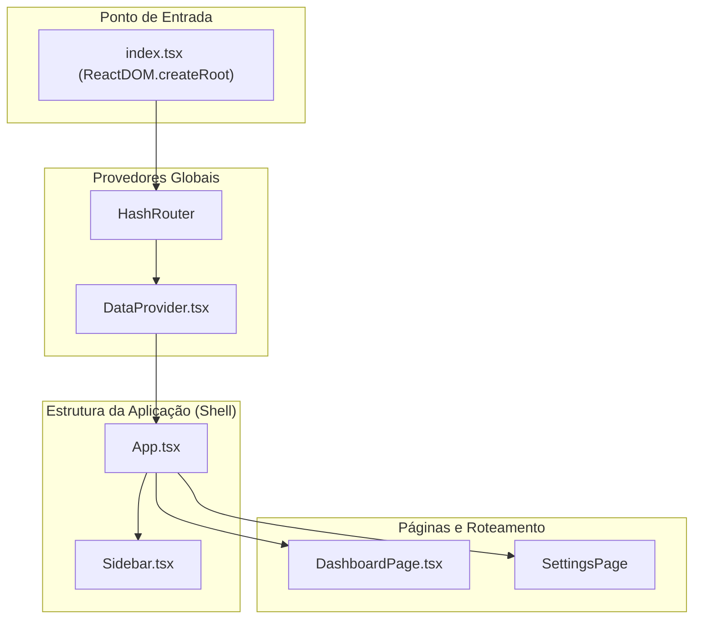

# UI Component Library - Cliente 360

Este documento serve como um guia de referência completo e detalhado para cada componente React utilizado na aplicação "Painel Cliente 360". Ele detalha o propósito, a API (props), o estado interno, as interações do usuário e as dependências de cada componente.

## 1. Componentes Principais e de Layout

Estes componentes formam a estrutura básica e a navegação da aplicação.

---

### 1.1. `App.tsx`

**Propósito:** O componente raiz da aplicação. Ele orquestra o layout geral (Sidebar + Conteúdo Principal), gerencia o roteamento e o estado de busca global.

*   **API de Props:** Nenhuma.
*   **Consumo de Dados:** Utiliza o hook `useData()` do `DataContext` para obter `allCustomers`, `loading`, `error` e `fetchCustomers`.

#### State Management Strategy
*   **Estado Local:** `searchTerm: string` é gerenciado com `useState`. Manter este estado no `App` é uma decisão arquitetural deliberada. Eleva o estado da busca para o ancestral comum mais próximo que precisa dele, permitindo que o `searchTerm` seja aplicado aos dados antes de serem passados para qualquer página ou componente filho.
*   **Dados Derivados:** `searchedCustomers` é derivado de `allCustomers` e `searchTerm` usando `useMemo`. Isso garante que a filtragem (uma operação potencialmente cara) só ocorra quando os dados brutos ou o termo de busca mudam, não a cada renderização do `App`.

#### Performance DNA
*   A principal otimização aqui é o `useMemo` para `searchedCustomers`. Sem ele, a filtragem de todo o array `allCustomers` aconteceria a cada re-renderização do `App`, mesmo que as mudanças de estado fossem irrelevantes para a busca (por exemplo, se um futuro estado de "tema" fosse adicionado aqui).
*   A função `handleSearch` é envolvida em `useCallback` para garantir que a prop `onSearchChange` passada para `Sidebar` seja estável, prevenindo re-renderizações desnecessárias do `Sidebar`.

#### Accessibility (A11y) Blueprint
*   A `div` principal com a classe `flex` estabelece a estrutura de layout. A tag `<main>` é usada para o conteúdo principal, o que é semanticamente correto e ajuda tecnologias assistivas a identificar a área de conteúdo principal da página.

**Dependências:** `react-router-dom`, `DataContext`, `Sidebar.tsx`, `DashboardPage.tsx`.

---

### 1.2. `Sidebar.tsx`

**Propósito:** Fornece a navegação principal, a identidade visual da marca e a funcionalidade de busca global para clientes.

**API de Props:**
| Prop           | Tipo                  | Obrigatório | Descrição                                        |
|----------------|-----------------------|-------------|--------------------------------------------------|
| `searchTerm`     | `string`              | Sim         | O valor atual do campo de busca (controlado).      |
| `onSearchChange` | `(term: string) => void` | Sim         | Função de callback chamada quando a busca muda. |

#### State Management Strategy
*   Este é um **componente controlado (Dumb Component)**. Ele não possui estado interno. Seu comportamento é inteiramente ditado pelas props recebidas de `App.tsx`, tornando-o altamente previsível e reutilizável.

#### Performance DNA
*   Sendo um componente "burro" com props estáveis (graças ao `useCallback` em `App.tsx`), ele raramente se re-renderiza desnecessariamente. Envolvê-lo em `React.memo` seria uma otimização possível, mas dado sua simplicidade, o ganho seria mínimo.

#### Accessibility (A11y) Blueprint
*   A tag `<aside>` é usada para o contêiner, que é a tag HTML semanticamente correta para conteúdo de barra lateral.
*   A tag `<nav>` envolve os links de navegação.
*   `NavLink` do React Router gerencia automaticamente os atributos `aria-current="page"` no link ativo, o que é crucial para leitores de tela.
*   **Melhoria Necessária:** O campo de busca `<input>` não possui uma tag `<label>` associada. Para acessibilidade, ele deveria ter um `<label htmlFor="search-input">` (que pode ser visualmente oculto) ou um atributo `aria-label="Buscar clientes"`.

---

### 1.3. `DashboardPage.tsx`

**Propósito:** O principal contêiner para a visualização do dashboard. Ele orquestra todos os widgets e gerencia o estado de filtragem por status.

**API de Props:**
| Prop                | Tipo           | Obrigatório | Descrição                                                              |
|---------------------|----------------|-------------|------------------------------------------------------------------------|
| `searchedCustomers` | `Customer[]`   | Sim         | A lista de clientes, já pré-filtrada pela busca global do `App.tsx`. |
| `loading`           | `boolean`      | Sim         | Indica se os dados iniciais estão sendo carregados.                      |
| `error`             | `string | null` | Sim         | Mensagem de erro, se houver.                                           |
| `onRetry`           | `() => void`   | Sim         | Função para tentar recarregar os dados em caso de erro.                  |

#### State Management Strategy
*   **Estado Local:** `activeTab` e `statusFilter` são gerenciados com `useState`, pois são estados de UI que pertencem exclusivamente à lógica desta página.
*   **Dados Derivados:** O `useMemo` em `dynamicKpiData` e `statusFilteredCustomers` é a chave aqui. Ele pega os dados brutos (`allCustomers` do contexto) e as props (`searchedCustomers`) e os transforma para os componentes de UI. Isso separa a computação dos dados da renderização.

#### Performance DNA
*   `useMemo` é usado para `dynamicKpiData` e `statusFilteredCustomers` para evitar recalcular KPIs e filtrar listas em cada renderização.
*   `handleStatusFilterChange` é envolvido em `useCallback`. Isso otimiza os componentes filhos como `KpiCard` e `CustomerStatusChart`, pois a prop `onClick` que eles recebem não é recriada a cada renderização do `DashboardPage`.

---

## 2. Widgets do Dashboard

Estes são os blocos de construção que exibem dados e fornecem interatividade na página do dashboard.

---

### 2.1. `KpiCard.tsx`

**Propósito:** Exibir um Indicador-Chave de Desempenho (KPI) de forma clara e concisa.

**API de Props:**
| Prop      | Tipo        | Obrigatório | Descrição                                                                 |
|-----------|-------------|-------------|---------------------------------------------------------------------------|
| `data`    | `KpiData`   | Sim         | Um objeto contendo todos os dados para o card (título, valor, etc.).       |
| `onClick` | `() => void` | Não         | Se fornecido, o card se torna clicável.       |
| `isActive`| `boolean`   | Não         | Se `true`, aplica um estilo de destaque visual.             |

#### State Management Strategy
*   Nenhum. Este é um componente puramente presentacional. Ele renderiza o que lhe é dado.

#### Accessibility (A11y) Blueprint
*   Quando clicável, o `div` principal deve ter `role="button"` e `tabIndex="0"` para ser focável e operável pelo teclado. Um evento `onKeyDown` também deve ser adicionado para lidar com as teclas "Enter" e "Espaço".
*   O conteúdo visual (ícone, valor, mudança) é claro, mas para um leitor de tela, um `aria-label` abrangente no `div` principal poderia ser útil, como `aria-label="Total de Clientes: ${value}, mudança de ${change}"`.

---

### 2.2. `CustomerTable.tsx`

**Propósito:** Exibir uma lista grande de clientes de forma performática.

**API de Props:**
| Prop        | Tipo         | Obrigatório | Descrição                               |
|-------------|--------------|-------------|-----------------------------------------|
| `customers` | `Customer[]` | Sim         | A lista de clientes a ser exibida.      |
| `loading`   | `boolean`    | Sim         | Se `true`, exibe a `SkeletonDivTable`. |

#### State Management Strategy
*   Gerencia um estado local complexo para a funcionalidade de chat (`isModalOpen`, `selectedCustomer`, `chatHistory`, etc.) e para a ordenação (`sortConfig`). Essa lógica está encapsulada aqui porque nenhum outro componente precisa saber sobre ela.

#### Performance DNA
*   **Virtualização (`react-window`):** A otimização mais importante. Evita a criação de milhares de nós no DOM.
*   **Memoização de Linha (`React.memo(Row)`):** Impede que as linhas visíveis sejam re-renderizadas quando algo irrelevante para elas muda (por exemplo, o estado do modal de chat).
*   **Memoização de Callbacks (`useCallback`):** A função `handleOpenChat` é memoizada e passada para `itemData` do `react-window`. Isso é crucial porque impede que a função seja recriada a cada rolagem, o que forçaria todas as linhas visíveis a se re-renderizarem.

#### Accessibility (A11y) Blueprint
*   **Tabela Semântica (Melhoria):** A estrutura atual usa `divs`. Deveria ser refatorada para usar `<table>`, `<thead>`, `<tbody>`, `tr`, `th`, e `td` para ser semanticamente correta.
*   **Cabeçalhos Ordenáveis:** Os `divs` clicáveis no cabeçalho deveriam ser `<button>`s dentro de cada `<th>` para serem naturalmente focáveis e operáveis. Atributos como `aria-sort` (`"ascending"`, `"descending"`) devem ser usados para indicar o estado de ordenação atual.
*   **Ações:** O botão de chat tem um `aria-label` claro (`Conversar com IA sobre ${customer.name}`), o que é excelente.

---

## 3. Componentes Comuns e Reutilizáveis

---

### 3.1. `common/Modal.tsx`

**Propósito:** Fornecer uma janela modal genérica e acessível.

**API de Props:**
| Prop       | Tipo              | Obrigatório | Descrição                                                  |
|------------|-------------------|-------------|------------------------------------------------------------|
| `isOpen`   | `boolean`         | Sim         | Controla a visibilidade do modal.                          |
| `onClose`  | `() => void`      | Sim         | Função chamada quando o usuário clica fora ou no botão "X". |
| `children` | `React.ReactNode` | Sim         | O conteúdo a ser renderizado dentro do modal.              |

#### Accessibility (A11y) Blueprint
*   **Foco:** Um modal acessível deve "prender" o foco do teclado dentro dele. Isso geralmente requer um `useEffect` para encontrar todos os elementos focáveis dentro do modal e gerenciar o `Tab` e `Shift+Tab`. Esta implementação não possui essa funcionalidade, que é uma melhoria crítica.
*   **Semântica:** O `div` principal do modal deveria ter `role="dialog"`, `aria-modal="true"`, e `aria-labelledby` apontando para o ID do título do modal.
*   **Fechamento:** O fechamento ao pressionar a tecla `Escape` deve ser implementado com um `useEffect` e um event listener no `window`.

---

### 3.4. `common/SkeletonLoader.tsx`

**Propósito:** Fornecer um conjunto de componentes de placeholder que imitam a estrutura da UI final.

#### Performance DNA
*   O uso de skeletons melhora a **performance percebida**. Em vez de mostrar uma tela em branco ou um spinner, o usuário vê a estrutura da página se formando, o que faz com que o tempo de carregamento pareça mais curto e a aplicação mais responsiva.

---
## 4. Visual States of Components

A documentação dos vários estados de um componente é crucial para desenvolvedores e designers.

#### `KpiCard.tsx`
*   **Padrão:** Aparência normal.
*   **Hover (Clicável):** A sombra se expande e o card se move para cima (`hover:shadow-xl`, `transform hover:-translate-y-1`).
*   **Ativo:** Um anel de destaque verde (`ring-2 ring-primary`) é adicionado.
*   **Loading:** Exibido como `SkeletonKpiCard`.

#### `CustomerTable.tsx`
*   **Loading:** Exibe a `SkeletonDivTable`.
*   **Vazio:** Mostra a mensagem "Nenhum cliente encontrado."
*   **Populada:** Exibe a lista virtualizada de clientes.
*   **Chat Aberto (Inicial):** O modal é exibido com um spinner enquanto a primeira resposta da IA é carregada.
*   **Chat Aberto (Streaming):** A resposta da IA aparece progressivamente com um cursor piscando.
*   **Chat Aberto (Erro):** Uma mensagem de erro é exibida dentro do modal.

#### `Botão de Envio (Chat)`
*   **Padrão:** Estilo normal, habilitado.
*   **Desabilitado:** A opacidade é reduzida e o cursor muda para `not-allowed`. Isso acontece quando a IA está respondendo ou o campo de texto está vazio.

---

## 5. Future Improvements & Refactoring Opportunities

Uma base de código saudável é aquela que está sempre evoluindo.

1.  **Componente `<Button />` Abstrato:**
    *   **Problema:** Botões são estilizados ad-hoc em toda a aplicação (ex: `bg-success`, `bg-bg-error`).
    *   **Solução:** Criar um componente `<Button variant="primary" size="lg" disabled={false} />`. Isso centralizaria os estilos, garantiria consistência e simplificaria o uso.

2.  **Melhorar Acessibilidade da Tabela:**
    *   **Problema:** A `CustomerTable` usa `divs`, o que é semanticamente incorreto e ruim para a acessibilidade.
    *   **Solução:** Refatorar para usar `<table>`, `<thead>`, `<tbody>`, `<th>`, `<td>`. Transformar os cabeçalhos de ordenação em `<button>`s dentro dos `<th>`s com `aria-sort`.

3.  **Implementar Focus Trap no Modal:**
    *   **Problema:** O foco do teclado pode "escapar" do modal, o que é uma falha de acessibilidade (WCAG).
    *   **Solução:** Usar uma biblioteca como `focus-trap-react` ou implementar um `useEffect` customizado para gerenciar o foco, garantindo que o usuário só possa navegar entre os elementos dentro do modal quando ele estiver aberto.

4.  **Tipagem de Ícones:**
    *   **Problema:** Os componentes de ícone não têm tipo e não aceitam `className` de forma padronizada.
    *   **Solução:** Definir um tipo `IconProps = { className?: string; }` e fazer com que cada ícone seja um `React.FC<IconProps>`, passando o `className` para o elemento `<svg>`.

5.  **Centralizar Constantes de Layout:**
    *   **Problema:** O `ROW_HEIGHT` (76px) da tabela está "hardcoded" no `CustomerTable.tsx`. Se um designer decidir mudar a altura da linha, essa alteração não seria trivial.
    *   **Solução:** Mover constantes de layout como esta para um arquivo de tema ou constantes centralizado.

---
## 6. Provedores de Contexto (Context Providers)

Componentes "headless" (sem UI própria) que fornecem estado e lógica para seus componentes filhos.

---

### 6.1. `contexts/DataProvider.tsx`

**Propósito:** Atuar como a **fonte única da verdade (Single Source of Truth)** para todos os dados de clientes na aplicação.

*   **API do Contexto (Valores Fornecidos):**
    *   `allCustomers: Customer[]`: A lista de clientes.
    *   `loading: boolean`: O estado de carregamento.
    *   `error: string | null`: O estado de erro.
    *   `addNewCustomers: (newCustomers: Customer[]) => void`: Função para adicionar novos clientes à lista.
    *   `fetchCustomers: () => Promise<void>`: Função para re-buscar todos os dados.
*   **Lógica Chave:**
    *   `useEffect`: Chama `fetchCustomers` na montagem inicial.
    *   `useCallback`: `fetchCustomers` e `addNewCustomers` são memoizadas para otimizar o desempenho dos componentes filhos que as consomem.

---

## 7. Sistema de Estilização e Tema (Theming & Styling System)

A aparência visual da aplicação é controlada por uma combinação de Tailwind CSS e um tema de cores customizado.

*   **Tecnologia:** Tailwind CSS.
*   **Configuração do Tema:** Localizada no `index.html`, estende o tema padrão do Tailwind com uma paleta de cores semântica (`primary`, `ui-surface`, `text-secondary`, etc.).
*   **Benefícios:** Consistência, manutenção fácil e legibilidade do JSX.

---

## 8. Iconografia (Iconography)

A aplicação utiliza um sistema de ícones SVG autocontidos para clareza visual e performance.

*   **Abordagem:** Todos os ícones estão definidos em `constants.tsx` como componentes funcionais React, permitindo que sejam estilizados com `className`.

**Galeria de Ícones:**

| Componente | Ícone | Propósito |
|---|---|---|
| `IconDashboard` | <svg xmlns="http://www.w3.org/2000/svg" className="h-6 w-6" fill="none" viewBox="0 0 24 24" stroke="currentColor"><path strokeLinecap="round" strokeLinejoin="round" strokeWidth={2} d="M4 6a2 2 0 012-2h2a2 2 0 012 2v2a2 2 0 01-2 2H6a2 2 0 01-2-2V6zM14 6a2 2 0 012-2h2a2 2 0 012 2v2a2 2 0 01-2 2h-2a2 2 0 01-2-2V6zM4 16a2 2 0 012-2h2a2 2 0 012 2v2a2 2 0 01-2 2H6a2 2 0 01-2-2v-2zM14 16a2 2 0 012-2h2a2 2 0 012 2v2a2 2 0 01-2 2h-2a2 2 0 01-2-2v-2z" /></svg> | Navegação do painel principal. |
| `IconSettings` | <svg xmlns="http://www.w3.org/2000/svg" className="h-6 w-6" fill="none" viewBox="0 0 24 24" stroke="currentColor"><path strokeLinecap="round" strokeLinejoin="round" strokeWidth={2} d="M10.325 4.317c.426-1.756 2.924-1.756 3.35 0a1.724 1.724 0 002.573 1.066c1.543-.94 3.31.826 2.37 2.37a1.724 1.724 0 001.065 2.572c1.756.426 1.756 2.924 0 3.35a1.724 1.724 0 00-1.066 2.573c.94 1.543-.826 3.31-2.37 2.37a1.724 1.724 0 00-2.572 1.065c-.426 1.756-2.924 1.756-3.35 0a1.724 1.724 0 00-2.573-1.066c-1.543.94-3.31-.826-2.37-2.37a1.724 1.724 0 00-1.065-2.572c-1.756-.426-1.756-2.924 0-3.35a1.724 1.724 0 001.066-2.573c-.94-1.543.826-3.31 2.37-2.37.996.608 2.296.07 2.572-1.065z" /><path strokeLinecap="round" strokeLinejoin="round" strokeWidth={2} d="M15 12a3 3 0 11-6 0 3 3 0 016 0z" /></svg> | Navegação para configurações. |
| ... | ... | ... |

---

## 9. Composição de Componentes e Hierarquia Visual

A aplicação é construída através do aninhamento de componentes, formando uma árvore hierárquica.

### Diagrama da Árvore de Componentes

**Análise da Hierarquia:** `DataProvider` envolve o `App`, tornando o estado global acessível a todas as páginas e componentes. `App` renderiza a `Sidebar` e a página ativa, que por sua vez compõe os widgets individuais.
