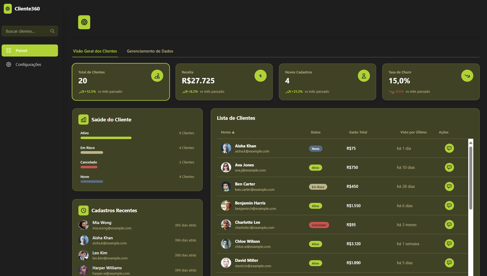

<div align="center">

# Customer 360 Dashboard - Customer Intelligence Panel
  
  <p>
    
    
    
    <a href="https://github.com/matheusfly/saas-platform/stargazers"></a>
    <a href="https://github.com/matheusfly/saas-platform/network/members"></a>
    <a href="https://github.com/matheusfly/saas-platform/issues"></a>
  </p>

  The **Customer 360 Dashboard** is an interactive and modern dashboard designed to provide a comprehensive and strategic view of a company's customers. It combines data visualization, information management, and AI-powered insights to empower teams to make proactive decisions and improve customer engagement.

  The application is built with the latest market technologies, including React, TypeScript, and Tailwind CSS, and utilizes the Google Gemini API for advanced AI features.

## 🚀 Cutting-Edge Technologies

* **Frontend:** [React](https://reactjs.org/)
* **Styling:** [Tailwind CSS](https://tailwindcss.com/)
* **State Management:** [React Context API](https://reactjs.org/docs/context.html)
* **Data Visualization:** [Recharts](https://recharts.org/)
* **UI Components:** [Headless UI](https://headlessui.com/)
* **Form Handling:** [React Hook Form](https://react-hook-form.com/)
* **Icons:** [Heroicons](https://heroicons.com/)
* **AI Integration:** [Google Gemini API](https://ai.google/)

## ✨ Key Features

- **Customer 360° View**: Comprehensive customer profiles with all relevant information in one place
- **Advanced Search**: Powerful search functionality with filters and sorting options
- **Performance Metrics**: Key performance indicators and visualizations
- **AI-Powered Insights**: Intelligent recommendations and predictions
- **Responsive Design**: Fully responsive layout that works on all devices
- **Dark Mode**: Built-in dark theme for better user experience

## 🛠️ Project Structure

```
src/pages/painel-cliente-360/
├── components/         # Reusable UI components
├── contexts/           # React context providers
├── hooks/             # Custom React hooks
├── services/          # API and data services
├── types/             # TypeScript type definitions
├── utils/             # Utility functions and helpers
├── App.tsx            # Main application component
└── README.md          # Documentation in English
```

## 🚀 Getting Started

### Prerequisites

- Node.js 16+
- Yarn or npm
- Google Gemini API Key

### Installation

1. **Clone the repository**
   ```bash
   git clone https://github.com/matheusfly/saas-platform.git
   cd saas-platform
   ```

2. **Install dependencies**
   ```bash
   cd src/pages/painel-cliente-360
   yarn install
   # or
   npm install
   ```

3. **Set up environment variables**
   ```bash
   cp .env.example .env
   # Edit .env file with your settings
   ```

4. **Start the development server**
   ```bash
   yarn dev
   # or
   npm run dev
   ```

## 🤝 Contributing

Contributions are welcome! Please follow these steps:

1. Fork the project
2. Create your feature branch (`git checkout -b feature/AmazingFeature`)
3. Commit your changes (`git commit -m 'Add some AmazingFeature'`)
4. Push to the branch (`git push origin feature/AmazingFeature`)
5. Open a Pull Request

## 📄 License

Distributed under the MIT License. See `LICENSE` for more information.

## 📞 Contact

Development Team - [contato@matheusfly.dev](mailto:contato@matheusfly.dev)

Project Link: [https://github.com/matheusfly/saas-platform](https://github.com/matheusfly/saas-platform)
