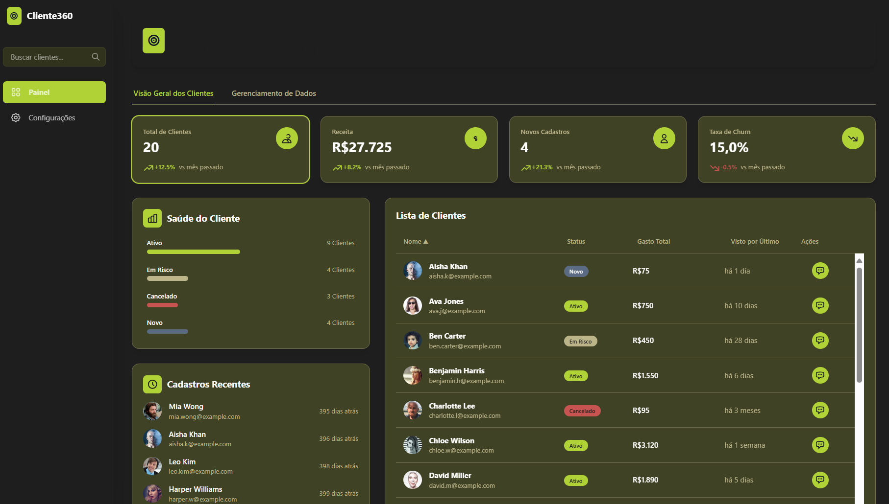
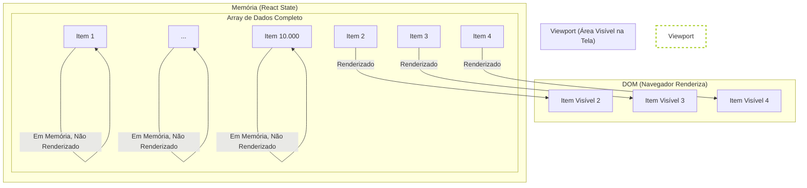
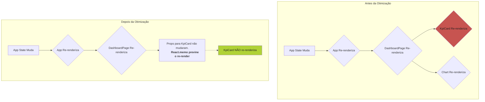
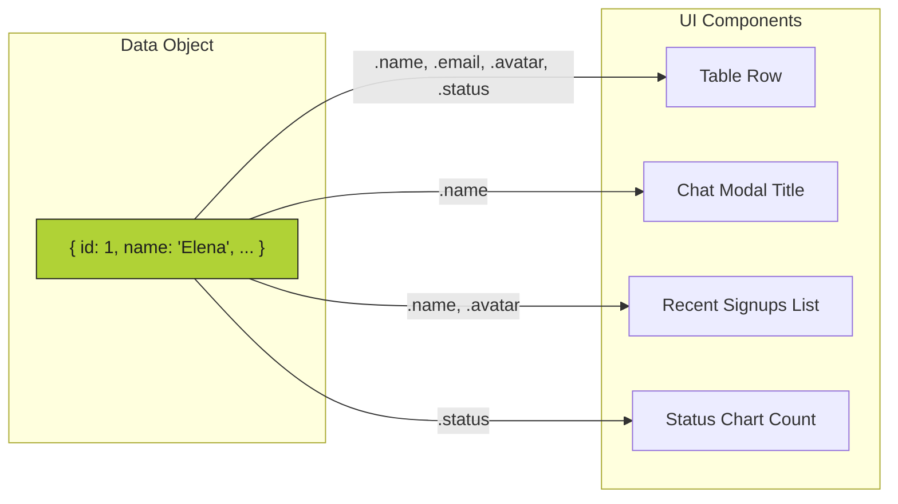
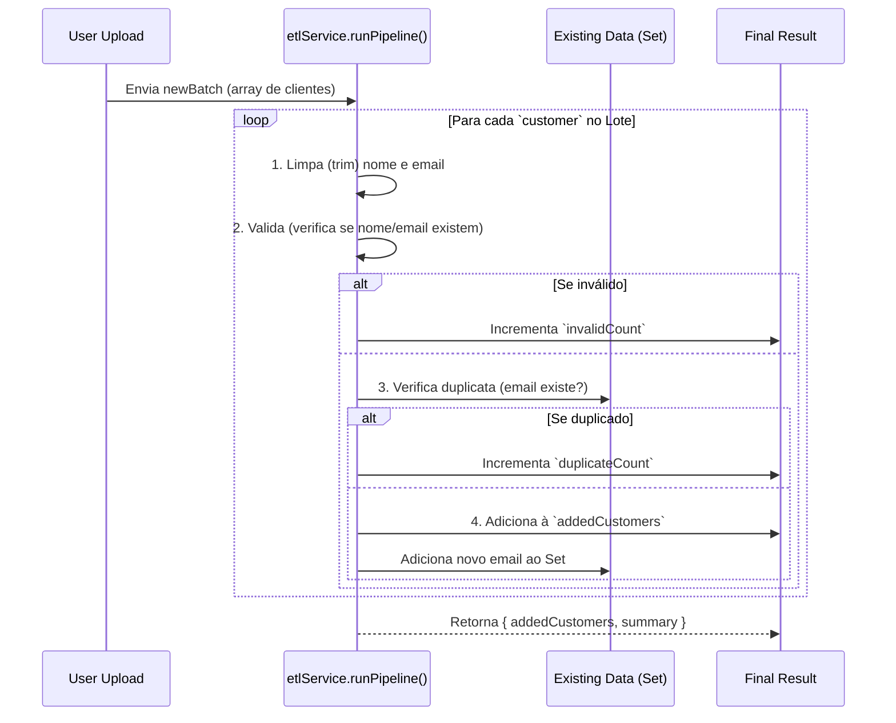

<div align="center">

<h1>Painel Cliente 360 - Dashboard de Inteligência de Clientes</h1>
  
  <p>
    
    
    
    <a href="https://github.com/matheusfly/saas-platform/stargazers"></a>
    <a href="https://github.com/matheusfly/saas-platform/network/members"></a>
    <a href="https://github.com/matheusfly/saas-platform/issues"></a>
  </p>

O **Painel Cliente 360** é um dashboard interativo e moderno construído para fornecer uma visão completa e estratégica dos clientes de uma empresa. Ele combina visualização de dados, gerenciamento de informações e insights baseados em Inteligência Artificial para capacitar equipes a tomar decisões proativas e melhorar o engajamento do cliente.

A aplicação foi desenvolvida com as mais recentes tecnologias do mercado, incluindo React, TypeScript e Tailwind CSS, e utiliza a API do Google Gemini para funcionalidades avançadas de IA.

## 🚀 Tecnologias de Ponta

* **Frontend:** [React](https://reactjs.org/)
* **Linguagem:** [TypeScript](https://www.typescriptlang.org/)
* **Estilização:** [Tailwind CSS](https://tailwindcss.com/)
* **Roteamento:** [React Router](https://reactrouter.com/)
* **Inteligência Artificial:** [Google Gemini API](https://ai.google.dev/)
* **Ícones:** SVGs customizados e [Font Awesome](https://fontawesome.com/)

## ✨ Funcionalidades Inovadoras

* **Dashboard Interativo:** Visualize KPIs (Indicadores-Chave de Desempenho) como total de clientes, receita, novos cadastros e taxa de churn.
* **UI Profissional com Skeleton Loading:** Uma experiência de carregamento suave que mostra placeholders de conteúdo em vez de um spinner de página inteira.
* **Filtragem Dinâmica:** Filtre a lista de clientes clicando nos cards de KPI ou no gráfico de status.
* **Tabela de Clientes Virtualizada e de Alta Performance:** Uma lista rolável e ordenável que renderiza apenas os itens visíveis, garantindo performance com milhares de registros.
* **Chat com IA por Cliente:** Inicie uma conversa com um assistente de IA (Gemini) para obter uma análise detalhada, nível de risco e ações sugeridas para qualquer cliente.
* **Insights Estratégicos com IA:** Gere tendências e recomendações para toda a base de clientes com um único clique.
* **Gerenciamento de Dados:** Simule o upload de arquivos de dados com um pipeline ETL que limpa, valida e carrega novos clientes, prevenindo duplicatas.
* **Design Responsivo:** A interface se adapta perfeitamente a diferentes tamanhos de tela.

---

## 🏛️ Arquitetura Robusta e Escalável

A aplicação é construída sobre uma arquitetura modular e escalável, centrada em componentes reutilizáveis e gerenciamento de estado desacoplado.

### Diagrama Arquitetural

Este diagrama ilustra como os dados fluem do nosso serviço de API, através do `DataContext` centralizado, e para os componentes da UI, que renderizam skeletons durante o carregamento.

```mermaid
graph TD
    subgraph "Camada de Dados"
        API[apiService.ts]
    end

    subgraph "Gerenciamento de Estado Global"
        CTX[DataContext.tsx]
        CTX -- Fetches Data --> API
    end

    subgraph "Camada de Orquestração"
        App[App.tsx]
        App -- Consumes --> CTX
        DP[DashboardPage.tsx]
        App -- Routes to --> DP
    end
  
    subgraph "Camada de UI (Componentes)"
        Table[CustomerTable.tsx]
        Kpi[KpiCard.tsx]
        Chart[CustomerStatusChart.tsx]
        Skeletons[common/SkeletonLoader.tsx]
    end

    DP -- Passes 'loading' state --> Table
    DP -- Passes 'loading' state --> Kpi
    DP -- Passes 'loading' state --> Chart

    Table -- Renders --> Skeletons
    Kpi -- Renders --> Skeletons
    Chart -- Renders --> Skeletons

    style API fill:#656B4B,stroke:#B0D236,stroke-width:2px
    style CTX fill:#4F512D,stroke:#B0D236,stroke-width:2px
    style App fill:#31331c,stroke:#BDB58A,stroke-width:1px
    style DP fill:#31331c,stroke:#BDB58A,stroke-width:1px
```



### Detalhamento de Componentes

| Componente                            | Diretório             | Responsabilidade                                                                                                   |
| ------------------------------------- | ---------------------- | ------------------------------------------------------------------------------------------------------------------ |
| **`App.tsx`**                 | `/`                  | Orquestrador principal. Gerencia rotas e o estado da busca.                                                        |
| **`index.tsx`**               | `/`                  | Ponto de entrada da aplicação. Renderiza o `App` dentro dos provedores de Contexto e Roteador.                 |
| **`DataContext.tsx`**         | `contexts/`          | **Fonte da Verdade.** Gerencia o estado global dos clientes (lista, loading, erro) e expõe via `useData`. |
| **`Sidebar.tsx`**             | `components/`        | Barra de navegação, logo e campo de busca global.                                                                |
| **`DashboardPage.tsx`**       | `components/`        | Layout principal da dashboard. Orquestra a exibição dos componentes de UI com base no estado `loading`.        |
| **`CustomerTable.tsx`**       | `components/`        | Exibe a tabela de clientes virtualizada e ordenável. Renderiza `SkeletonTable` durante o carregamento.          |
| **`KpiCard.tsx`**             | `components/`        | Card de KPI individual. Interativo para filtrar a tabela.                                                          |
| **`CustomerStatusChart.tsx`** | `components/`        | Gráfico de barras que mostra a distribuição de status dos clientes.                                             |
| **`StrategicInsights.tsx`**   | `components/`        | Card que busca e exibe insights estratégicos da API Gemini. Possui seu próprio estado de loading.                |
| **`DataManagement.tsx`**      | `components/`        | Gerencia o upload de dados e exibe o histórico de processamento do ETL.                                           |
| **`Modal.tsx`**               | `components/common/` | Componente de modal genérico e reutilizável.                                                                     |
| **`Spinner.tsx`**             | `components/common/` | Componente de spinner reutilizável com tamanhos configuráveis.                                                   |
| **`ErrorDisplay.tsx`**        | `components/common/` | Componente reutilizável para exibir mensagens de erro de forma clara, com botão de "Tentar Novamente".           |
| **`SkeletonLoader.tsx`**      | `components/common/` | Contém os componentes de "skeleton" (placeholders de carregamento) para a UI.                                     |

---

## ⚡ Performance Otimizada

Para garantir que a aplicação seja rápida e responsiva, mesmo com grandes volumes de dados, foram implementadas duas otimizações chave.

### Tabela Virtualizada com `react-window`

* **Problema:** Renderizar uma tabela com milhares de linhas cria milhares de nós no DOM, tornando a aplicação lenta, aumentando o uso de memória e causando travamentos.
* **Solução:** A virtualização. Em vez de renderizar todas as linhas, renderizamos apenas os itens que estão atualmente visíveis na tela do usuário. Conforme o usuário rola, os itens que saem da tela são removidos do DOM e novos itens são adicionados.



### Memoização com `React.memo` e `useCallback`

* **Problema:** Em React, quando o estado de um componente pai muda, todos os seus filhos são re-renderizados por padrão. Isso pode ser desnecessário se as propriedades (`props`) passadas para um filho não mudaram.
* **Solução:** `useCallback` e `React.memo`.
  * `useCallback` "memoriza" uma função, garantindo que ela não seja recriada a cada renderização, a menos que suas dependências mudem.
  * `React.memo` é um "invólucro" para componentes que previne a re-renderização se as `props` não mudaram.



---

## 🧠 Estrutura de Dados Inteligente

A aplicação é fortemente tipada com TypeScript para garantir a integridade dos dados. A interface `Customer` é o pilar central.

### A Interface `Customer`

```typescript
export interface Customer {
  id: number;
  name: string;
  email: string;
  avatar: string;
  status: CustomerStatus; // Enum: 'Ativo', 'Cancelado', 'Em Risco', 'Novo'
  totalSpend: number;
  lastSeen: string;
  joinDate: string;
}
```

### Mapeamento: De Dados à UI

Um único objeto `Customer` alimenta múltiplos componentes, garantindo consistência:



### Pipeline de ETL Visualizado

O `etlService` garante que apenas dados limpos e únicos entrem na aplicação.



---

## 🛠️ Guias de Desenvolvimento

### Como Adicionar um Novo Campo (ex: `priority`)

Este guia mostra como estender a aplicação com um novo campo de dados.

1. **Atualize o Tipo (`types.ts`):**
   Adicione o novo campo à interface `Customer`.

   ```typescript
   export interface Customer {
     // ... campos existentes
     priority: 'Baixa' | 'Média' | 'Alta';
   }
   ```
2. **Atualize os Dados Mock (`data/customers.json`):**
   Adicione o novo campo aos seus dados de exemplo.

   ```json
   { "id": 1, ..., "priority": "Alta" }
   ```
3. **Adicione à UI (`components/CustomerTable.tsx`):**
   a. Adicione o cabeçalho da nova coluna.
   b. Adicione a célula (`<div>`) para renderizar o novo dado na `Row` do componente.

   ```tsx
   // Adicionar ao cabeçalho
   <div className="w-1/6 ...">Prioridade</div>

   // Adicionar à célula na linha da tabela
   <div className="w-1/6 ...">{customer.priority}</div>
   ```
4. **Atualize o ETL (`services/etlService.ts`):**
   Se o novo campo precisar de validação ou limpeza, adicione a lógica ao pipeline. Caso contrário, ele será incluído automaticamente.

---

## 🗺️ Roadmap Estratégico para Produção

Esta aplicação tem uma base sólida. Os próximos passos para um ambiente de produção real envolvem mover a lógica para um backend.

### Arquitetura Alvo

```mermaid
graph TD
    Client[Browser: React App]
    LB[Load Balancer]
    API_Server[API Server (Node.js/Python/Go)]
    DB[(Database: PostgreSQL/MongoDB)]
  
    Client -- HTTPS Request --> LB
    LB -- Forwards --> API_Server
    API_Server -- CRUD Operations --> DB
  
    subgraph "Backend (AWS/GCP/Azure)"
        direction LR
        API_Server -- Caches Data --> Cache[Redis]
        API_Server -- Securely Calls --> Gemini[Gemini API]
    end

    style Client fill:#BDB58A,stroke:#1E1E1E
    style API_Server fill:#4F512D,stroke:#B0D236
    style DB fill:#656B4B,stroke:#B0D236
```

### Passos Estratégicos

1. **Backend API:**

   * Desenvolver uma API REST ou GraphQL.
   * **Endpoints:**
     * `GET /api/customers`: Com paginação, ordenação e filtragem no servidor.
     * `POST /api/customers/upload`: Para receber arquivos CSV/XLS e iniciar o pipeline ETL no backend.
     * `POST /api/customers/:id/chat`: Para interagir com a Gemini API de forma segura, sem expor a chave de API no cliente.
2. **Banco de Dados:**

   * Migrar `customers.json` para um banco de dados como PostgreSQL.
   * **Schema `customers`:** Indexar campos frequentemente consultados como `email` e `status`.
3. **Segurança e Performance:**

   * **Mover a Chave de API:** A chamada para a API Gemini **DEVE** ser feita a partir do backend para proteger a chave.
   * **Autenticação:** Implementar autenticação de usuário (ex: JWT, OAuth).
   * **Cache:** Implementar cache (ex: Redis) para endpoints de leitura pesada.
4. **DevOps:**

   * **CI/CD:** Configurar um pipeline para build, teste e deploy automáticos.
   * **Monitoramento:** Integrar ferramentas de monitoramento de performance e erros.

## 🚀 Guia de Execução

1. **API Key:** O projeto requer uma chave de API do Google Gemini. Esta chave deve ser configurada como uma variável de ambiente chamada `API_KEY`. O código (`geminiService.ts`) já está preparado para lê-la de `process.env.API_KEY`.
2. **Servidor Local:** Sirva os arquivos estáticos (`index.html`, `index.tsx`, etc.) a partir de um servidor web local. A maioria das ferramentas de desenvolvimento frontend (como Vite ou `live-server` do npm) faz isso automaticamente.
3. **Navegador:** Abra o `index.html` no seu navegador. A aplicação será carregada e estará pronta para uso.

</div>
