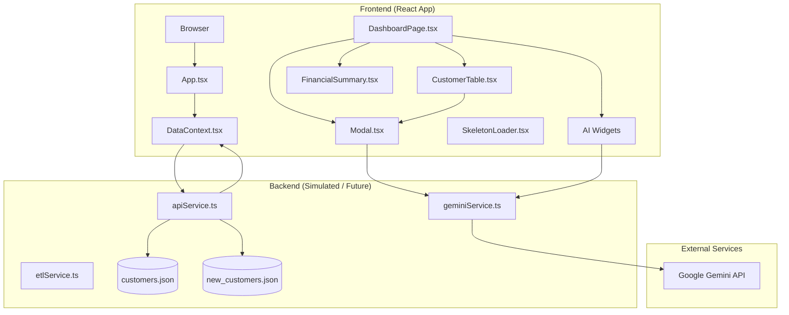
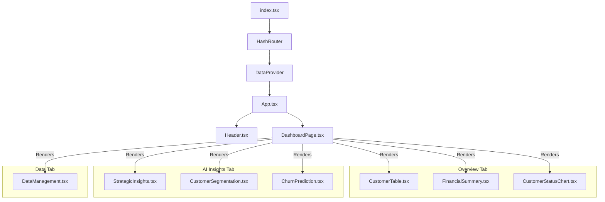
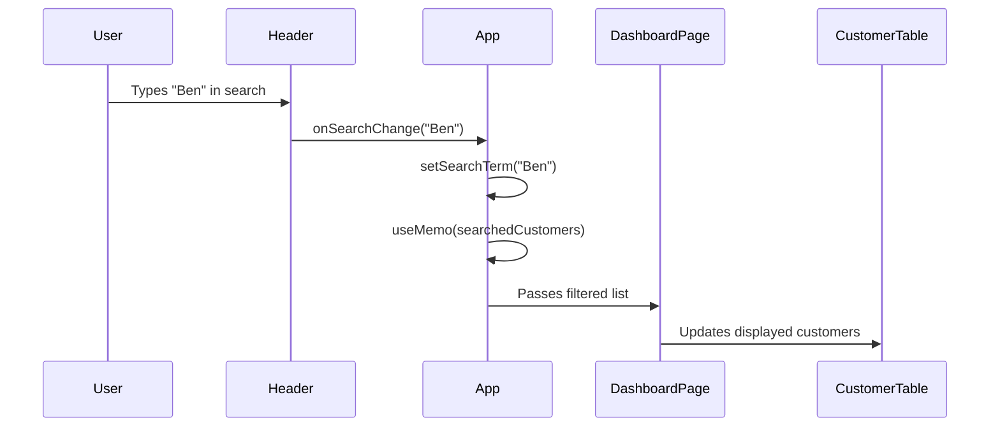
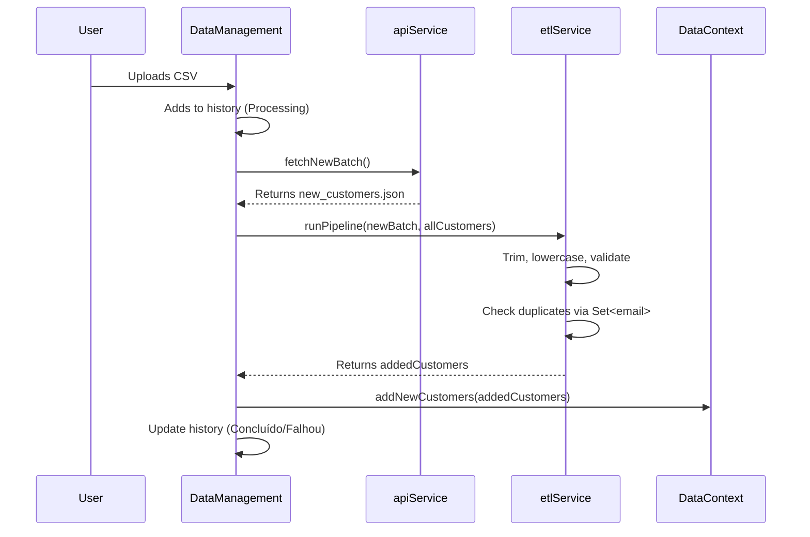
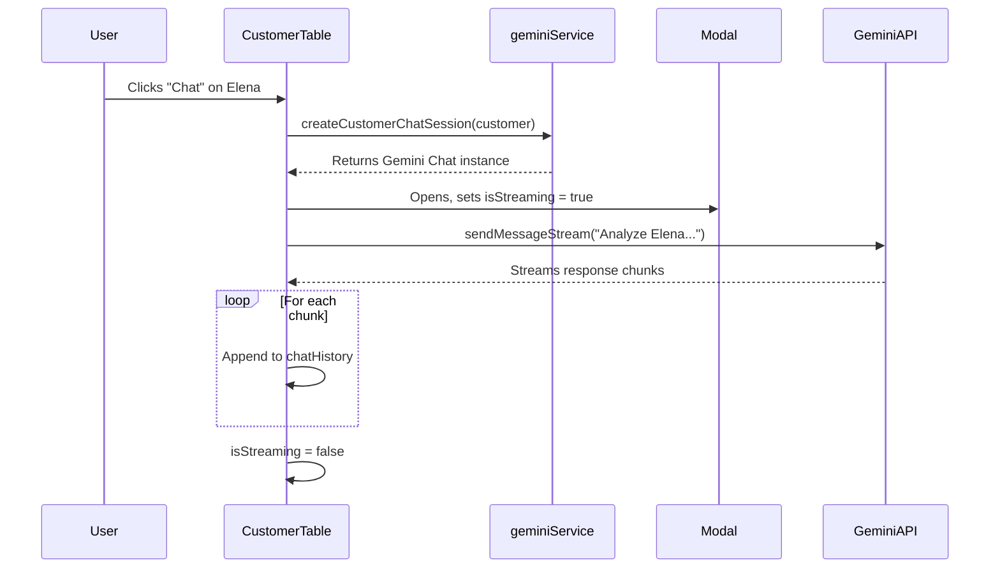

# Fullstack Technical Documentation: Customer 360 Dashboard

---

## **Overview**

The **Customer 360 Dashboard** is a modern, interactive, and AI-powered application designed to provide a comprehensive, strategic view of a company's customer base. Built with cutting-edge frontend technologies and integrated with the Google Gemini API for intelligent insights, this dashboard enables teams to make data-driven, proactive decisions and enhance customer engagement.

This technical documentation provides a complete fullstack breakdown of the system—covering architecture, data flow, component interlocks, runtime behavior, and production readiness—offering a holistic view of how every gear in the system functions and interacts.

---

## **Project Metadata**

| Attribute | Value |
|---------|-------|
| **Project Name** | Customer 360 Dashboard - Customer Intelligence Panel |
| **Repository** | [https://github.com/matheusfly/saas-platform](https://github.com/matheusfly/saas-platform) |
| **License** | MIT |
| **Contact** | [contato@matheusfly.dev](mailto:contato@matheusfly.dev) |
| **Build Status** |  |
| **Version** |  |
| **Stars** |  |
| **Forks** |  |
| **Issues** |  |

---

## **Tech Stack**

### Frontend
- **Framework**: [React](https://reactjs.org/)
- **Language**: [TypeScript](https://www.typescriptlang.org/)
- **Styling**: [Tailwind CSS](https://tailwindcss.com/)
- **Routing**: [React Router](https://reactrouter.com/)
- **State Management**: [React Context API](https://reactjs.org/docs/context.html)
- **UI Components**: Custom Components
- **Virtualization**: `react-window`
- **AI Integration**: [Google Gemini API](https://ai.google/)

### Backend (Production Roadmap)
- **API**: REST/GraphQL (Node.js, Python, or Go)
- **Database**: PostgreSQL
- **Cache**: Redis
- **Cloud**: AWS / GCP / Azure
- **CI/CD**: GitHub Actions, Jenkins
- **Monitoring**: Sentry, Datadog

---

## **Core Features**

| Feature | Description |
|--------|-----------|
| **Customer 360° View** | Unified profile with all relevant customer data. |
| **AI-Powered Insights** | Strategic trends and recommendations via Google Gemini. |
| **AI Customer Segmentation**| AI-driven grouping of customers into actionable personas. |
| **AI Churn Prediction** | Proactive identification of customers at high risk of churning. |
| **Chat with AI per Customer** | Conversational analysis with risk assessment and action suggestions. |
| **Virtualized Table** | High-performance table supporting thousands of records. |
| **Advanced Search & Filtering** | Global search, status filtering, and sorting. |
| **ETL Data Management** | Simulated pipeline to upload, clean, validate, and load new customer data. |
| **Responsive Design** | Fully adaptive UI across devices. |
| **Dark Mode** | Built-in theme toggle for improved UX. |
| **Skeleton Loading** | Smooth UX with placeholder UI during data fetch. |

---

## **System Architecture**

### High-Level Architecture Diagram



---

## **Component Hierarchy & Composition**

### Component Tree



### Key Components

| Component | Responsibility | Location |
|--------|----------------|----------|
| `App.tsx` | Root orchestrator, routing, global search state | `/` |
| `DataContext.tsx` | Global state provider (SSoT for customers) | `contexts/` |
| `Header.tsx` | Navigation, logo, global search input | `components/` |
| `DashboardPage.tsx` | Dashboard layout, tab management, filtering logic | `components/` |
| `CustomerTable.tsx` | Virtualized, sortable customer list with AI chat | `components/` |
| `StrategicInsights.tsx`| AI-driven strategic recommendations for the whole business. | `components/` |
| `CustomerSegmentation.tsx`| AI-driven segmentation of customers into personas. | `components/` |
| `ChurnPrediction.tsx`| AI-driven prediction of high-risk customers. | `components/` |
| `Modal.tsx` | Reusable modal for AI chat | `components/common/` |
| `SkeletonLoader.tsx` | UI placeholders during loading | `components/common/` |

---

## **Data Models & Schemas**

### TypeScript Interfaces

```ts
export enum CustomerStatus {
    Active = 'Ativo',
    Churned = 'Cancelado',
    AtRisk = 'Em Risco',
    New = 'Novo',
}

export interface Customer {
  id: number;
  name: string;
  email: string;
  avatar: string;
  status: CustomerStatus;
  totalSpend: number;
  lastSeen: string;
  joinDate: string;
}

export interface StrategicInsight {
  trends: string[];
  recommendations: CategorizedRecommendation[];
}

export interface CustomerSegment {
    segmentName: string;
    description: string;
    customerCount: number;
    personas: string[]; 
}

export interface ChurnPrediction {
    customerId: number;
    customerName: string;
    customerAvatar: string;
    churnProbability: number;
}
```

---

## **Runtime Data Flow & Interlocks**

### 1. **Initialization & Bootstrapping**

1. `index.tsx` renders `App` inside `HashRouter` and `DataProvider`.
2. On mount, `DataContext` calls `fetchCustomers()` via `apiService`.
3. `apiService.getAll()` fetches `/data/customers.json`.
4. Response is stored in `DataContext.allCustomers`, triggering re-renders.

### 2. **State Management (Global SSoT)**

- **Source of Truth**: `DataContext.allCustomers`
- **Unidirectional Flow**:
  - State flows down: `DataContext → App → DashboardPage → (Widgets)`
  - Events flow up: `Widgets → DashboardPage → App`
- **Immutability**: All state updates use spread syntax (`[...prev, newItem]`).

### 3. **Search & Filtering Pipeline**



- **Optimization**: `useMemo` prevents redundant filtering.
- **Debouncing**: Not implemented; future improvement.

### 4. **Dashboard Logic & Filtering**
- `DashboardPage` receives the pre-filtered `searchedCustomers` list.
- A local state `statusFilter` is managed.
- A final `useMemo` combines `searchedCustomers` and `statusFilter` to produce the final list for the `CustomerTable`.

### 5. **Virtualized Table (Performance Core)**

- **Library**: `react-window`
- **Mechanism**:
  - Only renders visible rows.
  - Recycles DOM nodes on scroll.
- **Optimizations**:
  - `React.memo(Row)` prevents unnecessary re-renders.

### 6. **ETL Pipeline (Data Ingestion)**



- **Key Optimization**: Uses `Set<string>` for O(1) duplicate checks.
- **Validation**: Ensures `name` and `email` are present.

### 7. **AI Chat Integration (Gemini API)**



- **System Instruction**: Dynamically populated with customer data.
- **Streaming**: Real-time response display with typing indicator.

### 8. **Macro-Level AI (Insights, Segmentation, Churn)**

- Components like `StrategicInsights.tsx` call their respective functions in `geminiService` (e.g., `generateStrategicInsights(customers)`).
- The service aggregates customer data into a summary.
- It uses `responseSchema` to enforce structured JSON output from Gemini.
- The component receives the structured data and renders it.

---

## **Performance Optimizations**

| Technique | Component | Benefit |
|--------|---------|--------|
| **Virtualization** | `CustomerTable` | Enables 10k+ rows without lag |
| **`useMemo`** | `DashboardPage`, `App` | Prevents recomputation of derived data |
| **`useCallback`** | `App`, `DashboardPage` | Stabilizes function props for child components |
| **`React.memo`** | `Row`, `FinancialSummary`, etc. | Prevents unnecessary re-renders of static widgets |
| **Skeleton UI** | All components | Improves perceived performance during data fetching |

---

## **Accessibility (A11y) Status**

| Component | Status | Issues |
|--------|--------|--------|
| `Header` | Partial | `aria-label` on search input is good, but no visible `<label>`. |
| `CustomerStatusChart` | Partial | Needs keyboard navigation for clickable items. |
| `CustomerTable` | ❌ | Uses `div`s instead of `<table>`; needs `<button>` headers for sorting. |
| `Modal` | ❌ | No focus trap, missing `role="dialog"`. |
| `Buttons` | ✅ | Proper `aria-label`s used on icon-only buttons. |

### **Recommended Fixes**
- Refactor table to semantic HTML (`<table>`, `<th>`, `<td>`).
- Implement focus trap in `Modal`.
- Add keyboard navigation to interactive widgets.

---

## **Production Roadmap**

### Target Architecture

```mermaid
graph TD
    Client[Browser: React App]
    LB[Load Balancer]
    API[API Server (Node.js/Python)]
    DB[(PostgreSQL)]
    Cache[Redis]
    Gemini[Google Gemini API]

    Client -- HTTPS --> LB
    LB --> API
    API --> DB
    API --> Cache
    API --> Gemini
```

### Key Steps

1. **Backend API**
   - Endpoints:
     - `GET /api/customers` (with pagination, filtering)
     - `POST /api/customers/upload` (CSV/ETL)
     - `POST /api/customers/:id/chat` (secure Gemini proxy)
     - `GET /api/ai/insights` (secure Gemini proxy)
     - `GET /api/ai/segmentation`
     - `GET /api/ai/churn-prediction`
2. **Database**
   - Migrate JSON → PostgreSQL.
   - Index `email`, `status`, `join_date`.
3. **Security**
   - Move Gemini API key to backend.
   - Implement JWT/OAuth authentication.
4. **DevOps**
   - CI/CD pipeline.
   - Monitoring (Sentry, Datadog).
   - Caching with Redis.

---

## **Development Setup**

### Prerequisites
- Node.js 16+
- Yarn or npm
- Google Gemini API Key

### Installation

```bash
git clone https://github.com/matheusfly/saas-platform.git
cd saas-platform/src/pages/painel-cliente-360

yarn install
# or
npm install

# Create a .env file and add your Gemini API key if you have one.
# The project will run in a high-fidelity demo mode without it.
# API_KEY=your_api_key_here
```

### Run Development Server

```bash
yarn dev
# or
npm run dev
```

### Environment Variables

```env
# Optional. If not provided, the app runs in demo mode.
API_KEY=your_api_key_here
```

---

## **Contributing**

1. Fork the repository.
2. Create a feature branch: `git checkout -b feature/NewFeature`.
3. Commit changes: `git commit -m 'Add NewFeature'`.
4. Push: `git push origin feature/NewFeature`.
5. Open a Pull Request.

---

## **License**

Distributed under the MIT License. See `LICENSE` for details.
