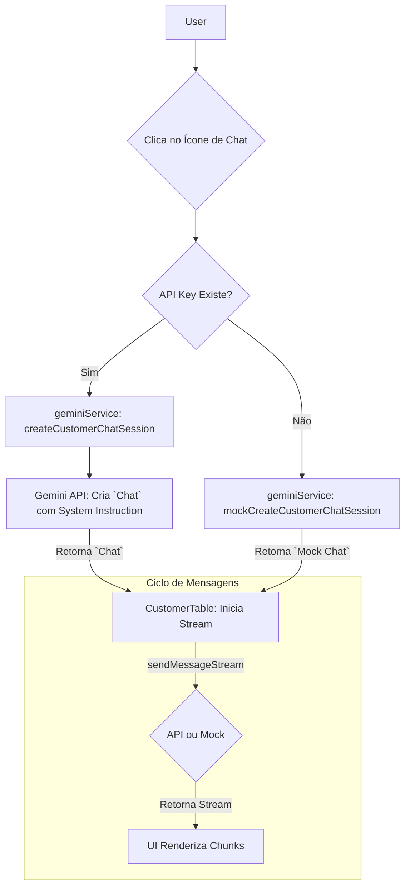

# Análise Profunda da Arquitetura de IA - Painel Cliente 360

Este documento fornece uma análise técnica detalhada da arquitetura de Inteligência Artificial (IA) da aplicação **Painel Cliente 360**. Ele explica o "como" e o "porquê" por trás de cada recurso de IA, detalhando os fluxos de trabalho tanto para o modo de produção (com uma chave de API do Google Gemini) quanto para o modo de demonstração offline.

## 1. Filosofia da Arquitetura de IA

A aplicação adota uma **estratégia de IA de múltipla abordagem**, utilizando diferentes capacidades da API Gemini para resolver diferentes problemas de negócios:

1.  **Análise Micro (Nível do Cliente):** Um **assistente de chat contextual e conversacional** para análises profundas de clientes individuais. O foco é na interatividade, especificidade e diálogo.
2.  **Análise Macro (Nível de Negócio):** Uma suíte de **ferramentas de análise agregada e estruturada** para recomendações, segmentação e previsão que abrangem toda a base de clientes. O foco é na eficiência, robustez e dados acionáveis.

## 2. Widget 1: Chat de IA por Cliente (`CustomerTable.tsx`)

Este recurso fornece um assistente de IA dedicado para cada cliente na tabela, permitindo uma investigação detalhada e contextual.

*   **Objetivo:** Permitir que um gerente de CRM faça perguntas em linguagem natural sobre um cliente específico e receba respostas instantâneas e inteligentes.

### Como Funciona (Modo Produção - Com API Key)

O processo é uma sequência orquestrada de etapas para criar uma experiência de chat fluida e inteligente.

1.  **Injeção Dinâmica de Contexto:** Quando o usuário clica no ícone de chat, `createCustomerChatSession` é chamado. Esta função não cria um chatbot genérico. Ela constrói uma **instrução de sistema (`systemInstruction`)** para a API Gemini, que é injetada dinamicamente com os dados do cliente selecionado (nome, status, gasto total, etc.). Isso "prepara" o modelo, que inicia a conversa já ciente de todo o contexto do cliente, resultando em respostas muito mais precisas.

2.  **Análise Inicial Proativa:** Para fornecer valor imediato, a aplicação envia automaticamente uma primeira mensagem em nome do usuário: *"Faça uma análise inicial completa..."*. Isso melhora a experiência do usuário, que recebe um resumo acionável sem precisar digitar nada.

3.  **Streaming para Performance Percebida:** A aplicação usa `chatSession.sendMessageStream()`. Em vez de esperar que a resposta completa seja gerada (o que pode levar vários segundos), a resposta é recebida em pequenos pedaços (`chunks`) assim que são gerados. O `CustomerTable.tsx` usa um loop `for await...of` para concatenar esses pedaços, atualizando a UI a cada novo pedaço de texto. Isso cria o efeito de "digitação ao vivo", melhorando drasticamente a performance percebida e o engajamento do usuário.

4.  **Memória Conversacional:** O objeto `Chat` criado pela API Gemini gerencia automaticamente o histórico da conversa. Quando o usuário faz uma pergunta de acompanhamento, a API a considera no contexto de todas as mensagens anteriores, permitindo um diálogo natural e contínuo.

5.  **Interação Guiada (Upgrade):** A análise inicial agora solicita que a IA sugira 3 perguntas de acompanhamento relevantes. Um marcador especial (`[SUGGESTIONS]`) é usado para separar essas sugestões do corpo da resposta. O frontend analisa essa resposta, remove o marcador e exibe as sugestões como botões clicáveis, orientando o usuário para uma análise mais profunda.

### Como Funciona (Modo Demonstração - Sem API Key)

Quando `process.env.API_KEY` não está disponível, o `geminiService` entra em modo de demonstração para garantir que a funcionalidade completa da UI possa ser experimentada.

1.  **Detecção de Modo Demo:** O serviço primeiro verifica se a chave de API existe. Se não, ele redireciona para as funções de mock.

2.  **Mock da Sessão de Chat (`mockCreateCustomerChatSession`):** Em vez de chamar a API Gemini, esta função retorna um objeto que **imita** a interface do `Chat` real.

3.  **Simulação de Streaming com Geradores Assíncronos:** O método `sendMessageStream` do objeto de mock é um **gerador assíncrono (`async function*`)**. Ele pega uma resposta pré-definida, divide-a em palavras e usa `yield` para "transmitir" cada palavra com um pequeno atraso (`await sleep(50)`). Isso simula perfeitamente o efeito de streaming do mundo real sem nenhuma chamada de rede, proporcionando uma experiência de demonstração de alta fidelidade.

4.  **Lógica de Resposta Simples:** As respostas são pré-fabricadas e baseadas em uma lógica simples de `if/else` que verifica palavras-chave na mensagem do usuário (ex: "status", "gasto total"), incluindo as novas sugestões de perguntas.

### Diagrama de Fluxo do Chat



## 3. Widgets de Análise Macro (`AI Insights` Tab)

A aba de "AI Insights" contém múltiplos widgets que fornecem uma visão de alto nível de toda a base de clientes.

### 3.1. Widget: Insights Estratégicos (`StrategicInsights.tsx`)

*   **Objetivo:** Transformar dados brutos de clientes em inteligência acionável para a tomada de decisões de negócios.

### Como Funciona (Modo Produção - Com API Key)

1.  **Agregação de Dados no Cliente:** Antes de chamar a IA, `generateStrategicInsights` primeiro processa a lista completa de clientes. Ele calcula totais e contagens por status. Isso cria um **resumo compacto e anônimo**. Enviar este resumo em vez de milhares de registros de clientes é muito mais rápido, mais barato e preserva a privacidade.

2.  **Saída JSON Garantida com `responseSchema`:** A chamada para a API Gemini inclui um `responseSchema` que define a estrutura exata do JSON esperado. Isso **força a API Gemini a gerar uma resposta que corresponde perfeitamente ao esquema**, eliminando a necessidade de análises de texto frágeis no frontend.

3.  **Insights Ricos e Categorizados:** O `responseSchema` exige que cada recomendação seja um objeto com o texto da recomendação e uma categoria (`Quick Win`, `Strategic Shift`, `Data Analysis`). Isso instrui o modelo a realizar uma análise mais profunda e fornecer uma saída muito mais útil.

### Como Funciona (Modo Demonstração - Sem API Key)

*   **Mock de Insights (`mockGenerateStrategicInsights`):** Esta função é chamada em vez da API real. Ela retorna um objeto `StrategicInsight` pré-definido após um `sleep(1500)` para simular a latência da rede, garantindo que a UI de demonstração reflita os recursos mais recentes.

### 3.2. Widget: Segmentação de Clientes (`CustomerSegmentation.tsx`)

*   **Objetivo:** Agrupar automaticamente os clientes em personas significativas para permitir estratégias de marketing e engajamento mais direcionadas.

### Como Funciona (Modo Produção - Com API Key)

1.  **Agregação de Dados:** Similar aos Insights Estratégicos, a função `segmentCustomers` primeiro cria um resumo dos dados dos clientes.
2.  **Prompt Focado em Personas:** O prompt instrui explicitamente a IA a atuar como um analista de marketing e criar 2-3 segmentos com nomes criativos, descrições e exemplos de clientes.
3.  **Schema de Segmentação:** Um `responseSchema` específico para a segmentação garante que a resposta da API contenha todos os campos necessários (`segmentName`, `description`, `customerCount`, `personas`) em um formato JSON previsível.

### Como Funciona (Modo Demonstração - Sem API Key)

*   **Mock de Segmentação (`mockSegmentCustomers`):** Esta função simula o comportamento da IA. Ela filtra a lista de clientes com base em regras simples (ex: status Ativo e gasto > 2000) para criar segmentos realistas e retorna um array de objetos `CustomerSegment` após um `sleep(2200)`.

### 3.3. Widget: Previsão de Churn (`ChurnPrediction.tsx`)

*   **Objetivo:** Identificar proativamente os clientes individuais com maior risco de cancelar o serviço, permitindo que a equipe de retenção intervenha.

### Como Funciona (Modo Produção - Com API Key)

1.  **Resumo Detalhado dos Clientes:** A função `predictChurningCustomers` envia um resumo que inclui ID, nome, status, gasto, e *importante*, "visto por último". O tempo de inatividade é um forte indicador de churn.
2.  **Prompt Focado em Risco:** O prompt pede à IA para identificar os 5 clientes com maior probabilidade de churn e para fornecer uma probabilidade numérica (0.0 a 1.0) para cada um.
3.  **Schema de Previsão:** O `responseSchema` garante que a resposta seja uma lista de objetos, cada um contendo `customerId`, `customerName`, `customerAvatar` e `churnProbability`.

### Como Funciona (Modo Demonstração - Sem API Key)

*   **Mock de Previsão (`mockPredictChurningCustomers`):** A função de mock filtra os clientes que já estão com o status "Em Risco", ordena-os e atribui uma probabilidade de churn decrescente. Isso fornece uma lista realista e acionável para a UI de demonstração após um `sleep(1800)`.

### Diagrama de Fluxo de Análise Macro

```mermaid
graph TD
    User --> A{Aba "AI Insights" é aberta}
    subgraph "Para Cada Widget de IA Macro"
        A --> B{Componente Renderiza}
        B --> C{API Key Existe?}
        C -- Sim --> D[Função de Serviço (ex: `segmentCustomers`)]
        D -- 1. Agrega Dados --> D
        D -- 2. Chama `generateContent` com `responseSchema` --> E[Gemini API]
        E -- Retorna JSON Estruturado --> F[UI Renderiza Dados]

        C -- Não --> G[Função de Mock (ex: `mockSegmentCustomers`)]
        G -- Retorna Mock JSON após `sleep` --> F
    end
```
