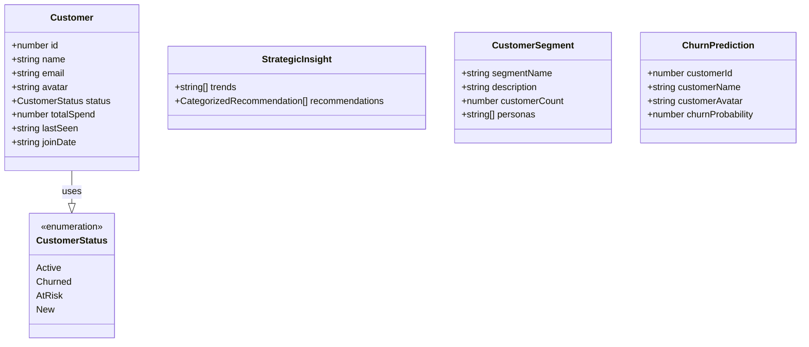
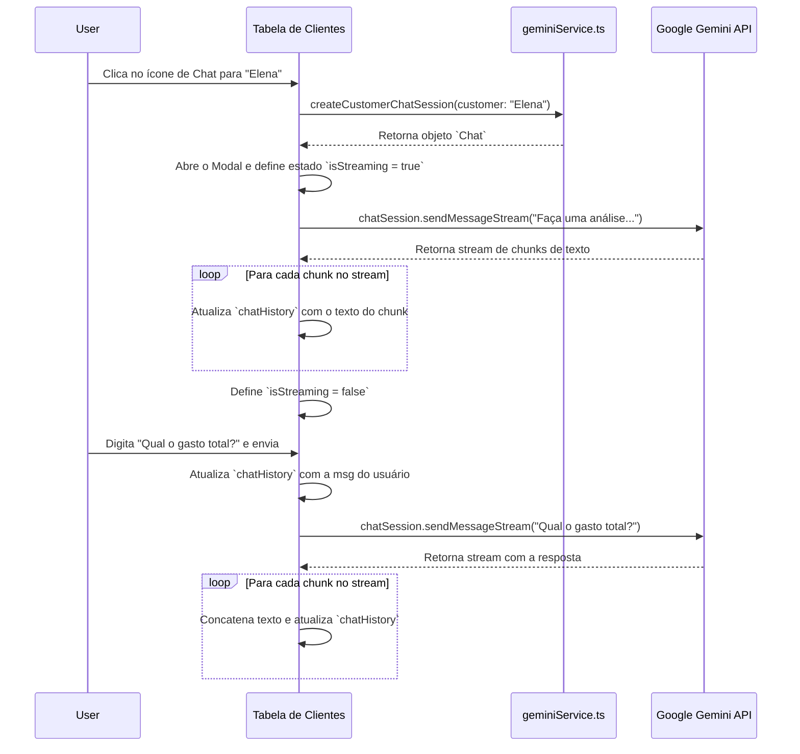
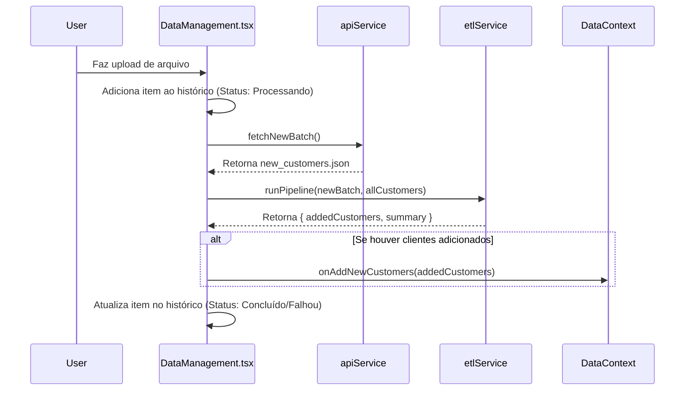
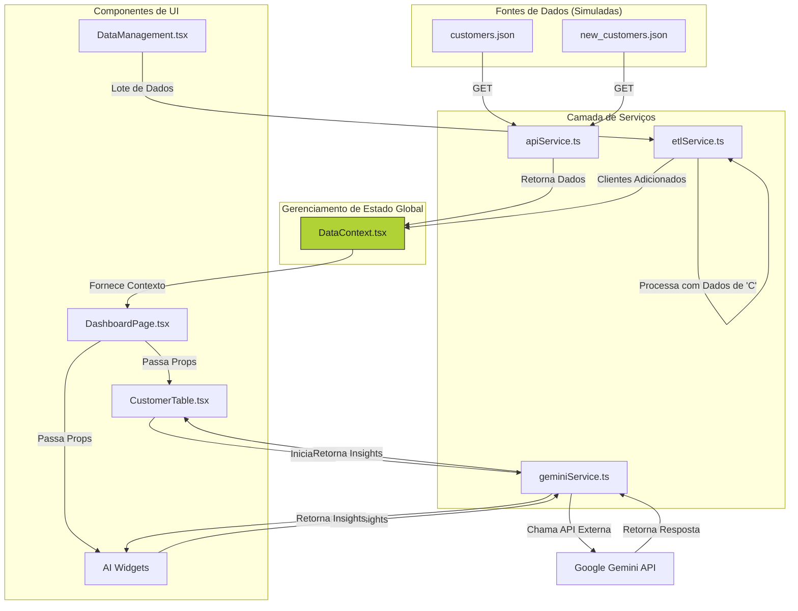

# Documento de Operações de Dados (DataOps) - Cliente 360

Este documento fornece uma análise aprofundada de todas as operações de dados, modelos, fluxos e arquitetura da aplicação **Painel Cliente 360**. Ele serve como um guia técnico para entender como os dados são originados, processados, armazenados (em memória) e apresentados.

## 1. Modelos de Dados e Esquemas

A base de toda a aplicação é um conjunto de interfaces TypeScript bem definidas que garantem a integridade e a consistência dos dados.

### 1.1. Esquemas de Tipos (`types.ts`)

Estas são as principais estruturas de dados utilizadas em toda a aplicação.

```typescript
// De: types.ts

export enum CustomerStatus {
    Active = 'Ativo',
    Churned = 'Cancelado',
    AtRisk = 'Em Risco',
    New = 'Novo',
}

export interface Customer {
  id: number;
  name: string;
  email: string;
  avatar: string;
  status: CustomerStatus;
  totalSpend: number;
  lastSeen: string;
  joinDate: string;
}

export interface StrategicInsight {
  trends: string[];
  recommendations: CategorizedRecommendation[];
}

export interface CustomerSegment {
    segmentName: string;
    description: string;
    customerCount: number;
    personas: string[]; 
}

export interface ChurnPrediction {
    customerId: number;
    customerName: string;
    customerAvatar: string;
    churnProbability: number;
}

export interface DataHistoryItem {
  id: number;
  file: string;
  status: 'Concluído' | 'Falhou' | 'Processando';
  date: string;
  records: string;
}

export interface ChatMessage {
  role: 'user' | 'model';
  text: string;
}
```

### 1.2. Diagrama de Classes do Modelo de Dados

Este diagrama visualiza as principais entidades de dados e suas relações.



## 2. Fluxo de Dados por Componente

Aqui detalhamos como os principais componentes manipulam, recebem e exibem dados.

### 2.1. `contexts/DataContext.tsx`

É o coração do gerenciamento de estado da aplicação, atuando como a **fonte única da verdade** para os dados dos clientes.

*   **Inputs:** Nenhum (inicia a busca de dados por conta própria).
*   **Estado Interno:**
    *   `allCustomers: Customer[]`: A lista completa de clientes.
    *   `loading: boolean`: Indica se os dados iniciais estão sendo buscados.
    *   `error: string | null`: Armazena mensagens de erro da API.
*   **Funções de Processamento:**
    *   `fetchCustomers()`: Usa `apiService` para buscar a lista inicial de clientes e atualiza o estado (`allCustomers`, `loading`, `error`).
    *   `addNewCustomers(newCustomers)`: Recebe uma lista de novos clientes (do pipeline ETL) e os adiciona ao estado `allCustomers`, evitando duplicatas por ID.
*   **Outputs:** Fornece o `DataContextType` (`allCustomers`, `loading`, `error`, etc.) para qualquer componente filho que use o hook `useData()`.

### 2.2. `components/DashboardPage.tsx`

Orquestra a exibição da página principal, distribuindo dados e estado para os componentes de UI através de um sistema de abas.

*   **Inputs:** `useData()` (consome `allCustomers`, `loading`, `error`).
*   **Estado Interno:**
    *   `activeTab: 'overview' | 'ai-insights' | 'data'`: Controla a aba visível.
    *   `statusFilter: CustomerStatus | 'all'`: Armazena o filtro de status atual.
*   **Funções de Processamento:**
    *   `useMemo(dashboardStats)`: Calcula os dados para os cabeçalhos dos widgets a partir de `allCustomers`.
    *   `useMemo(statusFilteredCustomers)`: Filtra `allCustomers` com base no `statusFilter` e no termo de busca (herdado de `App.tsx`). **Output:** `Customer[]` para a `CustomerTable`.
*   **Outputs:** Passa dados processados como props para os componentes de UI em cada aba.

### 2.3. `components/CustomerTable.tsx`

Exibe a lista de clientes e gerencia a interatividade do chat com IA.

*   **Inputs:** `customers: Customer[]`, `loading: boolean`.
*   **Estado Interno:**
    *   `sortConfig`: Controla a ordenação da tabela.
    *   `isModalOpen`, `selectedCustomer`: Controlam o modal do chat.
    *   `chatSession`, `chatHistory`, `isStreaming`, `chatError`: Gerenciam o estado do chat com a Gemini.
*   **Funções de Processamento:**
    *   `useMemo(sortedCustomers)`: Ordena os clientes recebidos via props.
    *   `handleOpenChat(customer)`: Inicia uma nova sessão de chat com a Gemini (`createCustomerChatSession`), abre o modal e busca a análise inicial.
    *   `handleSendMessage()`: Envia a mensagem do usuário para a sessão de chat ativa e processa a resposta em stream.
*   **Outputs:** Renderiza a tabela de clientes. A interação do usuário dispara chamadas para o `geminiService`.

#### Diagrama de Fluxo do Chat de IA



### 2.4. `App.tsx` & `Header.tsx` - Fluxo do Estado de Busca

A funcionalidade de busca é gerenciada no nível mais alto (`App.tsx`) para que o termo de busca possa ser aplicado antes de os dados serem passados para qualquer componente.

*   **`App.tsx` (Estado):**
    *   `searchTerm: string`: Mantém o estado atual do texto de busca.
    *   `handleSearch(term)`: Função (memoizada com `useCallback`) para atualizar o `searchTerm`.
*   **`Header.tsx` (Interação):**
    *   Recebe `searchTerm` e `onSearchChange` como props.
    *   O `<input>` de busca tem seu valor controlado por `searchTerm` e chama `onSearchChange` no evento `onChange`.
*   **`App.tsx` (Processamento):**
    *   Um `useMemo` em `searchedCustomers` é executado sempre que `allCustomers` (do `DataContext`) ou `searchTerm` mudam.
    *   Ele filtra `allCustomers` com base no `searchTerm` antes de passar a lista filtrada para `DashboardPage`.

### 2.5. `DataManagement.tsx` - Fluxo de Upload e Gatilho ETL

Este componente gerencia a interface de upload e orquestra a simulação do pipeline ETL.

*   **Inputs:** `onAddNewCustomers` (de `useData`), `allCustomers` (de `useData`).
*   **Estado Interno:** `history: DataHistoryItem[]`.
*   **Fluxo de Interação:**
    1.  O usuário arrasta ou seleciona um arquivo.
    2.  `handleFileUpload(file)` é chamado.
    3.  Imediatamente, um novo item é adicionado ao `history` com o status `'Processando'`.
    4.  Um `setTimeout` simula uma chamada assíncrona.
    5.  Dentro do `setTimeout`:
        a.  `apiService.customers.fetchNewBatch()` é chamado para obter os novos dados.
        b.  `etlService.runPipeline()` é chamado com o novo lote e a lista de clientes existentes.
        c.  `onAddNewCustomers()` (do `DataContext`) é chamado com os clientes validados e adicionados.
        d.  O item no `history` é atualizado para `'Concluído'` ou `'Falhou'` com base no resultado.

#### Diagrama de Sequência do Upload



## 3. Serviços de Dados e Processamento

Estes módulos desacoplam a lógica de negócios e o acesso a dados dos componentes de UI.

### 3.1. `services/apiService.ts`

Simula uma camada de acesso a uma API externa, buscando dados de arquivos JSON locais.

*   **Responsabilidade:** Centralizar todas as "chamadas de rede".
*   **Métodos:**
    *   `getAll()`: Busca `/data/customers.json`. **Output:** `Promise<Customer[]>`.
    *   `fetchNewBatch()`: Busca `/data/new_customers.json`. **Output:** `Promise<Customer[]>`.

### 3.2. `services/etlService.ts`

Implementa um pipeline de Extract, Transform, Load para processar novos lotes de dados de clientes.

*   **Responsabilidade:** Limpar, validar e carregar novos dados, prevenindo inconsistências e duplicatas.
*   **Input:** `newBatch: Customer[]`, `existingCustomers: Customer[]`.
*   **Lógica de Processamento (`runPipeline`):**
    1.  **Extract:** O lote `newBatch` já foi extraído pelo `apiService`.
    2.  **Transform:** Para cada cliente no lote, remove espaços em branco do nome (`trim()`) e converte o email para minúsculas.
    3.  **Validate:** Verifica se o cliente possui nome e email. Verifica se o email já existe no `Set` de emails existentes.
    4.  **Load:** Se o cliente for válido e não for duplicado, ele é adicionado à lista `addedCustomers`.
*   **Output:** `{ addedCustomers: Customer[], summary: string }`.

### 3.3. `services/geminiService.ts`

Encapsula todas as interações com a API do Google Gemini.

*   **Responsabilidade:** Construir prompts, definir esquemas de resposta e chamar a API Gemini de forma segura.
*   **Métodos:**
    *   `createCustomerChatSession(customer)`: Cria e retorna uma instância de chat da Gemini.
    *   `generateStrategicInsights(customers)`: Gera recomendações estratégicas para o negócio.
    *   `segmentCustomers(customers)`: Gera personas e segmentos de clientes.
    *   `predictChurningCustomers(customers)`: Gera uma lista de clientes com alto risco de churn.

## 4. Diagrama de Fluxo de Dados Geral

Este diagrama oferece uma visão de ponta a ponta do fluxo de dados na aplicação.



## 5. Arquitetura de Produção e Roadmap

A aplicação atual usa arquivos JSON. Para produção, um banco de dados relacional e uma API backend são essenciais.

### 5.1. Modelo Lógico (Esquema de Tabelas)

Este diagrama ER (Entidade-Relacionamento) detalha as tabelas, colunas e relacionamentos para um banco de dados PostgreSQL.

```mermaid
erDiagram
    CUSTOMERS {
        INT id PK "SERIAL"
        VARCHAR(255) name "NOT NULL"
        VARCHAR(255) email "UNIQUE NOT NULL"
        VARCHAR(255) avatar_url
        customer_status status "DEFAULT 'Novo'"
        DECIMAL(10, 2) total_spend "DEFAULT 0.00"
        TIMESTAMP last_seen_at
        DATE join_date "NOT NULL"
        TIMESTAMP created_at "DEFAULT CURRENT_TIMESTAMP"
        TIMESTAMP updated_at "DEFAULT CURRENT_TIMESTAMP"
    }

    USERS {
        INT id PK "SERIAL"
        VARCHAR(255) name "NOT NULL"
        VARCHAR(255) email "UNIQUE NOT NULL"
        VARCHAR(255) password_hash "NOT NULL"
        user_role role "DEFAULT 'viewer'"
        TIMESTAMP created_at "DEFAULT CURRENT_TIMESTAMP"
    }

    UPLOAD_HISTORY {
        INT id PK "SERIAL"
        VARCHAR(255) file_name "NOT NULL"
        upload_status status "DEFAULT 'Processing'"
        TEXT summary
        INT user_id FK
        TIMESTAMP created_at "DEFAULT CURRENT_TIMESTAMP"
    }

    CUSTOMERS ||--o{ UPLOAD_HISTORY : ""
    USERS ||--o{ UPLOAD_HISTORY : "uploaded by"

    %% Tipos ENUM para status e roles
    %% CREATE TYPE customer_status AS ENUM ('Ativo', 'Cancelado', 'Em Risco', 'Novo');
    %% CREATE TYPE upload_status AS ENUM ('Concluído', 'Falhou', 'Processando');
    %% CREATE TYPE user_role AS ENUM ('admin', 'editor', 'viewer');
```

## 6. Lógica de Transformação de Dados para a UI

Um aspecto fundamental do fluxo de dados é a transformação de dados brutos (`Customer[]`) em dados agregados e prontos para visualização. Isso é feito de forma eficiente usando `useMemo` para evitar cálculos desnecessários em cada renderização.

A lista de clientes final exibida na tabela (`statusFilteredCustomers`) é resultado de uma cadeia de derivações de dados:

1.  **Fonte:** `allCustomers` (do `DataContext`).
2.  **Filtro 1 (Busca):** `searchedCustomers` é calculado em `App.tsx` filtrando `allCustomers` pelo `searchTerm`.
3.  **Filtro 2 (Status):** `statusFilteredCustomers` é calculado em `DashboardPage.tsx` filtrando `searchedCustomers` pelo `statusFilter`.

Este encadeamento garante que os filtros sejam aplicados em uma ordem lógica e eficiente.
