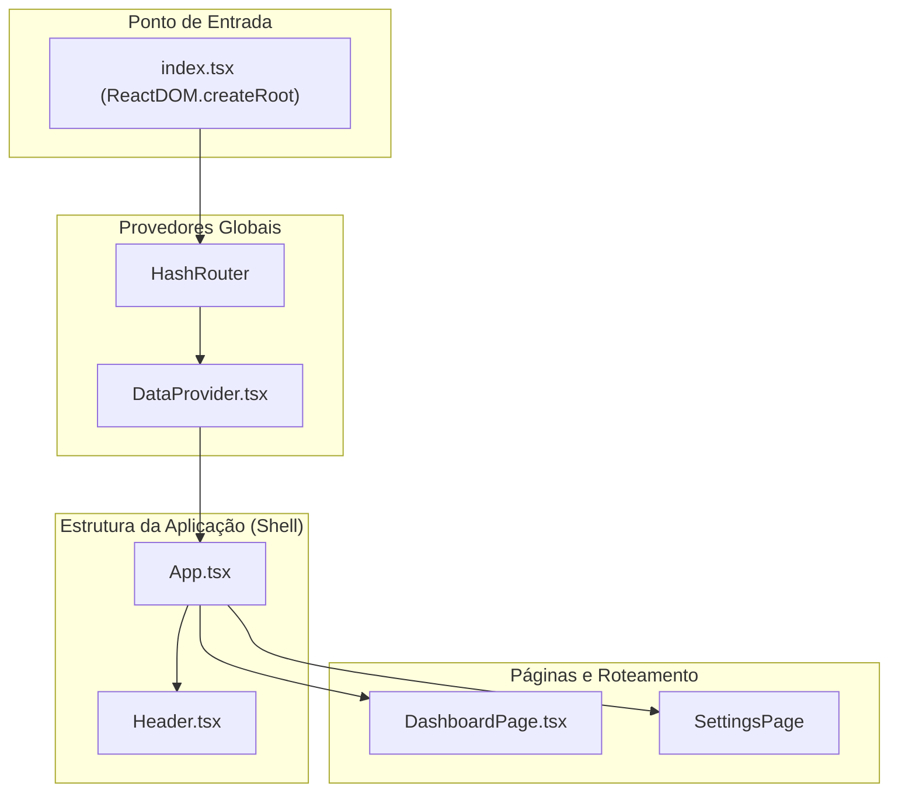

# UI Component Library - Cliente 360

Este documento serve como um guia de referência completo e detalhado para cada componente React utilizado na aplicação "Painel Cliente 360". Ele detalha o propósito, a API (props), o estado interno, as interações do usuário e as dependências de cada componente.

## 1. Componentes Principais e de Layout

Estes componentes formam a estrutura básica e a navegação da aplicação.

---

### 1.1. `App.tsx`

**Propósito:** O componente raiz da aplicação. Ele orquestra o layout geral (Header + Conteúdo Principal), gerencia o roteamento e o estado de busca global.

*   **API de Props:** Nenhuma.
*   **Consumo de Dados:** Utiliza o hook `useData()` do `DataContext` para obter `allCustomers`, `loading`, `error` e `fetchCustomers`.

#### State Management Strategy
*   **Estado Local:** `searchTerm: string` é gerenciado com `useState`. Manter este estado no `App` é uma decisão arquitetural deliberada. Eleva o estado da busca para o ancestral comum mais próximo que precisa dele, permitindo que o `searchTerm` seja aplicado aos dados antes de serem passados para qualquer página ou componente filho.
*   **Dados Derivados:** `searchedCustomers` é derivado de `allCustomers` e `searchTerm` usando `useMemo`. Isso garante que a filtragem (uma operação potencialmente cara) só ocorra quando os dados brutos ou o termo de busca mudam, não a cada renderização do `App`.

---

### 1.2. `Header.tsx`

**Propósito:** Fornece a navegação principal, a identidade visual da marca e a funcionalidade de busca global para clientes.

**API de Props:**
| Prop           | Tipo                  | Obrigatório | Descrição                                        |
|----------------|-----------------------|-------------|--------------------------------------------------|
| `searchTerm`     | `string`              | Sim         | O valor atual do campo de busca (controlado).      |
| `onSearchChange` | `(term: string) => void` | Sim         | Função de callback chamada quando a busca muda. |

#### State Management Strategy
*   Este é um **componente controlado (Dumb Component)**. Ele não possui estado interno. Seu comportamento é inteiramente ditado pelas props recebidas de `App.tsx`, tornando-o altamente previsível e reutilizável.

---

### 1.3. `DashboardPage.tsx`

**Propósito:** O principal contêiner para a visualização do dashboard. Ele orquestra todos os widgets através de um sistema de abas e gerencia o estado de filtragem por status.

**API de Props:**
| Prop                | Tipo           | Obrigatório | Descrição                                                              |
|---------------------|----------------|-------------|------------------------------------------------------------------------|
| `searchedCustomers` | `Customer[]`   | Sim         | A lista de clientes, já pré-filtrada pela busca global do `App.tsx`. |
| `loading`           | `boolean`      | Sim         | Indica se os dados iniciais estão sendo carregados.                      |
| `error`             | `string | null` | Sim         | Mensagem de erro, se houver.                                           |
| `onRetry`           | `() => void`   | Sim         | Função para tentar recarregar os dados em caso de erro.                  |

#### State Management Strategy
*   **Estado Local:** `activeTab` e `statusFilter` são gerenciados com `useState`, pois são estados de UI que pertencem exclusivamente à lógica desta página.
*   **Dados Derivados:** `statusFilteredCustomers` é derivado usando `useMemo` para garantir que a filtragem por status seja aplicada de forma eficiente.

---

## 2. Widgets do Dashboard

Estes são os blocos de construção que exibem dados e fornecem interatividade na aplicação.

---

### 2.1. `CustomerTable.tsx`

**Propósito:** Exibir uma lista grande de clientes de forma performática, com ordenação e uma ação para iniciar o chat de IA.

**API de Props:**
| Prop        | Tipo         | Obrigatório | Descrição                               |
|-------------|--------------|-------------|-----------------------------------------|
| `customers` | `Customer[]` | Sim         | A lista de clientes a ser exibida.      |
| `loading`   | `boolean`    | Sim         | Se `true`, exibe a `SkeletonDivTable`. |
| `stats`     | `string`     | Sim         | O número total de clientes para exibir no cabeçalho. |

#### State Management Strategy
*   Gerencia um estado local complexo para a funcionalidade de chat (`isModalOpen`, `selectedCustomer`, `chatHistory`, etc.) e para a ordenação (`sortConfig`). Essa lógica está encapsulada aqui porque nenhum outro componente precisa saber sobre ela.

#### Performance DNA
*   **Virtualização (`react-window`):** A otimização mais importante. Evita a criação de milhares de nós no DOM.
*   **Memoização de Linha (`React.memo(Row)`):** Impede que as linhas visíveis sejam re-renderizadas quando algo irrelevante para elas muda.
*   **Memoização de Callbacks (`useCallback`):** A função `handleOpenChat` é memoizada para otimizar as re-renderizações das linhas.

---

### 2.2. `StrategicInsights.tsx`

**Propósito:** Buscar e exibir insights estratégicos de alto nível para toda a base de clientes, gerados pela IA.

**API de Props:**
| Prop | Tipo | Obrigatório | Descrição |
|---|---|---|---|
| `customers` | `Customer[]` | Sim | A lista completa de clientes para análise. |

#### State Management Strategy
*   Possui estado local para gerenciar o ciclo de vida da busca de dados de IA: `insights`, `isLoading`, `error`. Isso o torna um componente autônomo e resiliente.

---

### 2.3. `CustomerSegmentation.tsx`

**Propósito:** Buscar e exibir personas de clientes geradas por IA, agrupando a base de clientes em segmentos acionáveis.

**API de Props:**
| Prop | Tipo | Obrigatório | Descrição |
|---|---|---|---|
| `customers` | `Customer[]` | Sim | A lista completa de clientes para segmentação. |

#### State Management Strategy
*   Assim como `StrategicInsights`, gerencia seu próprio ciclo de vida de dados com estados locais para `segments`, `isLoading` e `error`.

---

### 2.4. `ChurnPrediction.tsx`

**Propósito:** Buscar e exibir uma lista de clientes que a IA previu como tendo alto risco de churn.

**API de Props:**
| Prop | Tipo | Obrigatório | Descrição |
|---|---|---|---|
| `customers` | `Customer[]` | Sim | A lista completa de clientes para análise de churn. |

#### State Management Strategy
*   Gerencia seu próprio estado para `predictions`, `isLoading`, e `error`, garantindo que a busca de previsões seja independente de outros widgets.

---

## 3. Componentes Comuns e Reutilizáveis

---

### 3.1. `common/Modal.tsx`

**Propósito:** Fornecer uma janela modal genérica e acessível.

**API de Props:**
| Prop       | Tipo              | Obrigatório | Descrição                                                  |
|------------|-------------------|-------------|------------------------------------------------------------|
| `isOpen`   | `boolean`         | Sim         | Controla a visibilidade do modal.                          |
| `onClose`  | `() => void`      | Sim         | Função chamada quando o usuário clica fora ou no botão "X". |
| `children` | `React.ReactNode` | Sim         | O conteúdo a ser renderizado dentro do modal.              |

#### Accessibility (A11y) Blueprint
*   **Melhoria Crítica:** Precisa de um "focus trap" para prender o foco do teclado dentro do modal. Atributos como `role="dialog"` e `aria-modal="true"` também são necessários.

---

### 3.2. `common/SkeletonLoader.tsx`

**Propósito:** Fornecer um conjunto de componentes de placeholder que imitam a estrutura da UI final, melhorando a performance percebida.

---
## 4. Composição de Componentes e Hierarquia Visual

A aplicação é construída através do aninhamento de componentes, formando uma árvore hierárquica.

### Diagrama da Árvore de Componentes

**Análise da Hierarquia:** `DataProvider` envolve o `App`, tornando o estado global acessível a todas as páginas e componentes. `App` renderiza o `Header` e a página ativa, que por sua vez compõe os widgets individuais dentro de suas respectivas abas.
