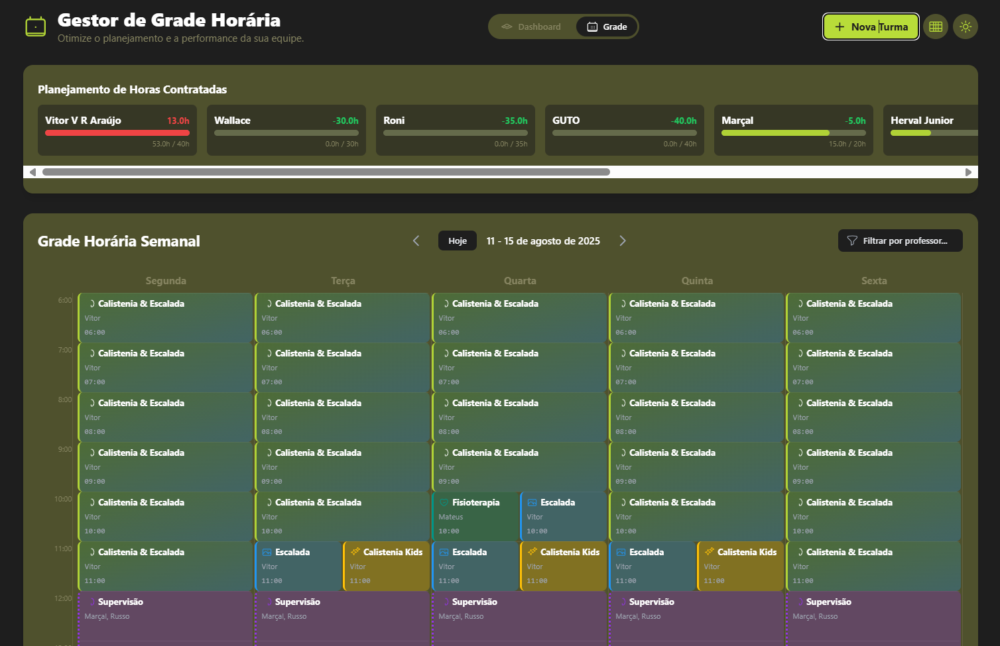
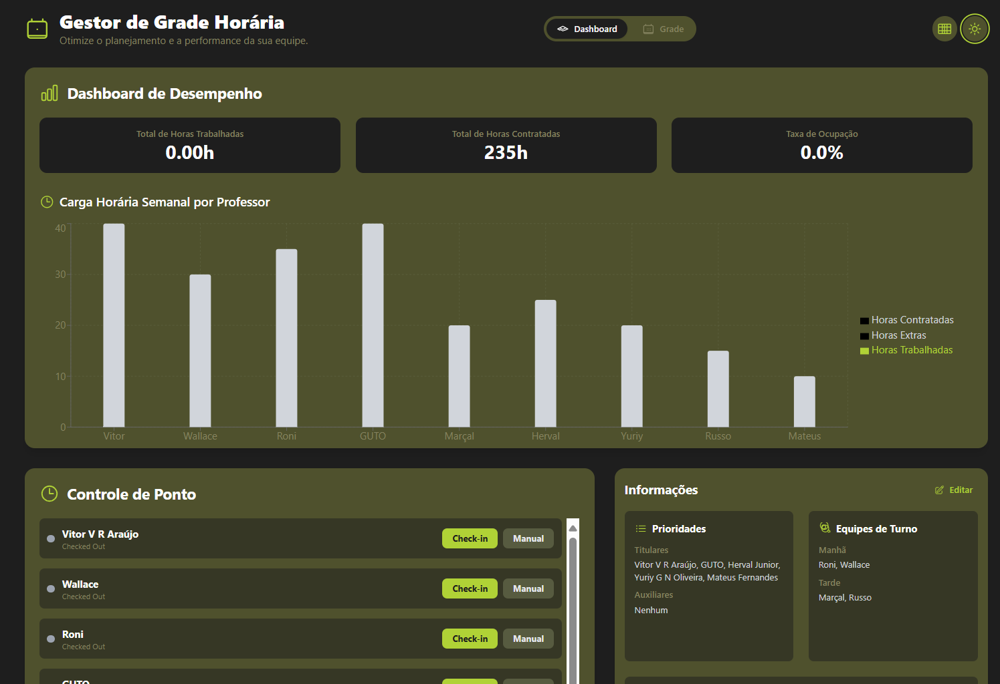

<div align="center">

# Schedule Manager
  
    
  <p>
    
    
    
  </p>
</div>

A feature-rich web application for managing teacher schedules, tracking work hours in real-time, and visualizing performance data. Built with a modern technology stack, this application offers a highly interactive and responsive user experience, designed to optimize operational planning.

<div>

<div>

## ✨ Innovative Features

- **Interactive Schedule Grid**: Drag-and-drop interface for easy schedule management
- **Real-time Work Tracking**: Clock in/out functionality with live updates
- **Performance Analytics**: Visualize work hours and performance metrics
- **Responsive Design**: Works seamlessly on desktop and mobile devices
- **User Management**: Role-based access control for different user types

## 🚀 Technology Stack

* **Frontend**: React, TypeScript, Tailwind CSS
* **State Management**: React Context API
* **Data Visualization**: Recharts
* **UI Components**: Headless UI
* **Form Handling**: React Hook Form
* **Icons**: Heroicons

## 🛠️ Project Structure

```
src/pages/schedule-manager/
├── components/         # Reusable UI components
├── contexts/           # React context providers
├── hooks/             # Custom React hooks
├── services/          # API and data services
├── types/             # TypeScript type definitions
├── utils/             # Utility functions and helpers
├── App.tsx            # Main application component
└── README.md          # Documentation in English
```

## 🚀 Getting Started

### Prerequisites

- Node.js 16+
- Yarn or npm

### Installation

1. **Clone the repository**
   ```bash
   git clone https://github.com/matheusfly/saas-platform.git
   cd saas-platform
   ```

2. **Install dependencies**
   ```bash
   cd src/pages/schedule-manager
   yarn install
   # or
   npm install
   ```

3. **Set up environment variables**
   ```bash
   cp .env.example .env
   # Edit .env file with your settings
   ```

4. **Start the development server**
   ```bash
   yarn dev
   # or
   npm run dev
   ```

## 🤝 Contributing

Contributions are welcome! Please follow these steps:

1. Fork the project
2. Create your feature branch (`git checkout -b feature/AmazingFeature`)
3. Commit your changes (`git commit -m 'Add some AmazingFeature'`)
4. Push to the branch (`git push origin feature/AmazingFeature`)
5. Open a Pull Request

## 📄 License

Distributed under the MIT License. See `LICENSE` for more information.

## 📞 Contact

Development Team - [contato@matheusfly.dev](mailto:contato@matheusfly.dev)

Project Link: [https://github.com/matheusfly/saas-platform](https://github.com/matheusfly/saas-platform)
