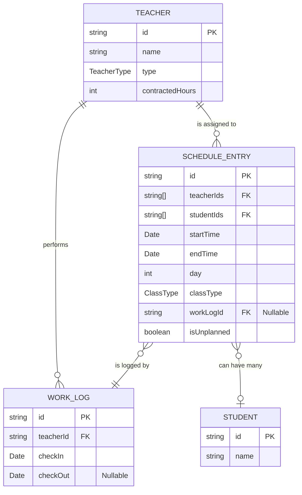
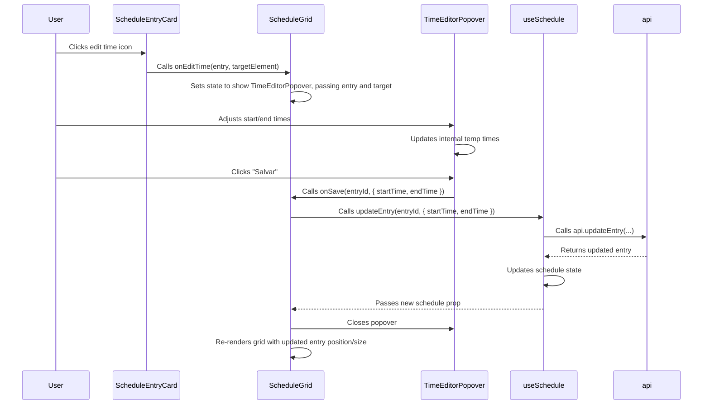
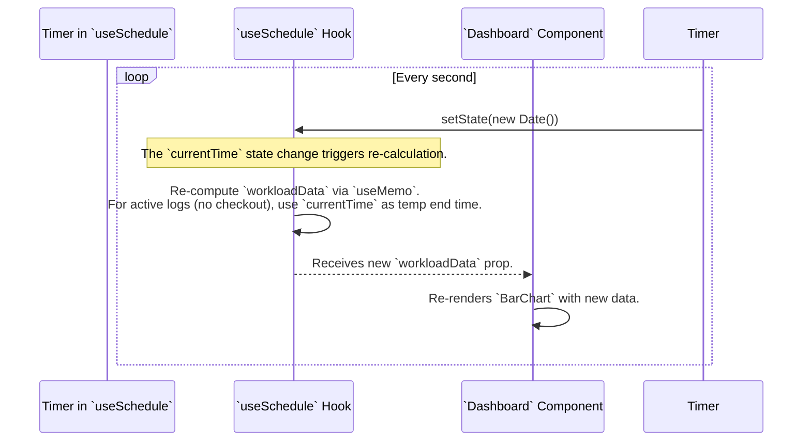
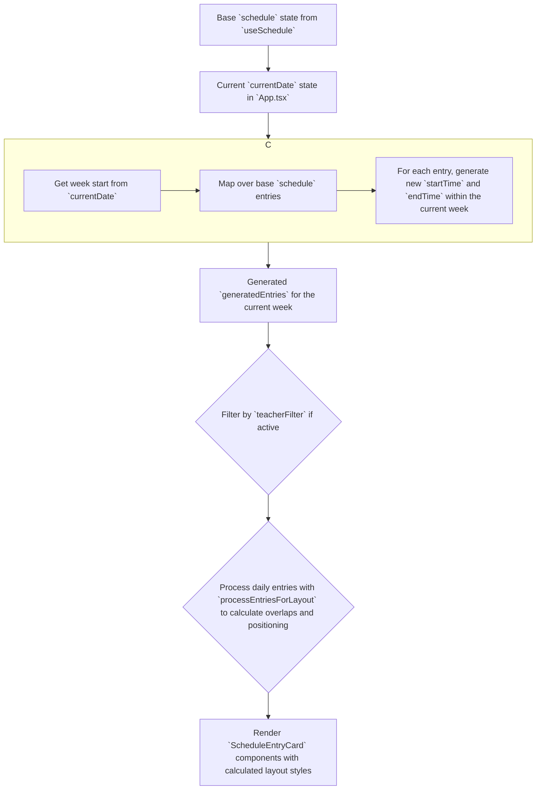
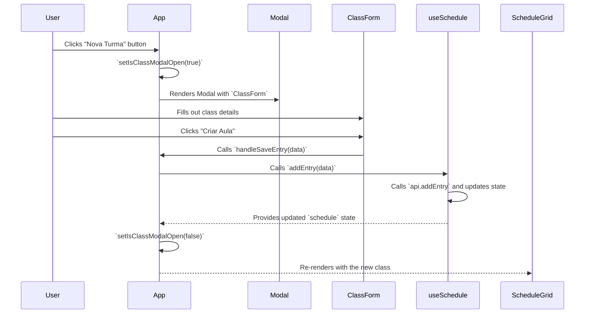
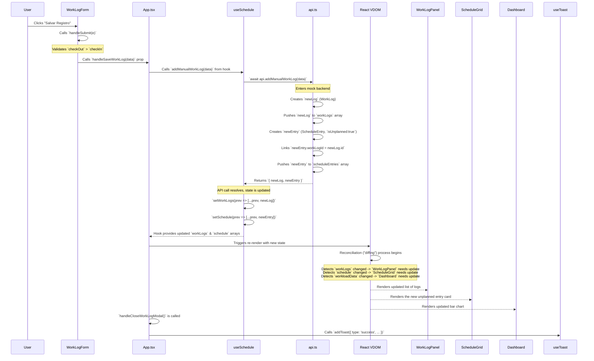
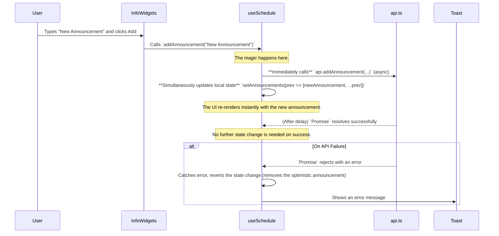
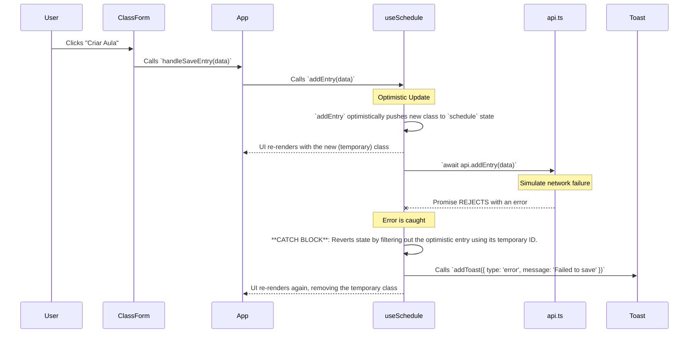

# Data Operations and Architecture Guide

This document provides an in-depth explanation of the data models, state management, and data flow within the Schedule Manager application. It serves as a technical reference for understanding how data is handled from the mock API layer to the UI components.

## 1. Core Data Models & Schema

The entire application operates on a set of well-defined TypeScript types located in `types.ts`. These types serve as the schema for our application's data.

### Main Entities

-   **`Teacher`**: Represents an instructor. Includes `id`, `name`, `type` (`Titular` or `Auxiliar`), and `contractedHours`.
-   **`Student`**: Represents a student who can be enrolled in classes.
-   **`ScheduleEntry`**: A planned event on the calendar. This is the central model for the schedule grid. It can be a recurring class or a one-off event. Critically, it can be linked to a `WorkLog`.
-   **`WorkLog`**: The source of truth for actual work performed. Created on `checkIn` and finalized on `checkOut`. This data drives the performance dashboard.
-   **`Announcement`**: A message broadcast to users.
-   **`PriorityList` & `ShiftRoster`**: Configuration objects that define teacher roles and shift assignments.

### Data Model Entity-Relationship Diagram (ERD)

This diagram shows the relationships between the core data models as they exist in the mock service.



---

## 2. Mock API Service (`services/api.ts`)

The `services/api.ts` file acts as a **simulated backend**. It encapsulates all data and the logic to mutate it, mimicking how a real-world API would function.

-   **Data Encapsulation**: All application data (`teachers`, `scheduleEntries`, `workLogs`) is stored as `let` variables within this file, inaccessible from the outside except through the exported `api` object.
-   **Asynchronous Simulation**: Every function is `async` and uses a `delay` to simulate network latency. This forces the UI to be built with loading states in mind.
-   **Immutable Operations**: When data is updated (e.g., `updateEntry`), the functions return new objects/arrays (`{...entry}`, `[...scheduleEntries]`) rather than modifying the existing ones in place. This prevents side effects and aligns with React's state management principles.
-   **Business Logic**: Complex logic, such as creating an "unplanned" `ScheduleEntry` during a check-in, is handled within this service layer, keeping the UI components clean.

---

## 3. State Management (`hooks/useSchedule.ts`)

The `useSchedule` hook is the **single source of truth for the application's client-side state**. It fetches the initial data from the API and provides components with both the data and the functions to update it.

-   **Centralization**: It manages `teachers`, `schedule`, `workLogs`, etc., in one place.
-   **Interaction with API**: It calls methods from `services/api.ts` to perform CRUD operations.
-   **Derived State**: It uses `useMemo` to efficiently compute derived data like `workloadData` without re-running expensive calculations on every render.

---

## 4. Key Data Workflows & Component Interactions

### Workflow 1: Teacher Check-in

This is a core workflow that involves linking planned schedules with actual work.

```mermaid
graph TD
    A[User clicks Check-in on `WorkLogPanel`] --> B{`App.tsx` calls `checkIn(teacherId, now)`};
    B --> C{`useSchedule` hook calls `api.checkIn(...)`};
    C --> D{`api.ts`: Create new `WorkLog`};
    D --> E{`api.ts`: Search `scheduleEntries` for an entry where:<br/>1. `teacherId` matches<br/>2. `checkInTime` is within `startTime` and `endTime`<br/>3. `workLogId` is null};
    E --> F{Match Found?};
    F -- Yes --> G{`api.ts`: Update found `ScheduleEntry` with `workLogId`};
    F -- No --> H{`api.ts`: Create a *new* `ScheduleEntry` with `isUnplanned: true` and link `workLogId`};
    G --> I{`useSchedule`: Update `workLogs` and `schedule` state};
    H --> I;
    I --> J[UI re-renders with live status and updated schedule];
```

### Workflow 2: Editing a Class Time from the Grid

This workflow demonstrates in-context editing without a full-page modal.



### Workflow 3: Real-time Dashboard Calculation

The dashboard provides a live view of teacher performance, updating every second.



### Workflow 4: Weekly Schedule Grid Generation

The schedule grid displays entries for the currently selected week, deriving them from a base pattern.



### Workflow 5: Creating a New Class

This flow demonstrates creating a new entity through a modal form.


---
## 5. Performance & Optimization Strategies

To ensure a smooth and responsive UI, especially on the complex `ScheduleGrid`, several optimization techniques are employed.

-   **Memoization with `useMemo`**: Expensive calculations are wrapped in `useMemo` to prevent them from running on every render. This is critical for:
    -   `workloadData` in `useSchedule`: This calculation iterates over all teachers and work logs. It only re-runs when `workLogs`, `teachers`, or the `currentTime` ticker changes.
    -   `generatedEntries` and `entriesByDay` in `ScheduleGrid`: Re-calculating the weekly schedule and especially the layout for overlapping events is costly. `useMemo` ensures this only happens when the base `entries` or filters change.

-   **Component Memoization with `React.memo`**: Presentational components that receive potentially complex props (objects/arrays) are wrapped in `React.memo`. This prevents them from re-rendering if their props have not changed.
    -   `ScheduleEntryCard` is a prime example. Without `React.memo`, every card would re-render when any part of the grid state changes.

-   **Callback Memoization with `useCallback`**: Functions passed down as props from parent to child components are wrapped in `useCallback`. This is essential for `React.memo` to work correctly. If a new function reference is created on every parent render, the child component will see its props as having changed and will re-render unnecessarily.

-   **Efficient Layout Algorithm**: The `processEntriesForLayout` function in `ScheduleGrid` uses a greedy algorithm to position overlapping events. It iterates through sorted events, placing each one in the first available "column" that doesn't conflict. This avoids more complex (and slower) graph-based solutions while providing a good-enough visual layout.

-   **State Colocation**: Global state is managed in `useSchedule`, but UI-specific state (e.g., whether a popover is open, or the value of a form input) is kept local to the component that needs it (`useState`). This prevents the entire application from re-rendering for minor UI changes.

---

## 6. Production Database Model (Conceptual)

To move this application to production, the mock data would be replaced by a relational database. The following schema is a logical starting point based on the application's types.

### Production ERD

This model introduces join tables for many-to-many relationships and uses standard conventions.

```mermaid
erDiagram
    teachers {
        UUID id PK
        TEXT name
        VARCHAR(50) type
        INT contracted_hours
        TIMESTAMPTZ created_at
        TIMESTAMPTZ updated_at
    }

    students {
        UUID id PK
        TEXT name
        TIMESTAMPTZ created_at
        TIMESTAMPTZ updated_at
    }

    schedule_entries {
        UUID id PK
        TIMESTAMPTZ start_time
        TIMESTAMPTZ end_time
        VARCHAR(50) class_type
        INT day_of_week "For recurring entries"
        BOOLEAN is_recurring
        INT capacity
        TEXT notes
        BOOLEAN is_unplanned
        UUID work_log_id FK "Nullable"
        TIMESTAMPTZ created_at
        TIMESTAMPTZ updated_at
    }

    work_logs {
        UUID id PK
        UUID teacher_id FK
        TIMESTAMPTZ check_in
        TIMESTAMPTZ check_out "Nullable"
        TIMESTAMPTZ created_at
        TIMESTAMPTZ updated_at
    }

    -- Join Tables for Many-to-Many
    schedule_entry_teachers {
        UUID schedule_entry_id PK, FK
        UUID teacher_id PK, FK
    }

    schedule_entry_students {
        UUID schedule_entry_id PK, FK
        UUID student_id PK, FK
    }

    teachers ||--o{ schedule_entry_teachers : "teaches"
    schedule_entries ||--o{ schedule_entry_teachers : "has"
    
    students ||--o{ schedule_entry_students : "attends"
    schedule_entries ||--o{ schedule_entry_students : "has"

    teachers ||--o{ work_logs : "performs"
    schedule_entries }o..|| work_logs : "can be logged by"
```

### Key Differences for Production:

1.  **UUIDs for IDs**: Using UUIDs is standard practice for primary keys to prevent enumeration attacks and simplify distributed systems.
2.  **Join Tables**: The `teacherIds` and `studentIds` arrays are replaced with proper join tables (`schedule_entry_teachers`, `schedule_entry_students`) to model many-to-many relationships correctly.
3.  **Timestamps**: `created_at` and `updated_at` columns are added to all tables for auditing and tracking changes.
4.  **Indexing**: For performance, indexes should be created on:
    *   Foreign keys (e.g., `work_logs.teacher_id`).
    *   Time-based columns used for querying ranges (e.g., `schedule_entries.start_time`, `work_logs.check_in`).
    *   Columns used for filtering (e.g., `schedule_entries.class_type`).

---

## 7. Overall Data Flow Architecture

This diagram provides a high-level overview of the application's architecture, showing the clear separation of concerns between data, logic, and view layers.

```mermaid
graph TD
    subgraph "Data & Logic Layer"
        A["`services/api.ts`<br/>(Mock Backend)<br/>- Raw Data Storage<br/>- Data Mutation Logic"]
        B["`hooks/useSchedule.ts`<br/>(State Management)<br/>- Centralized State Cache<br/>- API Interaction<br/>- Derived Data Calculation"]
    end
    
    subgraph "View Layer (React Components)"
        C["`App.tsx`<br/>(Orchestrator)"]
        D["`ScheduleGrid.tsx`<br/>(Complex View)"]
        E["`Dashboard.tsx`<br/>(Data Visualization)"]
        F["Forms & Modals<br/>(User Input)"]
    end

    A -- "Initial Fetch & Updates" --> B
    B -- "Provides State & Callbacks" --> C
    C -- "Passes Props" --> D
    C -- "Passes Props" --> E
    C -- "Manages Modals" --> F
    
    F -- "User Actions (e.g., onSave)" --> C
    D -- "User Actions (e.g., onEditTime)" --> C
    
    C -- "Calls Action (e.g., updateEntry)" --> B
    B -- "Calls API Method" --> A
    
    style A fill:#4F512D,stroke:#B0D236,color:#fff
    style B fill:#656B4B,stroke:#B0D236,color:#fff
    style C fill:#9A9873,stroke:#333
    style D fill:#BDB58A,stroke:#333
    style E fill:#BDB58A,stroke:#333
    style F fill:#BDB58A,stroke:#333
```
This architecture ensures that components are decoupled from the data source, making the application maintainable, testable, and ready for migration to a real backend API.
---
## 8. Microscopic Data Flow & State Persistency

This section provides a granular, step-by-step analysis of how user actions translate into persistent data changes within the application's architecture. It details the journey of data from a user's click to the mock database and back to the updated UI.

### 8.1. Architectural Principles for Data Integrity

The application's data reliability hinges on three core principles:

1.  **Single Source of Truth**:
    -   **Data Source**: `services/api.ts` is the *absolute* source of truth for all data. It simulates a backend database. No other part of the app holds a separate, canonical copy.
    -   **UI State Source**: The `useSchedule` hook is the single source of truth for the *state being displayed in the UI*. Components receive this state as props and do not manage their own copies. This prevents desynchronization between different parts of the UI.

2.  **Uni-directional Data Flow**: Data flows in one direction only: `State -> View`. Events flow in the opposite direction: `View -> State Update Request`. This predictable cycle prevents the chaotic "spaghetti code" that can arise from two-way data binding, where a change in one place can trigger a cascade of unpredictable updates.

3.  **Immutability**: State is never modified directly. Every update creates a *new* copy of the state (e.g., a new array or object using `[...oldArray, newItem]` or `{...oldObject, ...updates}`). This is fundamental for React's change detection mechanism and prevents complex bugs related to shared object references.

### 8.2. Anatomy of a Data Mutation: The `addManualWorkLog` Lifecycle

Let's trace a user adding a manual work log, which involves creating two new, linked data entries (`WorkLog` and `ScheduleEntry`).

**Trigger**: User clicks "Salvar Registro" in the `WorkLogForm` modal.



### 8.3. State Monitoring & Impact Matrix

This table breaks down how specific actions propagate through the system, affecting data, derived state, and the final DOM output.

| Action | Triggering Component | `useSchedule` Function | `api.ts` Function | State Vars Modified | Derived Data Re-calculated | Key DOM/UI Updates |
| :--- | :--- | :--- | :--- | :--- | :--- | :--- |
| **Check-in** | `WorkLogPanel` | `checkIn` | `checkIn` | `workLogs`, `schedule` | `workloadData` | Teacher status circle turns green, live timer starts. New `PONTO` card may appear on grid. Dashboard chart updates. |
| **Check-out** | `WorkLogPanel` | `checkOut` | `checkOut` | `workLogs`, `schedule` | `workloadData` | Teacher status circle turns gray, timer stops. `PONTO` card may resize. Dashboard chart updates. |
| **Add New Class** | `ClassForm` (in Modal) | `addEntry` | `addEntry` | `schedule` | `weeklyWorkload`, `entriesByDay` | New card appears on `ScheduleGrid`. Teacher workload summary updates. |
| **Update Class Time** | `TimeEditorPopover` | `updateEntry` | `updateEntry` | `schedule` | `weeklyWorkload`, `entriesByDay` | Existing card on `ScheduleGrid` changes position and/or height. Teacher workload summary updates. |
| **Delete Class** | `ClassForm` (in Modal) | `deleteEntry` | `deleteEntry` | `schedule` | `weeklyWorkload`, `entriesByDay` | Card is removed from `ScheduleGrid`. Teacher workload summary updates. |
| **Add Announcement** | `InfoWidgets` | `addAnnouncement` | `addAnnouncement` | `announcements` | - | New item appears in the "Avisos" list. |
| **Update Priority List**| `InfoWidgets` | `updatePriorityList` | `updatePriorityList`| `priorityList` | - | Text in "Prioridades" card changes after edit mode is closed. |

### 8.4. System Logic for Accuracy and Persistency

The system's reliability is not accidental; it is a direct result of its architectural design:

-   **Transactional Simulation**: In `services/api.ts`, operations that affect multiple data models (like `addManualWorkLog` which creates both a `WorkLog` and a `ScheduleEntry`) are performed together. In a real backend, this would be wrapped in a database transaction to ensure that either both operations succeed or neither do. This prevents orphaned records.

-   **Data-Driven UI**: The UI is a direct reflection of the state. There is no manual DOM manipulation. To change what's on screen, you *must* change the state. This eliminates an entire class of bugs where the UI and the underlying data become desynchronized. For example, a `ScheduleEntryCard`'s position is not set by `element.style.top = '100px'`. Instead, its position is calculated from the `entry.startTime` prop, so the data *is* the visual representation.

-   **Controlled State Updates**: The `useSchedule` hook acts as a gatekeeper. Components cannot directly mutate the global state. They must call a function provided by the hook (e.g., `addEntry`). This ensures all state changes follow predefined, testable logic.

-   **Asynchronous-First Mindset**: By making all data operations `async` from the start, the application is inherently built to handle the realities of network communication. The `isLoading` and `error` states are not afterthoughts; they are a core part of the data flow, leading to a more resilient and user-friendly experience when things go wrong or are slow.
---
## 9. Component-Level Data Handling & Widget State

This section details how specific components (widgets) participate in the data lifecycle. It breaks down what data they consume, what local state they manage, and how they trigger global state changes.

### 9.1. Component Data Flow Diagram

This diagram illustrates the hierarchical flow of props (data down) and callbacks (events up) between the main components.

```mermaid
graph TD
    subgraph "State & Logic Layer"
        useSchedule["`useSchedule` Hook"]
    end
    
    subgraph "View Layer (Components)"
        App["`App.tsx` (Orchestrator)"]
        Dashboard["`Dashboard.tsx`"]
        ScheduleGrid["`ScheduleGrid.tsx`"]
        WorkLogPanel["`WorkLogPanel.tsx`"]
        InfoWidgets["`InfoWidgets.tsx`"]
        DataTableView["`DataTableView.tsx`"]
        Modal["`Modal`"]
        ScheduleForm["`ScheduleForm.tsx`"]
        ScheduleEntryCard["`ScheduleEntryCard.tsx`"]
    end
    
    useSchedule -- "Global State & Mutator Functions" --> App
    
    App -- "workloadData, teachers" --> Dashboard
    App -- "schedule, teachers, currentDate, filter, callbacks" --> ScheduleGrid
    App -- "workLogs, teachers, callbacks" --> WorkLogPanel
    App -- "config data, teachers, callbacks" --> InfoWidgets
    App -- "all data, onBack callback" --> DataTableView
    App -- "isOpen, title, children" --> Modal
    
    Modal -- "Renders as child" --> ScheduleForm
    
    ScheduleGrid -- "entry, layout, callbacks" --> ScheduleEntryCard
    
    ScheduleForm -- "onSave(data)" --> App
    ScheduleEntryCard -- "onEdit(entry)" --> ScheduleGrid
    ScheduleGrid -- "onEditEntry(entry)" --> App
    WorkLogPanel -- "onCheckIn(id)" --> App
    InfoWidgets -- "updatePriorityList(list)" --> App
    
    style useSchedule fill:#4F512D,stroke:#B0D236,color:#fff
```

### 9.2. Detailed Component Breakdown

#### `App.tsx` (The Orchestrator)
-   **Role**: The central hub of the application. It fetches all global data via the `useSchedule` hook and distributes it to the child components. It also holds UI-level state that affects multiple components, such as the current `view` (`dashboard` or `schedule`), modal visibility, and the active `teacherFilter`.
-   **Data Flow**: It consumes the entire state from `useSchedule` and passes down only the necessary slices to each child. It implements the callback handlers (e.g., `handleSaveEntry`, `handleOpenNewClass`) that are ultimately passed to the child components to trigger state changes.

#### `ScheduleGrid.tsx` (Complex Data Visualization)
-   **Inputs**: `entries`, `teachers`, `currentDate`, `teacherFilter`, various callbacks.
-   **Internal State**: `editingTime` (to control the `TimeEditorPopover`), `highlightedTeacherId` (for the workload summary interaction).
-   **Key Algorithms & Logic**:
    -   **Weekly Generation (`useMemo`)**: It doesn't display the raw `entries` prop directly. Instead, it regenerates a new set of entries for the `currentDate`'s week based on the recurring patterns in the base data. This is memoized for performance.
    -   **Layout Algorithm (`processEntriesForLayout`)**: This is the most complex client-side algorithm.
        -   **Purpose**: To calculate the `width` and `left` CSS properties for each `ScheduleEntryCard` to handle overlapping events without visual collision.
        -   **Method**: It's a greedy algorithm. For a given day, it sorts events by start time. It then iterates through the sorted events, placing each one in the first available horizontal "column" that doesn't conflict with already-placed events in that time slot.
        -   **Complexity**: The complexity for a single day is roughly O(n²), where n is the number of events on that day. Given that n is typically small, performance is excellent for this use case.

#### `ScheduleForm.tsx` (Data Creation/Mutation)
-   **Inputs**: `entry` (data for the class being edited), `teachers` (to populate the teacher list), `onSave`, `onCancel`, `onDelete` (callbacks).
-   **Internal State**: A `formData` object holds the state of the form's controlled inputs. It also manages local UI state like `errors`, `isConfirmingDelete`, and the visibility of various popovers (`activePopover`).
-   **Why Local State?**: The form's state is temporary and shouldn't affect the rest of the application until the user explicitly saves. Managing it locally prevents re-rendering the entire app every time a user types a character.
-   **Data Flow**: On submit, it validates the local `formData`, transforms it into the canonical `ScheduleEntry` shape, and passes this new data object to the `onSave` callback, delegating the actual state mutation to its parent.

#### `WorkLogPanel.tsx` (Real-time Interaction)
-   **Inputs**: `teachers`, `workLogs`, `onCheckIn`, `onCheckOut`.
-   **Key Logic**:
    -   `getTeacherStatus`: A pure function that derives a teacher's status ("Checked In" or "Checked Out") by filtering and sorting the `workLogs` prop to find their most recent log entry.
    -   `TimeDuration`: This self-contained component is a good example of presentational logic. It receives a static `startTime` prop and uses its own `setInterval` to create a live-updating timer purely for display purposes. This timer does not affect global state.

#### `SortableTable.tsx` (Reusable Data Display)
-   **Inputs**: A generic `data` array, `headers` for configuration, and a `renderRow` function.
-   **Internal State**: `sortConfig` (`{ key, direction }`) and `isCollapsed`.
-   **Key Algorithm**: The sorting logic inside the `useMemo` hook is designed to be robust for unknown data structures. It intelligently handles different data types:
    -   **Dates**: Compares by UNIX timestamp (`getTime()`).
    -   **Strings**: Uses `localeCompare` for proper, locale-aware alphabetical sorting.
    -   **Numbers/Others**: Uses standard `<` and `>` comparison operators.
    -   **Null/Undefined**: It gracefully handles missing values by pushing them to the end of the sorted list, preventing crashes.
This component demonstrates how to create a reusable, data-agnostic widget that encapsulates complex UI logic (like sorting) away from the main application.
---
## 10. Advanced Data Handling and Architectural Patterns

This section explores some of the more nuanced patterns and algorithms the application uses to manage data, ensure its integrity, and provide a responsive user experience.

### 10.1. Data Validation and Integrity Strategy

Data integrity is maintained at multiple levels of the application stack:

*   **Type System (Static Validation)**: TypeScript is the first line of defense. By strictly typing all data models (`types.ts`), we prevent entire classes of bugs where data of the wrong shape or type is passed between functions or components.
*   **Form-Level Validation (Client-Side)**: Components like `ScheduleForm.tsx` implement validation logic (`validate` function) before allowing a user to submit data. This provides immediate feedback to the user (e.g., "Selecione pelo menos um professor") and prevents malformed requests from ever reaching the service layer.
*   **Service-Level Logic (Backend Simulation)**: The mock API in `services/api.ts` contains business logic that enforces data relationships. For example, the `checkIn` function doesn't just create a `WorkLog`; it also decides whether to link it to an existing `ScheduleEntry` or create a new `unplanned` one. In a real backend, this layer would perform even more rigorous validation, such as checking for schedule conflicts or ensuring a teacher isn't checked in twice.

This multi-layered approach ensures that data is as clean and correct as possible by the time it becomes "persistent" in our mock database.

### 10.2. The Optimistic UI Pattern

The application makes extensive use of an **optimistic UI** pattern to feel fast and responsive.

**Definition**: When a user performs an action (e.g., adds an announcement), the UI updates *immediately* as if the action has already successfully completed on the server. The actual API call is sent in the background.

**Example**: Adding an announcement in `InfoWidgets.tsx`.


**Benefits**:
-   **Perceived Speed**: The app feels instantaneous because the user doesn't have to wait for network latency.
-   **Improved UX**: Provides immediate visual confirmation of the user's action.

**Trade-offs**:
-   Requires a "rollback" mechanism to handle cases where the background API call fails. In this app, this would be implemented in the `catch` block of the calling function inside `App.tsx` or `useSchedule`. For instance, if `addEntry` failed, we would call `deleteEntry` with the optimistic ID to revert the state.

### 10.3. Deep Dive: The Schedule Layout Algorithm (`processEntriesForLayout`)

The visual stacking of overlapping events in `ScheduleGrid.tsx` is powered by a specific layout algorithm. Its goal is to position and size each event card so that none obscure each other.

**Algorithm Steps**:
1.  **Sort**: For a given day, sort all `ScheduleEntry` events primarily by `startTime` (ascending) and secondarily by `endTime` (descending). Sorting by duration ensures that longer events are processed first in a tie, which can lead to a more stable layout.
2.  **Assign Columns**: Iterate through the sorted events. For each event, find the first available horizontal "column" (starting from column 0) where it does not overlap with any previously placed event in that column. An overlap occurs if `eventA.startTime < eventB.endTime` and `eventA.endTime > eventB.startTime`.
3.  **Determine Group Width**: After placing an event, re-scan all events that it overlaps with *anywhere* on the grid. The highest column number assigned to any event in this overlapping group determines the `totalCols` for that group. All events within that overlapping time block will share this `totalCols` value.
4.  **Calculate CSS Properties**: For each event, the final CSS properties are calculated:
    -   `width`: `100% / totalCols`
    -   `left`: `(event.col * (100 / totalCols))%`
    -   `zIndex`: `event.col` (to ensure events on the left are rendered below events on the right in case of slight pixel overlap).

**Visual Example**:
Imagine three events:
-   A: 9:00 - 11:00
-   B: 9:30 - 10:30
-   C: 10:00 - 12:00

```mermaid
gantt
    title Event Overlap Layout
    dateFormat  HH:mm
    axisFormat %H:%M
    section Schedule
    Event A (col 0): 09:00, 2h
    Event B (col 1): 09:30, 1h
    Event C (col 2): 10:00, 2h
```



**Processing Logic**:
-   **Event A (9-11)** is placed in `col: 0`.
-   **Event B (9:30-10:30)** comes next. It overlaps with A in `col: 0`. So, it's placed in `col: 1`.
-   **Event C (10-12)** comes last. It overlaps with A in `col: 0`. It overlaps with B in `col: 1`. So, it's placed in `col: 2`.
-   The maximum column used for this entire overlapping block is 2, so `totalCols = 3`.
-   **Final Layouts**:
    -   A: `width: 33.3%`, `left: 0%`
    -   B: `width: 33.3%`, `left: 33.3%`
    -   C: `width: 33.3%`, `left: 66.6%`

### 10.4. Complex State Derivation: `workloadData` vs. `weeklyWorkload`

The application computes several different "views" of workload data, each for a specific purpose.

| Derived State | Hook/Component | Source Data | Calculation | Purpose | Update Cadence |
| :--- | :--- | :--- | :--- | :--- | :--- |
| **`workloadData`** | `useSchedule` | `workLogs`, `teachers`, `currentTime` | Sums duration of all **actual work** from `WorkLog` entries for each teacher. Uses `currentTime` for active logs. | Powers the main **Performance Dashboard**, showing real-time hours worked, overtime, and deficit. | Every second |
| **`weeklyWorkload`**| `ScheduleGrid` | `generatedEntries`, `teachers` | Sums duration of all **planned classes** from the current week's `ScheduleEntry` items for each teacher. | Powers the **Contracted Hours Planning** summary above the schedule grid, helping managers balance the *planned* schedule against contracts. | Only when `currentDate` or base `schedule` changes |

This separation is crucial. The **Dashboard** cares about *what has actually happened* (or is happening right now), so it uses `WorkLog` data. The **Schedule Grid Planning Summary** cares about *what is planned to happen*, so it uses `ScheduleEntry` data for the selected week. This distinction allows managers to see both real-time performance and future planning effectiveness.
---
## 11. Current 'Database' Operations & In-Memory Structure (`services/api.ts`)

This section provides a microscopic analysis of the application's *current* data storage and manipulation layer as implemented in `services/api.ts`. This file serves as a high-fidelity, in-memory mock of a real database backend, allowing the frontend to be developed independently.

### 11.1. The In-Memory "Database"

The application's database is currently simulated using a collection of top-level, mutable arrays within the `services/api.ts` module scope.

-   **"Tables"**: Each array represents a database table.
    -   `let teachers: Teacher[]` -> `teachers` table
    -   `let students: Student[]` -> `students` table
    -   `let scheduleEntries: ScheduleEntry[]` -> `schedule_entries` table
    -   `let workLogs: WorkLog[]` -> `work_logs` table
    -   `let announcements: Announcement[]` -> `announcements` table
-   **"Schema"**: The schema for these "tables" is not defined by a database language but is strictly enforced by the TypeScript interfaces in `types.ts`. Any attempt to add an object with a missing property or incorrect type to these arrays will result in a compile-time error.
-   **Volatility**: This is a **volatile, in-memory database**. All data, including any changes made by the user, is completely reset to its initial state whenever the application is reloaded. There is no persistence to disk or `localStorage`.

### 11.2. "Query" and "CRUD" Operations

There is no SQL or formal query language. All data retrieval and manipulation are performed using standard JavaScript array methods. The exported `api` object serves as the Data Access Layer (DAL).

| DB Operation | JavaScript Equivalent in `api.ts` | Example from Code (`checkIn` function) |
| :--- | :--- | :--- |
| **SELECT ... WHERE** | `.find()`, `.filter()` | `scheduleEntries.find(entry => ...)` |
| **SELECT ...** (all) | `[...array]` (spread for immutability) | `return { teachers: [...teachers] }` |
| **INSERT INTO ...** | `.push()` | `workLogs.push(newLog)` |
| **UPDATE ... SET** | `.map()` | `scheduleEntries.map(e => e.id === id ? {...e, ...updates} : e)` |
| **DELETE FROM ...** | `.filter()` | `scheduleEntries.filter(entry => entry.id !== entryId)` |

### 11.3. Simulated "Transactions" and Relational Integrity

The most complex operations are those that simulate database transactions, where multiple "tables" are updated in a single logical step to maintain relational integrity.

**Case Study: The `api.checkIn` "Transaction"**

This function must:
1.  Create a new `WorkLog` record.
2.  Find a corresponding *plannable* `ScheduleEntry`.
3.  If found, link the two by updating the `ScheduleEntry`.
4.  If not found, create a *new* `unplanned` `ScheduleEntry` and link it.

This ensures that no `WorkLog` is ever "orphaned" and that all work time is visually accounted for on the schedule.

```mermaid
graph TD
    subgraph "api.checkIn(teacherId, checkInTime)"
        A(Start) --> B{Create new `WorkLog` object};
        B --> C{Push `WorkLog` to `workLogs` array};
        
        C --> D{Find `ScheduleEntry` in `scheduleEntries` where<br>teacherIds includes teacherId<br>AND checkInTime is between startTime/endTime<br>AND workLogId is null};
        
        D --> E{Entry Found?};
        
        E -- Yes --> F{Update the found `ScheduleEntry`'s `workLogId` to match the new `WorkLog`'s ID.<br/>(Uses `.map` on `scheduleEntries`)};
        
        E -- No --> G{Create a *new* `ScheduleEntry` with `isUnplanned:true`<br>and set its `workLogId` to the new `WorkLog`'s ID};
        G --> H{Push the new `unplanned` entry to the `scheduleEntries` array};
        
        F --> I{Return `{ newLog, updatedEntry }`};
        H --> I;
    end
    
    style A fill:#4F512D,stroke:#B0D236,color:white
    style I fill:#4F512D,stroke:#B0D236,color:white
```

This flow perfectly simulates a backend service endpoint that performs a transactional write, ensuring the data model remains consistent.

### 11.4. Managing Relationships: "Foreign Keys"

The mock database manages relationships using ID references, just like foreign keys in a relational database.

-   **One-to-Many**: A `WorkLog` belongs to one `Teacher`. This is represented by the `teacherId` property on the `WorkLog` object, which holds the `id` of the corresponding `Teacher`.
    -   *Example*: `workLogs.filter(log => log.teacherId === 't1')` queries all logs for a specific teacher.
-   **Many-to-Many**: A `ScheduleEntry` can have multiple `Teacher`s. This is represented by the `teacherIds` array of strings on the `ScheduleEntry` object.
    -   *Example*: `scheduleEntries.filter(e => e.teacherIds.includes('t1'))` queries all entries for a specific teacher.
-   **One-to-One (Optional)**: A `ScheduleEntry` can be linked to exactly one `WorkLog`. This is represented by the optional `workLogId` property. Its existence signifies that a teacher has checked in for that specific class.

This approach of using simple arrays and JavaScript methods, while not as powerful as a real database, provides a remarkably effective and easy-to-understand simulation of a backend API, allowing the frontend team to build complex features with confidence in the data layer's behavior.
---
## 12. Data Transformation for Presentation

Raw data models, while perfect for storage and business logic, are often not in the ideal shape for direct rendering in UI components. A crucial step in the data flow is the transformation of this raw data into a "view model" tailored for a specific component. This is typically done within the component itself or a parent component, often using memoization (`useMemo`) for performance.

### 12.1. Dashboard: Shaping Data for Charts

The `Dashboard` component's bar chart requires a specific data format to render correctly.

-   **Input Data**: `workloadData: Workload[]` and `teachers: Teacher[]`.
-   **Target Format**: An array of objects, where each object has keys matching the `<Bar dataKey="...">` props, like `'Horas Trabalhadas'`.
-   **Transformation Process**: The `Dashboard` component maps over the `workloadData` array. For each `Workload` object, it finds the corresponding teacher's name from the `teachers` array and constructs a new object with the required keys.

```mermaid
graph LR
    subgraph Raw Data
        A["`workloadData` item:<br>{ teacherId: 't1', workedHours: 8.5, ... }"]
        B["`teachers` item:<br>{ id: 't1', name: 'Vitor...' }"]
    end
    
    subgraph Transformation in `Dashboard.tsx`
        C["`workloadData.map(wl => ...)`"]
    end
    
    subgraph Chart-Ready Data
        D["`chartData` item:<br>{ name: 'Vitor', 'Horas Trabalhadas': 8.5, ... }"]
    end

    A -- "Joined by teacherId" --> C
    B -- "Joined by teacherId" --> C
    C -- "Produces" --> D
```

This transformation decouples the charting library's requirements from the core `Workload` data model.

### 12.2. Schedule Grid: From Abstract Pattern to Concrete Instances

The `schedule` state holds the *template* for recurring classes (e.g., "A class on Monday at 9 AM"). The `ScheduleGrid` must transform this template into concrete events for the specific week being viewed.

-   **Input Data**: `entries: ScheduleEntry[]` and `currentDate: Date`.
-   **Target Format**: A new array of `ScheduleEntry` objects where the `startTime` and `endTime` are concrete `Date` objects falling within the currently displayed week.
-   **Transformation Process**: The `generatedEntries` `useMemo` hook in `ScheduleGrid.tsx` performs this transformation. It calculates the start date of the visible week from `currentDate`. Then, it maps over the base `entries`, and for each entry, it creates a new `Date` object based on the weekly pattern's `day` and time, but within the context of the visible week.

### 12.3. Data Table View: Enriching Data for Display

The `DataTableView` displays raw data, but sometimes it needs to be enriched with human-readable information.

-   **Input Data**: `workLogs: WorkLog[]` and `teachers: Teacher[]`.
-   **Target Format**: An array of `WorkLog` objects that also includes the `teacherName`.
-   **Transformation Process**: Inside the `DataTableView` component, a `useMemo` hook creates `processedWorkLogs`. It maps over the raw `workLogs` and, for each log, performs a lookup in the `teachers` array to find the corresponding name, adding it as a new property. This avoids performing this lookup repeatedly inside the `renderRow` function, which would be inefficient.

---
## 13. Error Handling and System Resilience

A robust application must gracefully handle unexpected situations, such as API failures or network issues. This application's architecture is designed with resilience in mind.

### 13.1. Core Error Handling Mechanism

-   **State Management**: The `useSchedule` hook maintains an `error: string | null` state.
-   **API Interaction**: All calls to the `api` service within the `useSchedule` hook (or `App.tsx`) are wrapped in `try...catch` blocks.
-   **UI Display**: The root `App.tsx` component conditionally checks the `error` state. If it's not null, it renders a dedicated error screen instead of the main application, providing the user with clear feedback and an option to retry.

### 13.2. Optimistic UI Rollback on Failure

The optimistic UI pattern requires a robust rollback strategy for when the background operation fails.

**Scenario**: A user adds a new class. The UI updates instantly, but the backend API call fails.



This ensures the UI always returns to a state consistent with the "source of truth" (the API), preventing "ghost" data from remaining on the screen after a failure. The user is notified of the problem via a toast message without a disruptive full-page error.

### 13.3. User Feedback Through Toasts

The `useToast` hook and `ToastContainer` provide a centralized, non-blocking notification system.
-   **Decoupled**: Components don't need to know how to render a toast. They just call the `addToast` function.
-   **Contextual**: Toasts are used to confirm successful actions (`'success'`) or report non-critical errors (`'error'`, `'warning'`), giving the user confidence and clarity about the system's status.
-   **Auto-Dismissing**: Toasts disappear automatically, preventing screen clutter. This makes them ideal for feedback that is useful but doesn't require a permanent UI element.
---
## 14. Holistic System View & Future-Proofing Strategies

This final section consolidates the previously discussed concepts into a single, holistic view of the application's data architecture. It also provides forward-looking suggestions for scaling and enhancing the system.

### 14.1. The Grand Unified Data Flow Diagram

This diagram illustrates the complete end-to-end lifecycle of a complex user action—updating a schedule entry—showing how all parts of the system work in concert.

```mermaid
graph TD
    subgraph "User Action"
        U[User clicks 'Save' in ScheduleForm]
    end
    
    subgraph "Component Layer (View)"
        SF[ScheduleForm] -->|onSave(data)| App
        App(App.tsx)
        SG[ScheduleGrid]
        DB[Dashboard]
        WP[WorkLogPanel]
    end
    
    subgraph "Logic & State Layer"
        Hook(useSchedule Hook)
    end
    
    subgraph "Service Layer"
        API(services/api.ts)
    end

    U --> SF
    
    App -->|Calls mutator| Hook
    Hook -->|Updates state| Hook
    Hook -->|Calls service| API
    API -->|Returns result| Hook
    
    Hook -- "Provides updated data" --> App
    
    App -- "schedule" --> SG
    App -- "workloadData" --> DB
    App -- "workLogs" --> WP
    
    SG -->|Re-renders| DOM1[DOM: Updated Grid]
    DB -->|Re-renders| DOM2[DOM: Updated Chart]
    WP -->|Re-renders| DOM3[DOM: No Change]
    
    style U fill:#B0D236,stroke:#333
    style DOM1 fill:#e3f2a2,stroke:#333
    style DOM2 fill:#e3f2a2,stroke:#333
    style DOM3 fill:#e3f2a2,stroke:#333
```

### 14.2. State Synchronization and Consistency Guarantees

The architecture inherently prevents common state issues like race conditions and stale data:

*   **Atomic State Updates**: Each user action triggers a single, complete cycle of `(action) -> (state update) -> (re-render)`. Because JavaScript is single-threaded, two state updates cannot happen simultaneously, preventing race conditions.
*   **Stale State Prevention**: The use of functional state updates (e.g., `setSchedule(prev => [...prev, newEntry])`) ensures that mutations are always based on the very latest state, not a stale copy from when the component rendered. Furthermore, wrapping callbacks passed to children in `useCallback` with appropriate dependencies ensures they don't hold references to stale state variables.
*   **Single Source of Truth**: Since all components derive their view from the `useSchedule` hook, it's impossible for one part of the UI (e.g., the `Dashboard`) to be out of sync with another (e.g., the `ScheduleGrid`). When the state updates, the entire affected UI re-renders consistently.

### 14.3. Strategies for Scaling and Future Development

As the application grows, the following strategies can be implemented to maintain performance and manage complexity.

#### Performance Optimization
*   **Code Splitting (Lazy Loading)**: For large components that are not needed on the initial page load (like the `DataTableView`), use `React.lazy` and `Suspense`. This splits them into separate JavaScript chunks that are only downloaded when the user navigates to them, dramatically reducing the initial bundle size and load time.
    ```jsx
    const DataTableView = React.lazy(() => import('./components/DataTableView'));

    // In App.tsx render:
    <React.Suspense fallback={<div>Loading...</div>}>
      {isDataTableViewVisible && <DataTableView {...props} />}
    </React.Suspense>
    ```
*   **Data Virtualization**: If the schedule grid or data tables were to handle thousands of entries, rendering all of them would crash the browser. Libraries like `TanStack Virtual` (formerly React Virtual) can be used to render only the items currently visible in the viewport, maintaining high performance regardless of the dataset size.

#### State Management Evolution
*   **When to Upgrade**: The `useSchedule` hook is excellent for this application's current complexity. A move to a more formal state management library might be considered if:
    1.  State needs to be shared between deeply nested components without extensive "prop drilling".
    2.  Multiple, independent slices of state begin to interact in complex ways.
    3.  More advanced features like middleware for logging, time-travel debugging, or complex async sagas are required.
*   **Suggested Next Step**: A library like **Zustand** would be a natural next step. It offers a centralized store similar to Redux but with minimal boilerplate, feeling much like a globally accessible custom hook.

#### Testing Strategy
A robust testing pyramid should be implemented to ensure reliability:
*   **Unit Tests (Vitest/Jest)**: Focus on pure functions and business logic. The `services/api.ts` file is a perfect candidate. Test individual functions like `addManualWorkLog` to ensure they correctly manipulate the in-memory arrays.
*   **Integration/Component Tests (React Testing Library)**: Test components in isolation to verify they render correctly and respond to user interaction. A great target would be `ScheduleForm`, ensuring that validation works and the `onSave` callback is fired with the correct data.
*   **End-to-End (E2E) Tests (Cypress/Playwright)**: Simulate full user workflows. A critical E2E test would be:
    1.  Click "Check-in" for a teacher.
    2.  Assert that their status indicator turns green in the `WorkLogPanel`.
    3.  Navigate to the `ScheduleGrid` and assert that a new `PONTO` entry has appeared.
    4.  Verify that the `Dashboard` chart for that teacher has updated.

### 14.4. Conclusion: The Architectural Pillars

The success and maintainability of this application rest on three foundational pillars:
1.  **A Single Source of Truth**: Centralizing data in the mock API and UI state in the `useSchedule` hook eliminates data inconsistency.
2.  **Uni-directional Data Flow**: Ensures a predictable and debuggable update cycle.
3.  **Strict Separation of Concerns**: Isolating the View (Components), Logic (Hooks), and Services (API) makes the system modular, testable, and ready to be migrated to a real production backend with minimal friction.

By adhering to these principles, the application provides a feature-rich, performant user experience while remaining architecturally sound and prepared for future growth.
