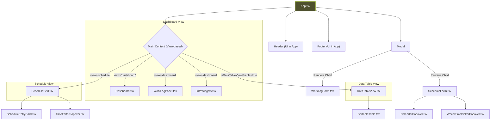

# UI Component Documentation

This document provides a complete and detailed breakdown of every React component used in the Schedule Manager application. It serves as a technical reference for understanding the purpose, props, and internal logic of the UI layer.

## Component Philosophy

The application's frontend is built on a philosophy of creating reusable, single-purpose components.

-   **Separation of Concerns**: "Smart" container components (`App.tsx`, `ScheduleGrid.tsx`) handle logic and state, while "dumb" presentational components (`ScheduleEntryCard.tsx`, `icons.tsx`) are only responsible for rendering UI based on the props they receive.
-   **Consistency**: A standardized set of popover and picker components (`CalendarPopover`, `WheelTimePicker`, etc.) ensures a consistent and high-quality user experience for all date and time interactions.
-   **Reusability**: Components like `Modal.tsx` and `SortableTable.tsx` are designed to be generic and reusable across the application.

## Component Hierarchy

This diagram illustrates how the main components are structured and nested within the application.

---

## 1. Core Application & Layout

### `App.tsx`
-   **Purpose**: The root component and central orchestrator of the entire application. It fetches all data, manages top-level UI state (like the current view and modal visibility), and distributes data and callbacks to its children.
-   **State**:
    -   `theme`: Manages the 'light'/'dark' theme.
    -   `view`: Controls whether the 'dashboard' or 'schedule' view is visible.
    -   `isClassModalOpen`, `isWorkLogModalOpen`: Boolean flags to control modal visibility.
    -   `editingEntry`, `editingWorkLog`: Holds the data for the item currently being edited in a modal.
    -   `currentDate`: The date the `ScheduleGrid` is centered on.
    -   `teacherFilter`: The ID of the teacher to filter by in the grid.
    -   `isDataTableViewVisible`: Controls the visibility of the raw data view.
-   **Props**: None.
-   **Key Logic**:
    -   Fetches all initial data from the `useSchedule` hook.
    -   Contains all the top-level callback handlers (`handleSaveEntry`, `handleOpenNewClass`, etc.) that orchestrate interactions between components, hooks, and modals.
    -   Renders the main layout, header, and footer.
    -   Conditionally renders the main content (`Dashboard`, `ScheduleGrid`, `DataTableView`) based on the `view` and `isDataTableViewVisible` state.
-   **Dependencies**: `useSchedule`, `useToast`, `Dashboard`, `ScheduleGrid`, `Modal`, `ClassForm`, `WorkLogPanel`, `InfoWidgets`, `DataTableView`, `WorkLogForm`.

### `components/Modal.tsx`
-   **Purpose**: A generic, reusable modal/dialog component that provides a consistent look and feel for pop-up forms.
-   **Props**:
    -   `isOpen: boolean`: Controls if the modal is visible.
    -   `onClose: () => void`: Callback to close the modal.
    -   `title: string`: The title displayed in the modal's header.
    -   `children: React.ReactNode`: The content to be rendered inside the modal.
-   **State**: None.
-   **Key Logic**:
    -   Uses a fixed-position overlay to cover the screen.
    -   Attaches a global keydown listener to close the modal on 'Escape'.
    -   Prevents clicks inside the modal from closing it, while clicks on the background overlay trigger `onClose`.
-   **Dependencies**: `XIcon`.

### `components/Toast.tsx`
-   **Purpose**: Renders individual toast notifications. It is used exclusively by `ToastContainer`.
-   **Props**:
    -   `toast: ToastMessage`: The toast object containing the message, type, and ID.
    -   `onRemove: (id: string) => void`: Callback to remove the toast from the list.
-   **State**: `isExiting: boolean` to control the exit animation.
-   **Key Logic**:
    -   Selects the appropriate icon and color scheme based on the `toast.type`.
    -   Uses an effect to automatically trigger the exit animation after a delay.
-   **Dependencies**: `useToasts`, `CheckIcon`, `XIcon`, `InformationCircleIcon`.

### `hooks/useToast.tsx`
-   **Purpose**: Provides the context and hooks for a global toast notification system.
-   **Exports**:
    -   `ToastProvider`: The context provider that should wrap the application.
    -   `useToast()`: A hook to get the `addToast` function.
    -   `useToasts()`: A hook to get the full list of `toasts` and the `removeToast` function.
-   **State**: `toasts: ToastMessage[]`.
-   **Key Logic**: Manages an array of toast messages. The `addToast` function adds a new toast and sets a `setTimeout` to automatically remove it after 5 seconds, ensuring notifications don't linger permanently.

---

## 2. Main Views

### `components/Dashboard.tsx`
-   **Purpose**: Displays a high-level overview of team performance using charts and key metrics.
-   **Props**:
    -   `workloadData: Workload[]`: The calculated workload data for all teachers.
    -   `teachers: Teacher[]`: The list of all teachers, used to get names.
-   **State**: None.
-   **Key Logic**:
    -   Transforms the `workloadData` and `teachers` props into the specific `ChartData` format required by the `recharts` library.
    -   Calculates aggregate metrics like `totalWorkedHours` and `occupancyRate`.
    -   Uses the `ResponsiveContainer` from `recharts` to make the chart adapt to the screen size.
    -   Defines two separate `<Tooltip>` components with different styles, using CSS to show one for light mode and the other for dark mode.
-   **Dependencies**: `recharts`, `ChartBarIcon`, `ClockIcon`.

### `components/ScheduleGrid.tsx`
-   **Purpose**: Renders the main interactive weekly schedule. This is one of the most complex components.
-   **Props**:
    -   `entries: ScheduleEntry[]`: The base schedule patterns.
    -   `teachers: Teacher[]`: Full list of teachers.
    -   `getTeacherById`, `getTeachersByIds`: Getter functions from `useSchedule`.
    -   `onEditEntry`: Callback to open the edit modal for a class.
    -   `updateEntry`: Callback to persist changes.
    -   `currentDate`, `setCurrentDate`: State for the currently viewed week.
    -   `teacherFilter`, `setTeacherFilter`: State for filtering by teacher.
-   **State**:
    -   `editingTime`: Holds the entry and target element for the `TimeEditorPopover`.
    -   `highlightedTeacherId`: Tracks the selected teacher from the workload summary to highlight their classes.
-   **Key Logic**:
    -   **`weeklyWorkload` (`useMemo`)**: Calculates the *planned* scheduled hours for each teacher for the visible week.
    -   **`generatedEntries` (`useMemo`)**: Transforms the base `entries` (which are patterns) into concrete `ScheduleEntry` instances for the `currentDate`'s week.
    -   **`entriesByDay` (`useMemo`)**: Groups the `generatedEntries` by day and applies the `processEntriesForLayout` algorithm to calculate positioning for overlapping events. This is the core of the visual layout.
    -   **`processEntriesForLayout`**: A complex layout algorithm that calculates the `width`, `left`, and `zIndex` for each event card to prevent visual collisions.
    -   Handles navigation between weeks and filtering by teacher.
-   **Dependencies**: `ScheduleEntryCard`, `TimeEditorPopover`, `ChevronLeftIcon`, `ChevronRightIcon`, `FunnelIcon`.

### `components/DataTableView.tsx`
-   **Purpose**: Provides a "raw data" view of all the application's data models in sortable tables.
-   **Props**:
    -   `schedule: ScheduleEntry[]`, `workLogs: WorkLog[]`, `teachers: Teacher[]`, `students: Student[]`: The core data arrays.
    -   `onBack: () => void`: Callback to return to the main application view.
-   **State**: None.
-   **Key Logic**:
    -   Defines a configuration array (`tableDefinitions`) where each object specifies the data, headers, and render function for a table.
    -   Enriches `workLogs` data with `teacherName` for better readability.
    -   Dynamically sorts the tables to show the most populated ones first.
-   **Dependencies**: `SortableTable`, `ChevronLeftIcon`.

---

## 3. Panels & Data Display

### `components/WorkLogPanel.tsx`
-   **Purpose**: Displays the real-time check-in/check-out status for every teacher.
-   **Props**:
    -   `teachers: Teacher[]`, `workLogs: WorkLog[]`: Data arrays.
    -   `onCheckIn`, `onCheckOut`, `onAddManualLog`, `onEditManualLog`: Callbacks to trigger actions.
-   **State**: None.
-   **Key Logic**:
    -   `getTeacherStatus`: A pure function that derives a teacher's current status ("Checked In" or "Checked Out") by finding their last `WorkLog` entry.
    -   Conditionally renders "Check-in" or "Check-out" buttons based on the derived status.
-   **Dependencies**: `ClockIcon`, `TimeDuration` (internal component).

### `components/InfoWidgets.tsx`
-   **Purpose**: A container for displaying and editing secondary information: Priority Lists, Shift Rosters, and Announcements.
-   **Props**: All config data (`priorityList`, `shiftRoster`, `announcements`) and their corresponding update callbacks.
-   **State**:
    -   `isEditing: boolean`: Toggles the entire panel between view and edit mode.
    -   `localPriorities`, `localShifts`: Local copies of the props to allow editing without affecting the global state until "Save" is clicked.
-   **Key Logic**:
    -   Uses an `isEditing` flag to conditionally render either display paragraphs or form elements (`MultiSelect`).
    -   The "Save" button calls the update callbacks passed via props to persist the changes.
-   **Dependencies**: `PencilIcon`, `CheckIcon`, and various other icons.

### `components/ScheduleEntryCard.tsx`
-   **Purpose**: Renders a single event on the `ScheduleGrid`. It's highly optimized for performance as many instances can be on screen.
-   **Props**:
    -   `entry: ScheduleEntry`: The data for the event.
    -   `getTeachersByIds`: Function to get teacher names.
    -   `onEdit`, `onEditTime`: Callbacks for user actions.
    -   `layout: CardLayout`: The calculated position (`top`, `height`, `width`, `left`, `zIndex`) from `ScheduleGrid`.
    -   `isHighlighted: boolean`: Flag to apply a highlight style.
-   **State**: None.
-   **Key Logic**:
    -   Calculates its own `top` and `height` based on the entry's `startTime` and duration.
    -   Selects the correct color scheme and icon based on `entry.classType`.
    -   Applies different border styles based on the primary teacher's `type` (`Titular` vs. `Auxiliar`).
    -   Optimized with `React.memo` to prevent re-rendering if its props haven't changed.
-   **Dependencies**: Various icons.

### `components/SortableTable.tsx`
-   **Purpose**: A generic, reusable component that renders a table with sortable columns.
-   **Props**:
    -   `title: string`: The title of the table.
    -   `data: any[]`: The array of data to display.
    -   `headers: { key, label, sortable }[]`: Configuration for the columns.
    -   `renderRow: (item) => React.ReactNode`: A function that defines how to render a `<tr>` for an item.
    -   `initialSortKey: string`: The key to sort by initially.
-   **State**:
    -   `isCollapsed: boolean`: To show/hide the table body.
    -   `sortConfig: { key, direction }`: The current sorting state.
-   **Key Logic**:
    -   The sorting logic is memoized with `useMemo` for performance.
    -   It intelligently handles sorting for different data types (date, string, number).
    -   The `requestSort` function handles toggling the sort direction.
-   **Dependencies**: `ChevronUpIcon`, `ChevronDownIcon`.

---

## 4. Forms & Inputs

### `components/ScheduleForm.tsx`
-   **Purpose**: A comprehensive form for creating and editing `ScheduleEntry` objects.
-   **Props**:
    -   `entry: ScheduleEntry | null`: The entry to edit, or `null` to create a new one.
    -   `teachers: Teacher[]`: Used to populate the teacher multi-select.
    -   `onSave`, `onCancel`, `onDelete`: Callbacks.
-   **State**:
    -   `formData`: A large state object holding all form values.
    -   `errors`: Form validation errors.
    -   `isConfirmingDelete`: A flag for the two-step delete confirmation.
    -   `activePopover`, `popoverAnchor`: State to manage the date/time picker popovers.
-   **Key Logic**:
    -   Conditionally renders different date/day inputs based on whether the class is "Recorrente" or "Aula Única".
    -   Implements a `validate` function for client-side validation.
    -   Handles the multi-select logic for `teacherIds`.
    -   On submit, it transforms the local `formData` into the canonical `ScheduleEntry` format and calls the `onSave` prop.
-   **Dependencies**: `TrashIcon`, `CalendarPopover`, `WheelTimePickerPopover`, `InfoPopover`, and various other icons.

### `components/WorkLogForm.tsx`
-   **Purpose**: A specialized form for adding or editing a manual `WorkLog`.
-   **Props**:
    -   `teacher: Teacher`: The teacher for whom the log is being created.
    -   `logToUpdate: WorkLog | null`: The log to edit, or `null` for a new one.
    -   `onSave`, `onCancel`: Callbacks.
-   **State**:
    -   `checkIn`, `checkOut`: `Date` objects for the form's values.
    -   `error`: Validation error string.
    -   `activePopover`, `popoverAnchor`: State to manage popovers.
-   **Key Logic**:
    -   Uses popovers for a consistent date/time picking experience.
    -   Validates that `checkOut` is after `checkIn` before submitting.
-   **Dependencies**: `CalendarPopover`, `WheelTimePickerPopover`, `CalendarIcon`, `ClockIcon`.

---

## 5. Popover & Picker Components

This suite of components provides a standardized, theme-aware replacement for native browser date/time inputs.

### Popover Containers
-   **`TimeEditorPopover.tsx`**: A specialized popover for editing an event's start and end time directly on the `ScheduleGrid`. It contains a `WheelTimePicker`.
-   **`DateTimePickerPopover.tsx`**: A generic popover that combines a calendar and a time picker in tabs.
-   **`CalendarPopover.tsx`**: A popover that shows only the `ElegantCalendar` component.
-   **`WheelTimePickerPopover.tsx`**: A popover that shows only the `WheelTimePicker` component.
-   **`InfoPopover.tsx`**: A read-only popover used to display contextual help information.

**Common Logic**: All popover containers share this logic:
-   They accept an `anchorEl` prop (the element that triggered them).
-   They use `useEffect` to calculate their position relative to the `anchorEl` and the viewport, preventing them from rendering off-screen.
-   They render a full-screen, invisible backdrop that closes the popover when clicked.
-   They listen for the 'Escape' key to close.

### Picker Widgets (The content of popovers)
-   **`ElegantCalendar.tsx`**: A stylish, interactive calendar for picking a date.
-   **`WheelTimePicker.tsx`**: A modern, touch-friendly time picker with scrolling wheels for hours and minutes. This is the primary time selection widget.
-   **`ClockTimePicker.tsx`**: An alternative time picker that mimics an analog clock face.
-   **`ClickerTimePicker.tsx`**: An alternative time picker with up/down arrows.
-   **`SimpleTimePicker.tsx`**: An alternative time picker using simple text inputs.
-   **`SliderTimePicker.tsx`**: An alternative time picker using range sliders.

---

## 6. Atomic Components

### `components/icons.tsx`
-   **Purpose**: A single file that exports all SVG icons used in the application as individual, self-contained React components.
-   **Props**: `className?: string` for applying Tailwind CSS classes.
-   **Benefits**:
    -   **Consistency**: All icons are managed in one place.
    -   **Performance**: As React components, they are part of the main bundle and don't require separate HTTP requests.
    -   **Stylability**: They can be easily styled (color, size) via the `className` prop.

This comprehensive component architecture enables rapid development, easy maintenance, and a consistent, high-quality user experience across the entire application.
