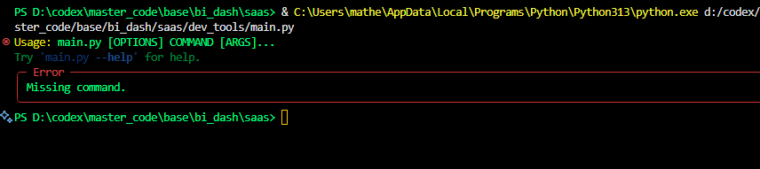

# `dev_tools` CLI Documentation

This document provides technical documentation for the `dev_tools` Command Line Interface (CLI), a tool designed to automate repetitive development and testing tasks.

## 1. Overview

The `dev_tools` CLI is a Python application built with `typer` and `rich` that provides a simple and intuitive interface for running tests and other development tasks across the different applications in this monorepo. It uses `taskipy` to execute predefined shell commands, and it logs all output for later analysis.

## 2. Installation and Setup

The CLI is located in the `dev_tools` directory. To use it, you first need to install the necessary Python dependencies.

### 2.1. Requirements

The required Python packages are listed in `dev_tools/requirements.txt`:

```
typer
rich
taskipy
```

### 2.2. Installation

To install the dependencies, run the following command from the root of the project:

```bash
python -m pip install -r dev_tools/requirements.txt
```

## 3. Usage

The CLI is executed using the `python -m dev_tools.main` command. It provides a `test` subcommand with several options for running tests on different applications.

### 3.1. `test root`

This command runs the tests for the root application.

**Command:**

```bash
python -m dev_tools.main test root
```

**Underlying Shell Command:**

This command executes the `test_root` task defined in the root `pyproject.toml` file, which runs the following shell command in the project root directory:

```bash
npm install && npm run dev
```

### 3.2. `test dashboard`

This command runs the tests for the dashboard application.

**Command:**

```bash
python -m dev_tools.main test dashboard
```

**Underlying Shell Command:**

This command executes the `test_dashboard` task, which runs the following shell command in the `src/base_business-intelligence-dashboard` directory:

```bash
npm install && npm run dev
```

### 3.3. `test scheduler`

This command runs the tests for the scheduler application.

**Command:**

```bash
python -m dev_tools.main test scheduler
```

**Underlying Shell Command:**

This command executes the `test_scheduler` task, which runs the following shell command in the `src/schedule-manager` directory:

```bash
npm install && npm run dev
```

### 3.4. `test clients`

This command runs the tests for the clients application.

**Command:**

```bash
python -m dev_tools.main test clients
```

**Underlying Shell Command:**

This command executes the `test_clients` task, which runs the following shell command in the `src/painel-cliente-360` directory:

```bash
npm install && npm run dev
```

### 3.5. `test all`

This command runs the tests for all applications sequentially.

**Command:**

```bash
python -m dev_tools.main test all
```

**Underlying Shell Commands:**

This command executes the following tasks in order:
1.  `test_root`
2.  `test_dashboard`
3.  `test_scheduler`
4.  `test_clients`

## 4. Automation Scripts

The `dev_tools` CLI is powered by the following Python scripts:

### 4.1. `dev_tools/main.py`

This is the main entry point for the CLI. It uses:
-   **`typer`**: To create the command-line interface with subcommands and arguments.
-   **`rich`**: To print beautifully formatted output to the console.
-   **`subprocess`**: To execute the shell commands.
-   **`taskipy`**: To run the predefined tasks from `pyproject.toml`.

The script defines the `test` subcommand and its options (`root`, `dashboard`, etc.). When a command is executed, it calls the `run_task` function, which in turn executes the corresponding `taskipy` task.

### 4.2. Logging

All output from the executed commands is captured and saved to a log file in the `logs` directory. The log files are named with the task name and a timestamp, for example: `logs/dashboard-test-2025-08-12_10-00-00.log`. This is useful for debugging and keeping a record of test runs.

## 5. PowerShell/Shell Commands

The `taskipy` tasks in `pyproject.toml` execute standard shell commands. The primary command used is:

```bash
npm install && npm run dev
```

-   **`npm install`**: This command installs all the Node.js dependencies defined in the `package.json` file of the respective application.
-   **`npm run dev`**: This command runs the `dev` script defined in the `package.json` file, which typically starts the development server for the application.

## 🧪 6. New Test Suites

The CLI has been updated with new test suites.

### 6.1. `test run unit` 🔬

Runs the unit tests for the entire project.

**Command:**
```bash
python -m dev_tools.main test run unit
```

### 6.2. `test run e2e` 🎭

Runs the end-to-end tests using Playwright.

**Command:**
```bash
python -m dev_tools.main test run e2e
```

### 6.3. `test run coverage` 📊

Runs the tests with code coverage analysis.

**Command:**
```bash
python -m dev_tools.main test run coverage
```

### 6.4. `test list` 📋

Lists all available test suites.

**Command:**
```bash
python -m dev_tools.main test list
```

## 🐍 7. Poetry Integration

The CLI now includes a `poetry` subcommand to manage the backend's Poetry environment.

### 7.1. `poetry install` 📦

Installs the backend dependencies.

**Command:**
```bash
python -m dev_tools.main poetry install
```

### 7.2. `poetry update` ⬆️

Updates the backend dependencies.

**Command:**
```bash
python -m dev_tools.main poetry update
```

### 7.3. `poetry show` 👀

Shows the backend dependencies.

**Command:**
```bash
python -m dev_tools.main poetry show
```

## 📝 8. Viewing Logs

The CLI provides a `logs` subcommand to view the logs for each application.

### 8.1. `logs view` 📄

This command allows you to view the logs for a specific application.

**Command:**

```bash
python -m dev_tools.main logs view <app_name>
```

Replace `<app_name>` with the name of the application you want to view logs for (e.g., `root`, `dashboard`, `scheduler`, `clients`).

The command will list all the available log files for the specified application and prompt you to select one to view.
